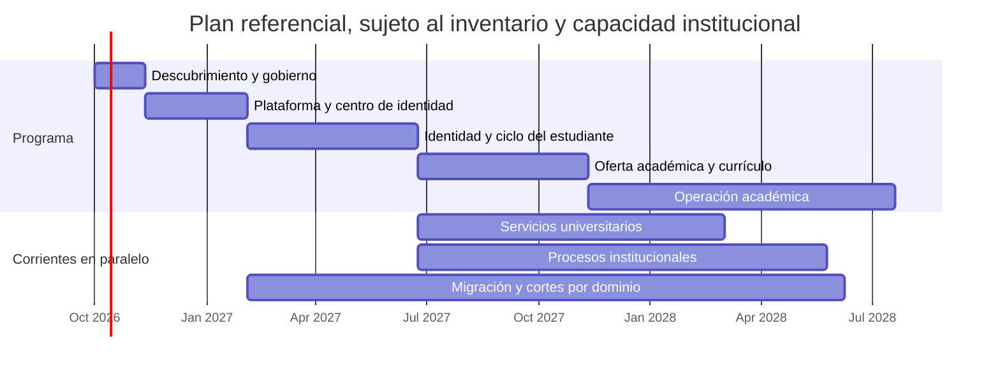

# Cronograma inicial del programa

Duraciones relativas; no son una fecha contractual. Se recalibran cuando UPTC entregue inventario de aplicaciones y bases, calidad y volumen de datos, responsables de dominio, contratos, dependencias de identidad, restricciones de contratación y tamaño de equipos. El inventario público DTIC de 2024 evidencia variedad de procesos, pero no sirve como cronograma actualizado.

## Etapas y actividades

| Etapa | Actividades principales | Duración indicativa | Resultado verificable |
|---|---|---:|---|
| 0. Descubrimiento y gobierno | Inventariar sistemas, dueños, bases e interfaces; talleres por proceso; clasificación de datos; reglas actuales; identidad institucional; seguridad, continuidad y contratación; mapa de dependencias | 4–6 semanas | Catálogo vigente, dueños por dominio, riesgos, alcance priorizado y cronograma base aprobado |
| 1. Plataforma y diseño transversal | Repos separados y coordinados; Java 25/SDKMAN; React/Vite/SCSS; monolito modular; API con i18n; Compose Watch; MySQL; migraciones; auditoría; observabilidad; C4; Centro de Identidad Visual | 8–12 semanas | Aplicaciones arrancables, configuración de marca gobernada, permisos de ejemplo no productivos, métricas de latencia instrumentadas |
| 2. Identidad y ciclo del estudiante | Estructura institucional, identificadores, personas y vínculos, roles, admisiones, expediente, estados del ciclo y trazabilidad | 3–5 meses | Recorridos validados con personal y datos sintéticos; reglas institucionales aprobadas |
| 3. Oferta académica y currículo | Programas, sedes/modalidades, versiones de malla, currículo, asignaturas, prerrequisitos, créditos y equivalencias | 3–5 meses | Catálogo versionado y migración de ensayo conciliada |
| 4. Operación académica | Periodos, grupos, matrícula, carga de cursos, programación, horarios, calificaciones, certificados y grados | 5–9 meses | Flujo académico completo por cohortes piloto y criterios de corte |
| 5. Servicios universitarios | Bienestar, salud, restaurante, residencias, biblioteca y otros servicios confirmados; pagos e integraciones donde aplique | 4–9 meses por corrientes paralelas | Flujos de servicio integrados y responsables operativos formados |
| 6. Procesos institucionales | Talento humano, finanzas, presupuesto, adquisiciones, inventarios, investigación, extensión, gestión documental, planeación y reportes | 6–12+ meses por corrientes paralelas | Procesos inventariados implementados, conciliados y aceptados por sus dueños |
| 7. Migración, corte y retiro | Ensayos repetibles, calidad y conciliación, pruebas de reversa, paralelo controlado, aceptación, corte y retiro por dominio | 3–6+ meses por dominio, solapados | Acta de corte, fuentes oficiales actualizadas, operación estabilizada y legado retirado según retención |

## Vista temporal de alto nivel

Las fechas del diagrama son una ilustración relativa iniciada el 1 de octubre de 2026, no una fecha autorizada de inicio. El programa completo podría abarcar aproximadamente 18–36+ meses con equipos de dominio y trabajo paralelo; un único equipo, integraciones complejas o datos de baja calidad pueden ampliarlo. Cada hito depende de pruebas de aceptación y ventanas de corte aprobadas, no solo del calendario.

## Cadencia y gates por dominio

1. Descubrimiento y propietario: proceso, estados, reglas, fuente oficial, datos y usuarios.
2. Especificación de aceptación y contrato del dominio.
3. Implementación en TDD y revisión de impacto arquitectónico, privacidad y rendimiento.
4. Perfilado, mapeo, limpieza autorizada y ensayos de migración con datos ficticios o debidamente anonimizados.
5. Aceptación funcional y reconciliación de control totals con el responsable de datos.
6. Operación paralela de lectura o sombra; una sola fuente de escritura oficial.
7. Corte reversible, monitorización, estabilización y retiro de legado según archivo/retención.

## Hitos próximos

- H0: inventario institucional vigente y propietarios de dominios identificados.
- H1: frontend y backend reproducibles desde repos separados con SDKMAN Java 25 y Compose local.
- H2: Centro de Identidad Visual con administración autorizada, vista previa, publicación y auditoría.
- H3: autenticación federada y roles UPTC confirmados.
- H4: identidad, expediente estudiantil y ciclo básico probados en un entorno UPTC no productivo, empezando por rutas priorizadas y reglas, datos y permisos aprobados por sus responsables. Ver [descubrimiento inicial del ciclo](discovery/student-lifecycle-baseline.md).
- H5: catálogo de programas, mallas, versiones curriculares y asignaturas aprobado.
- H6: primer corte de dominio ejecutado con conciliación y reversa ensayada.
