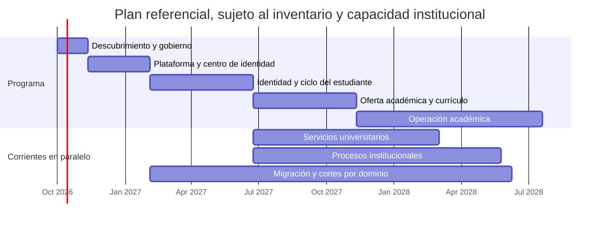

# Cronograma inicial del programa

Duraciones relativas; no son una fecha contractual. Se recalibran cuando UPTC entregue inventario de aplicaciones y bases, calidad y volumen de datos, responsables de dominio, contratos, dependencias de identidad, restricciones de contratación y tamaño de equipos. El inventario público DTIC de 2024 evidencia variedad de procesos, pero no sirve como cronograma actualizado.

## Etapas y actividades

| Etapa | Actividades principales | Duración indicativa | Resultado verificable |
|---|---|---:|---|
| 0. Descubrimiento y gobierno | Inventariar sistemas, dueños, bases e interfaces; talleres por proceso; clasificación de datos; reglas actuales; identidad institucional; seguridad, continuidad y contratación; mapa de dependencias | 4–6 semanas | Catálogo vigente, dueños por dominio, riesgos, alcance priorizado y cronograma base aprobado |
| 1. Plataforma y diseño transversal | Repos separados y coordinados; Java 25/SDKMAN; React/Vite/SCSS; monolito modular; API con i18n; Compose Watch; MySQL; migraciones; auditoría; observabilidad; C4; Centro de Identidad Visual | 8–12 semanas | Aplicaciones arrancables, configuración de marca gobernada, permisos de ejemplo no productivos, métricas de latencia instrumentadas |
| 2. Identidad y ciclo del estudiante | Descubrir primero pregrado presencial; validar responsables, norma compilada, calendario y convocatoria, sistemas maestros, identificadores, datos mínimos, permisos y excepciones. Después implementar por cortes aprobados: admisión/matrícula, trámites de estudiante y expediente | 3–5 meses (referencial, tras acceso a dueños y sistemas) | Primer recorrido presencial aprobado y probado con datos sintéticos; conciliación y rollback definidos. Sin modelar FESAD/virtual o posgrado por analogía |
| 3. Oferta académica y currículo | Programas, sedes/modalidades, versiones de malla, currículo, asignaturas, prerrequisitos, créditos y equivalencias | 3–5 meses | Catálogo versionado y migración de ensayo conciliada |
| 4. Operación académica | Periodos, grupos, matrícula, carga de cursos, programación, horarios, calificaciones, certificados y grados | 5–9 meses | Flujo académico completo por cohortes piloto y criterios de corte |
| 5. Servicios universitarios | Bienestar, salud, restaurante, residencias, biblioteca y otros servicios confirmados; pagos e integraciones donde aplique | 4–9 meses por corrientes paralelas | Flujos de servicio integrados y responsables operativos formados |
| 6. Procesos institucionales | Talento humano, finanzas, presupuesto, adquisiciones, inventarios, investigación, extensión, gestión documental, planeación y reportes | 6–12+ meses por corrientes paralelas | Procesos inventariados implementados, conciliados y aceptados por sus dueños |
| 7. Migración, corte y retiro | Ensayos repetibles, calidad y conciliación, pruebas de reversa, paralelo controlado, aceptación, corte y retiro por dominio | 3–6+ meses por dominio, solapados | Acta de corte, fuentes oficiales actualizadas, operación estabilizada y legado retirado según retención |

## Vista temporal de alto nivel

Las fechas del diagrama son una ilustración relativa iniciada el 1 de octubre de 2026, no una fecha autorizada de inicio. El programa completo podría abarcar aproximadamente 18–36+ meses con equipos de dominio y trabajo paralelo; un único equipo, integraciones complejas o datos de baja calidad pueden ampliarlo. Cada hito depende de pruebas de aceptación y ventanas de corte aprobadas, no solo del calendario.

## Línea base de entregas locales v0 — 30 de septiembre de 2026

| Entrega | Estado en los repositorios de desarrollo | Alcance y gate restante |
|---|---|---|
| Frontend y backend coordinados | Implementación local en dos repositorios separados, ambas ramas `develop`; Compose integra los servicios para vista previa. | Sigue siendo entorno de desarrollo. No es un despliegue UPTC ni tiene SSO institucional. |
| Identidad y permisos | Endpoint de identidad propia y autorización del catálogo implementados con permisos internos separados. | Emisor, audience, grupos y roles UPTC siguen sin mapear; no hay credenciales de prueba. |
| Catálogo de pregrado presencial | CSV prevalidado sin escritura con resumen y muestra de hasta 10 asignaturas; confirmación vuelve a validar y crea borrador, revisión de entradas, cola administrativa por cursor (25 por respuesta, máximo 100), publicación protegida e interfaces públicas para versiones publicadas y su detalle; actualmente vacío. | Formato y códigos deben mapearse con la fuente maestra y los responsables antes de cargar la oferta oficial. |
| Vista de React del catálogo | Ruta `/#programas` con estados vacío/red/error, búsqueda local de programas por código/nombre/facultad/sede, detalle tabular accesible de asignaturas con búsqueda y filtro de semestre en servidor (máximo 100 por página), y cola administrativa con cursor desde backend, estable ante publicaciones concurrentes. | Es preview local. El flag autoritativo `programs.available` sigue en `false` y la pantalla no habilita operación institucional. |
| Estructura y periodos | Ruta `/#academia`; maestros separados y API protegida para facultades/unidades, lugares, relaciones ordenadas y afiliaciones a programas existentes. Periodos `REGULAR` e `INTERSEMESTRAL` con borrador, calendario versionado, aprobación, apertura, cierre, cancelación y auditoría; enmiendas conservan revisiones publicadas. | La interfaz es de lectura y los catálogos locales están vacíos. OIDC, grupos internos mapeados, fuentes maestras y aprobación de calendarios por responsables UPTC son gates previos a escritura institucional. La oferta de grupos, matrícula y controles de cupos por curso quedan para fases posteriores. |
| Ciclo de vida del estudiante | Descubrimiento público ampliado para **inscripción y selección de pregrado presencial**: Acuerdos 053/2008 y 031/2021; Resoluciones 19/28 de 2014; tabla ACRA; calendario 2027-I; cupos 015/2021–2941/2021–5362/2025; y vía normalista 026/2009, 1577/2019 y 3418/2019. | No se implementan aspirantes, expediente, admisión ni matrícula. Vigencia consolidada, selección normalista, cupos/discapacidad, datos, permisos y recursos requieren aprobación institucional. El calendario 2027-I ya inició y no se asume como corte de reemplazo. |
| Latencia MySQL | MySQL 8.4 desechable, 10.000 filas, 10 calentamientos, 50 muestras y concurrencia 1: medias 15,830 ms (paginación sin filtro), 39,612 ms (búsqueda) y 16,923 ms (cola de borradores, página de 25). | Las tres medias pasan el presupuesto local de regresión `<50 ms`; búsqueda mostró p95/p99 de 108,218/126,693 ms en esta ejecución, por lo que la variación de cola sigue visible. El perfil institucional, la carga concurrente y el SLO de producción siguen pendientes. Ver [runbook](runbook/local-development.md#contrato-y-perfil-mysql-de-paginación-curricular), [especificación de paginación](superpowers/specs/2026-09-30-curriculum-server-pagination-design.md) y [ADR-0002](architecture/decisions/ADR-0002-curriculum-search-snapshots.md). |

La plantilla sin filas [academic-curriculum-template.csv](templates/academic-curriculum-template.csv) documenta el contrato de importación técnico; no es un formato exportado de un legado ni una lista de programas aprobada. El hito H5 requiere validación del catálogo y no se considera cumplido solo porque exista el endpoint o la interfaz.

### Secuencia de trabajo para habilitar estructura y periodos

Los incrementos de software ya disponibles en `develop` son una base técnica, no una habilitación institucional. Las duraciones siguientes son estimaciones relativas al acceso a las áreas dueñas y a datos no productivos; se ajustan en conjunto con ACRA, Secretaría General, DTIC y responsables de facultad/sede.

| Orden | Actividad | Duración indicativa | Dependencia y criterio de salida |
|---:|---|---:|---|
| 1 | Confirmar catálogo maestro vigente de facultades, escuelas, unidades, sedes/campus y códigos estables; acordar dueño y procedencia de cada dato | 1–2 semanas | Responsable designado; fuente y reglas de vigencia aprobadas |
| 2 | Mapear el catálogo existente a unidades responsables y lugares; revisar jerarquía, orden y afiliaciones con facultades/sedes piloto | 1–2 semanas | Ningún programa duplicado; conteos y excepciones conciliados; aprobación de los dueños |
| 3 | Validar cómo se identifica el periodo regular e intersemestral, qué órgano aprueba el calendario y qué actos habilitan apertura/cambios/cierre | 1–3 semanas | Matriz de estados, referencias y ventanas aceptada; evitar tratar intersemestral como regla autónoma no validada |
| 4 | Integrar SSO OIDC y mapear grupos institucionales a permisos de lectura/escritura de estructura y periodos | 2–4 semanas, en paralelo | DTIC valida issuer, audience, claims y matriz de mínimo privilegio; pruebas 401/403 pasan |
| 5 | Completar la interfaz administrativa para gestionar maestros y transiciones, con vista previa, confirmación y auditoría | 2–4 semanas | Los comandos requieren permiso real en servidor; no se habilitan usuarios ni tokens semilla |
| 6 | Ejecutar aceptación del flujo regular e intersemestral en un entorno institucional no productivo; probar enmiendas, cierre, conciliación, respaldo y reversa | 2–3 semanas | Acta de aceptación de dueños; casos borde y concurrencia aprobados; rollback ensayado |
| 7 | Implementar grupos/oferta, matrícula y controles de capacidad por curso; planear piloto de cohorte con los dueños operativos | 6–10+ semanas | Reglas y datos maestros aprobados; el conteo por curso se valida contra normativa vigente antes de automatizar |

Las actividades 1–6 son gates para poner en operación la administración de la estructura y de calendarios. La ruta de lectura actual no abre periodos desde el navegador; la API administrativa requiere autorización OIDC válida. La etapa 7 depende además de implementar oferta y matrícula, actualmente ausentes.

## Desglose del siguiente hito: pregrado presencial

Estimación de trabajo posterior a que UPTC designe responsables y facilite documentación no productiva. La investigación web localizó la Resolución 111/2026, el Acuerdo 053/2008, las Resoluciones 19/28 de 2014, tabla enlazada por ACRA y la cadena de cupos especiales 015/2021–2941/2021–5362/2025; también las derogatorias de Acuerdos 017/2001 y 120/2006 y del artículo 17 del Acuerdo 130. La página ACRA publica para 2027-I una vía normalista, con fuentes 026/2009, 1577/2019, 3418/2019 y Ley 2481/2025 que requieren modelado separado. El siguiente trabajo es validar matriz y reglas operativas con ACRA, Secretaría General y Jurídica, no repetir la búsqueda inicial. No incluye espera de aprobaciones ni contratación y no constituye fecha comprometida.

El calendario 2027-I fija el cierre de inscripción para el 23 de octubre de 2026 y resultados para el 13 de noviembre. Como el desarrollo aún está en descubrimiento y sin contratos de datos/SSO aprobados, esta convocatoria no es el objetivo de reemplazo operativo. La fecha de un primer piloto debe seleccionarse con UPTC después de cerrar G0–G3.

| Orden | Actividad | Duración estimada | Dependencia / salida de control |
|---|---|---:|---|
| 1 | Validar la matriz pública ya localizada: Acuerdos 130 y 053/2008; Acuerdo 031/2021; Resoluciones 19/28 de 2014; tabla ACRA; Acuerdo 015/2021 y Resoluciones 2941/2021 y 5362/2025; Resolución 111/2026; derogatorias de 017/2001 y 120/2006; regímenes históricos 019/2000 y 061/2000; vigencia del Acuerdo 030/2007; y ruta normalista (Resolución 026/2009, 1577/2019, 3418/2019, Ley 2481/2025 y convenios vigentes) | 1–2 semanas | Matriz consolidada y aceptada por Secretaría General/Jurídica y dueño del proceso; vigencia, categorías de cupo, discapacidad, ruta normalista, erratas y reglas de cohorte aclaradas |
| 2 | Recorrer con ACRA y programas piloto el subproceso priorizado de inscripción y selección de aspirantes; documentar su límite con matrícula inicial y sus recursos/excepciones | 2–3 semanas | Flujo, actores, reglas, excepciones, plazos y punto de corte funcional aceptados |
| 3 | Confirmar sistemas fuente, identificadores y contratos para persona, aspirante y estudiante; perfilar calidad y volumen sin copiar datos personales a desarrollo | 2–3 semanas | Mapa de sistemas e interfaces, catálogo minimizado y plan de ensayo/conciliación |
| 4 | Aprobar autenticación, matriz actor-permiso, retención, trazabilidad, criterios de aceptación y escenarios sintéticos AAA | 1–2 semanas | Contratos de API y pruebas de aceptación firmados por responsables |
| 5 | Implementar la ruta vertical de inscripción y selección de pregrado presencial con TDD, migración Flyway, auditoría, observabilidad y diagramas actualizados, después de los gates normativos y de datos | 4–6 semanas | Flujo aprobado en entorno no productivo; casos felices y bordes de dos opciones, ponderación por versión, aptitud, empate, resultados históricos, cupos especiales, permisos y concurrencia; vía normalista separada solo si G1 la incluye, todo con datos sintéticos |
| 6 | Ensayar integración/migración, reversa y carga representativa; medir API y SQL por separado (promedio, p50/p95/p99) | 2–3 semanas | Informe de conciliación/performance y decisión de avanzar, corregir o no cortar |

Las actividades 2 y 3 pueden solaparse parcialmente. La duración nominal resultante es de unas 12–19 semanas, pero el acceso a documentación/ambientes, las aprobaciones y los hallazgos pueden ampliarla. El corte priorizado cubre inscripción y selección; la matrícula inicial queda como etapa posterior, no como parte asumida del primer flujo. No se ejecuta corte ni se usa una fuente productiva antes de aceptación explícita del dueño de dominio. Ver el [descubrimiento preliminar](superpowers/specs/2026-09-30-pregrado-admissions-process-discovery.md) y el [cronograma relativo propuesto](superpowers/plans/2026-09-30-pregrado-admissions.md).

## Cadencia y gates por dominio

1. Descubrimiento y propietario: proceso, estados, reglas, fuente oficial, datos y usuarios.
2. Especificación de aceptación y contrato del dominio.
3. Implementación en TDD y revisión de impacto arquitectónico, privacidad y rendimiento.
4. Perfilado, mapeo, limpieza autorizada y ensayos de migración con datos ficticios o debidamente anonimizados.
5. Aceptación funcional y reconciliación de control totals con el responsable de datos.
6. Operación paralela de lectura o sombra; una sola fuente de escritura oficial.
7. Corte reversible, monitorización, estabilización y retiro de legado según archivo/retención.

## Hitos próximos

- H0: inventario institucional vigente y propietarios de dominios identificados.
- H1: frontend y backend reproducibles desde repos separados con SDKMAN Java 25 y Compose local.
- H2: Centro de Identidad Visual con administración autorizada, vista previa, publicación y auditoría.
- H3: autenticación federada y roles UPTC confirmados.
- H4: ruta de inscripción y selección de aspirantes de **pregrado presencial** probada en un entorno UPTC no productivo. El patrocinador priorizó el subproceso; matrícula inicial queda para una etapa posterior. Ya se investigaron las normas ordinarias, especiales y de normalistas publicadas para 2027-I, incluidas derogatorias, la Ley 2481/2025 y rutas por convenio. Falta consolidar vigencia, ponderaciones, cupos/discapacidad, selección normalista, operación, cohorte piloto, sistemas maestros, contrato de datos y permisos. Ver [descubrimiento del ciclo](discovery/student-lifecycle-baseline.md), la [especificación preliminar de admisiones](superpowers/specs/2026-09-30-pregrado-admissions-process-discovery.md), el [plan relativo](superpowers/plans/2026-09-30-pregrado-admissions.md) y la [plantilla de validación institucional](discovery/pregrado-presencial-validacion-institucional.md).
- H5: catálogo de programas, mallas, versiones curriculares y asignaturas aprobado.
- H6: primer corte de dominio ejecutado con conciliación y reversa ensayada.
