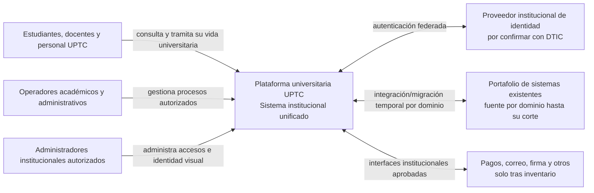
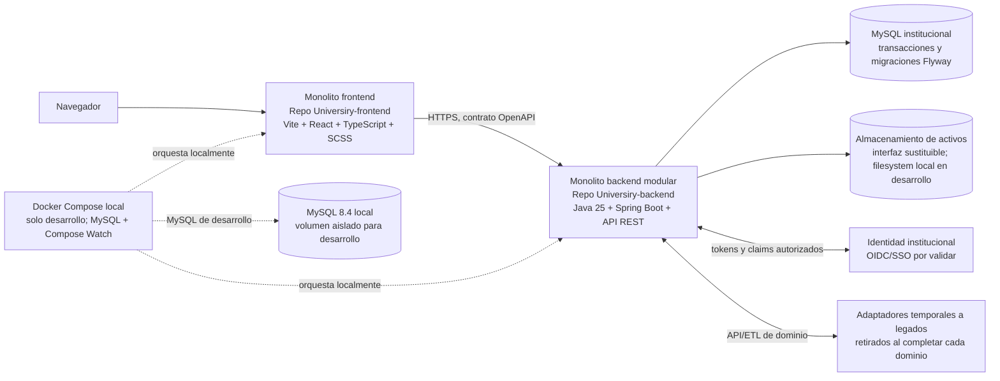
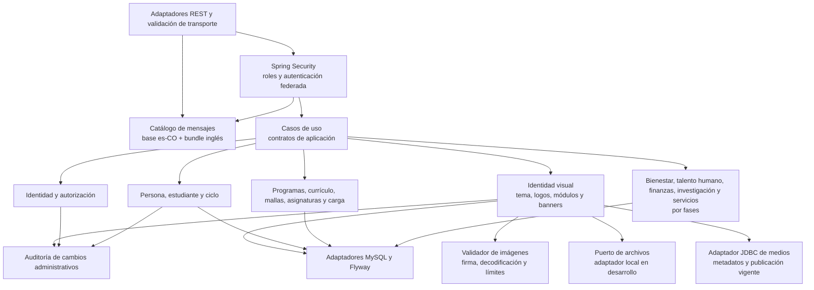

# Arquitectura C4

Diagramas objetivo de la plataforma final. Los adaptadores a legados son temporales y desaparecen por dominio después de cada corte aceptado. La identidad federada es un actor externo a confirmar con DTIC.

## Nivel 1 — Contexto

## Nivel 2 — Contenedores

## Nivel 3 — Componentes del backend modular

Los módulos comparten proceso y MySQL al inicio, pero no escriben las tablas de otros dominios sin pasar por contratos de aplicación. Las dependencias van desde adaptadores hacia casos de uso y dominio; Spring sirve para componer límites y persistencia, no para delegar reglas de negocio a controladores.
