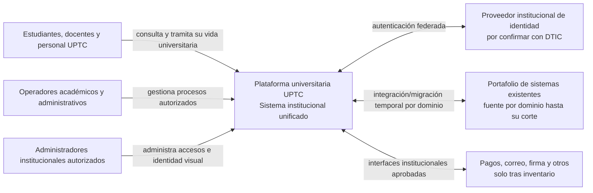
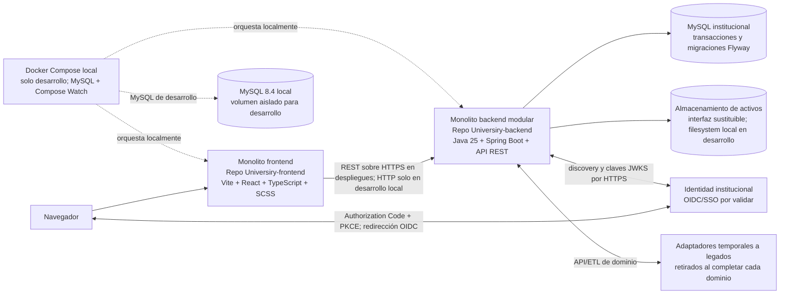
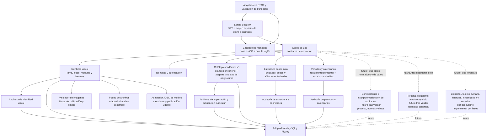

# Arquitectura C4

Los diagramas separan el destino de la plataforma del incremento que existe hoy. Los adaptadores a legados son una estrategia futura y desaparecen por dominio después de cada corte aceptado. La identidad federada es un actor externo por confirmar con DTIC.

## Estado de esta entrega

| Capacidad | Estado comprobado en desarrollo | Límite operativo |
|---|---|---|
| Centro de identidad visual | API, persistencia y cliente local disponibles | La escritura administrativa depende de OIDC y permisos institucionales; Compose no incluye identidad de prueba. |
| Identidad de sesión | Cliente React Authorization Code + PKCE, sesión por pestaña, consulta `/api/v1/me` y mapa backend configurable con valor vacío | Emisor, audiencia, scopes y grupos UPTC no están configurados; por eso inicio de sesión y permisos permanecen cerrados. |
| Catálogo académico | Importación CSV a borrador, revisión, publicación protegida, metadata pública y entradas publicadas por páginas de hasta 100 | La ruta React es una vista previa local. `programs.available` sigue en `false`; el catálogo inicia vacío y no está habilitado para operación institucional. |
| Estructura y periodos académicos | Árbol ordenado de unidades, sedes y programas; cinco editores de prioridad; formulario protegido para alta de facultad raíz; confirmación auditada de apertura/cierre de periodos regulares e intersemestrales. | La alta y las demás escrituras requieren `academic:structure:write`; sin OIDC/grupos institucionales la interfaz oculta los controles. La estructura oficial sigue vacía. Crear una facultad raíz no asigna escuelas ni programas; cambiar prioridad no reasigna unidades o lugares; abrir/cerrar no activa oferta ni matrícula. |
| Inscripción y selección de aspirantes | Fuentes públicas ampliadas: Resolución 111/2026, Acuerdos 053/2008 y 031/2021, Resoluciones 19/28 de 2014, tabla ACRA y cadena especial 015/2021–2941/2021–5362/2025; vía normalista publicada (026/2009, 1577/2019, 3418/2019, Ley 2481/2025) requiere modelado separado | No hay captura de aspirantes, selección, matrícula ni datos personales implementados. Derogatorias expresas localizadas para Acuerdos 017/2001 y 120/2006 y artículo 17 del 130; interpretación de cupos/discapacidad y reglas normalistas pendientes. 2027-I no se asume como objetivo de reemplazo. |
| Otros dominios y cortes de legado | Planeados | Requieren inventario actual, dueño de datos, contrato y aceptación institucional. |

## Nivel 1 — Contexto

## Nivel 2 — Contenedores

## Nivel 3 — Componentes del backend modular

Los módulos comparten proceso y MySQL al inicio, pero no escriben las tablas de otros dominios sin pasar por contratos de aplicación. `Academics` administra el catálogo curricular; `Structure` separa jerarquías organizacionales de lugares de desarrollo y enlaza programas existentes; `Periods` administra calendarios y el ciclo de estados. `Structure` permite crear una facultad raíz y actualizar prioridades mediante rutas explícitas protegidas por `academic:structure:write`; ambas escrituras conservan actor, referencia y auditoría transaccional. El formulario de facultad solo aparece para un operador autorizado. No hay proveedor OIDC UPTC configurado ni datos oficiales cargados. Las altas relacionadas, cierres y reasignaciones siguen pendientes. Ninguno implementa todavía oferta de grupos, matrícula, horarios, notas ni grados. `Admissions` y `Student` son módulos futuros: no hay tablas ni endpoints de aspirantes, no se almacena PII y las reglas de selección permanecen sin implementar hasta aprobación institucional. Las dependencias sólidas del diagrama son las del incremento existente; las punteadas son capacidades futuras. Cada dominio mantiene su auditoría separada. Spring compone límites y persistencia, no delega reglas de negocio a controladores.
