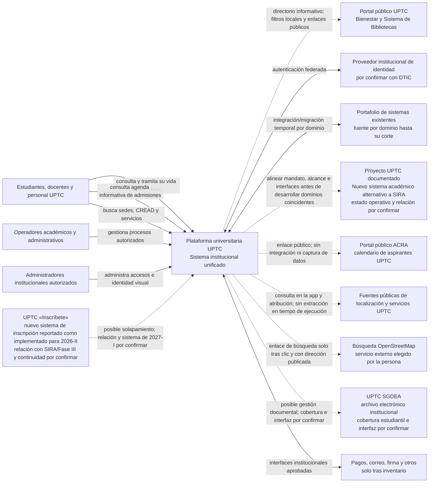
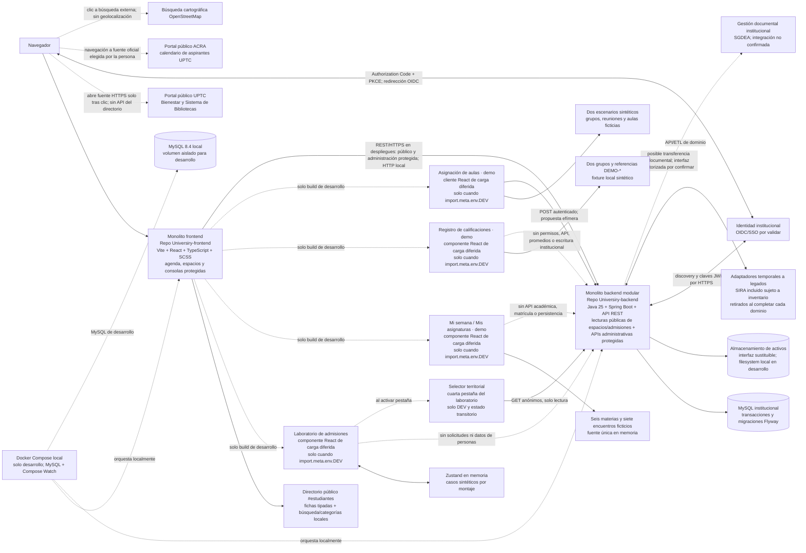

# Arquitectura C4

Los diagramas separan el destino de la plataforma del incremento que existe hoy. Los adaptadores a legados son una estrategia futura y desaparecen por dominio después de cada corte aceptado. La identidad federada es un actor externo por confirmar con DTIC.

## Estado de esta entrega

| Capacidad | Estado comprobado en desarrollo | Límite operativo |
|---|---|---|
| Centro de identidad visual | API, persistencia y cliente local disponibles | La escritura administrativa depende de OIDC y permisos institucionales; Compose no incluye identidad de prueba. |
| Identidad canónica y sesión | V21 crea `university_user.user_id` mínimo; cada vínculo OIDC opaco apunta a un UUID canónico. `/api/v1/me` retorna `userId` y `subject`; asignaciones usan `user_id`, y cada evento de auditoría conserva `actor_user_id` más `actor_identity_id`. | Emisor, audiencia, scopes y grupos UPTC no están configurados; el acceso sigue cerrado. No existe flujo de asociación/fusión de vínculos ni perfiles de ciclo académico; no hay PII ni autoridad semilla. React conserva tokens solo en memoria. Recargar requiere iniciar sesión. |
| Sesión de desarrollador local | Compose activa el perfil backend `local-preview`; Vite DEV permite pulsar «Entrar al preview local». El backend emite bearers opacos efímeros y `/api/v1/me` entrega permisos allowlisted para revisar las consolas. | Identidad `local-preview-developer` de cuatro horas, hasta 16 sesiones en memoria; salir revoca. Los puertos Compose están ligados a `127.0.0.1`; solo se usa con datos locales sintéticos. Sin asignación de rol en MySQL. Fuera del perfil local, Spring no registra el controlador, servicio ni decoder; el build de producción no incluye el cliente ni la lógica React de sesión local. Ver [ADR-0004](decisions/ADR-0004-local-preview-developer-session.md). |
| Administración de acceso | Consola protegida `/#accesos`, API de perfiles/identidades/asignaciones por `userId`, vigencias tipadas, revocación por versión y auditoría transaccional. | OIDC institucional y la matriz siguen cerrados y sujetos a aprobación. El catálogo no asigna permisos académicos por nombre; `ADMINISTRATOR` solo tiene acceso de roles y ámbito `UNIVERSITY`. En local, la sesión dev técnica permite revisar la consola sin crear una asignación ni autoridad semilla. |
| Catálogo académico | Importación CSV a borrador, revisión, publicación protegida, metadata pública y entradas publicadas por páginas de hasta 100; la vista pública resuelve unidad académica y sede desde la afiliación vigente | La ruta React es una vista previa local. `programs.available` sigue en `false`; el catálogo inicia vacío y no está habilitado para operación institucional. Si falla la consulta de estructura, la vista pública no presenta etiquetas históricas del CSV como afiliación actual. |
| Estructura y periodos académicos | Árbol ordenado de unidades, sedes y programas; cinco editores de prioridad; formularios protegidos para facultad raíz, alta atómica de unidad hija y relación, lugar raíz, relaciones entre entidades existentes, alta/cierre/reasignación atómica de afiliaciones fechadas y cierre fechado de relaciones de unidades/sedes; snapshot administrativo de vigencias futuras e históricas; consola React para crear borradores `REGULAR`/`INTERSEMESTRAL`, registrar actividades en revisiones de calendario, publicar una revisión con confirmación explícita, aprobarla con referencia propia, abrir o cerrar periodos y consultar historial/auditoría. | La consola de estructura requiere `academic:structure:read` y `academic:structure:write`; el flujo de periodos requiere `academic:period:read` y, para escribir, `academic:period:write`; sin OIDC/grupos institucionales la interfaz oculta los controles. La estructura oficial sigue vacía y no hay fechas oficiales precargadas. Publicar una revisión la vuelve inmutable; aprobar y abrir son pasos separados. Crear, aprobar, abrir o cerrar un periodo no activa oferta ni matrícula. Crear una raíz no crea relaciones; la alta de hija guarda dos eventos en una transacción; la afiliación selecciona un programa publicado y maestros existentes, no importa textos legados; cerrar un vínculo no elimina registros ni extiende cierres finitos. La reasignación compara la versión de origen, conserva el `program_id`, corta e inserta la afiliación sucesora y audita ambas operaciones en la misma transacción; exige destinos activos y sin cruces de vigencia. Las reglas y maestros siguen pendientes de validación institucional. Boletines UPTC de 2025 describen SIRA para PAE, planes de estudio, oferta y horarios; el estado actual y la frontera del catálogo requieren validación DTIC/Vicerrectoría antes de usar datos institucionales. |
| Borradores de oferta académica | Panel `/#academia` y API administrativa para crear/editar grupos propuestos por periodo, currículo publicado y asignatura; lista e historial cursorados; migración V23 y auditoría transaccional. | `academic:offerings:read/write` es una familia independiente de estructura y periodo. Solo persiste borradores con capacidad propuesta; no publica cursos, comunica disponibilidad ni permite inscripción, matrícula, asignación docente/aula u horario semanal. Sin maestros/catálogos oficiales y autorización institucional no es fuente de operación. Periodo regular/intersemestral permanece con ciclo propio. |
| Bitácora de estructura académica | React en `/#academia` y `GET /api/v1/admin/academic-structure/audit-events` consultan por cursor hasta 100 eventos existentes, con filtros por UUID de entidad y acción; respuesta con fecha, acción, actor opaco, referencia y resumen. Flyway V20 agrega índices de lectura. | Solo lectura y protegida en el servidor por `academic:structure:read`; reutiliza `academic_structure_audit_event`, no crea tablas y no consulta dominios de aspirantes o estudiantes. React cancela y descarta resultados cuando pierde lectura. El endpoint valida cursores/filtros y limita cada página a 100. Sin OIDC/grupos institucionales la ruta permanece cerrada. |
| Registro de calificaciones · demo | Ruta `/#calificaciones-demo`, cargada solo en Vite DEV. Dos grupos y referencias `DEMO-*`; captura y validación provisional 0–5; guardar muestra un acuse volátil. | Prototipo solo frontend, sin API, roles, grupos reales, promedio/resultado, base de datos ni almacenamiento. Escala y flujo no son reglas UPTC. El build de producción excluye todo `src/features/gradebook/demo/`. |
| Asignación de aulas · demo | Ruta `/#aulas-demo` carga en Vite DEV un cliente con dos escenarios sintéticos. `POST /api/v1/dev/room-allocation/proposals` genera una propuesta con el puerto Java `RoomAssignmentPlanner`. | Requiere sesión autenticada con el perfil Spring `local-preview`; request y resultados viven en memoria. No consulta inventario, horarios ni matrícula, no reserva ni audita y no usa MySQL. El manifiesto productivo excluye `src/features/room-planning/demo/`; las reglas de optimización no son política UPTC. |
| Convocatorias públicas de admisiones | React `/#admisiones` consulta hasta 100 convocatorias versionadas en `GET /api/v1/admissions/calls`, permite elegir su última revisión publicada y conserva el calendario 2027-I del frontend cuando no hay publicación o falla la API. Consola protegida crea, corrige y publica revisiones con referencia y auditoría vía `/api/v1/admin/admissions/calls`. | V22 agrega revisiones, hitos y auditoría. Los permisos `admissions:calendar:read/write` no se asignan aún; sin OIDC institucional la consola queda cerrada. No hay aspirantes, documentos, PIN, pagos, resultados ni selección automática. El calendario de respaldo debe contrastarse con ACRA. |
| Laboratorio local de experiencia de admisiones | En Vite DEV, `/#admisiones` carga de forma diferida cuatro tarjetas accesibles: recorrido de aspirante, bandeja de operador, calendario público y catálogo territorial. Las dos primeras se destacan como caminos de prueba; React Hook Form valida opciones sintéticas y Zustand comparte la ficha efímera entre perspectivas. | No es un trámite ni asigna roles. No contiene datos reales, no llama una API de postulaciones y no persiste al recargar. La condición `import.meta.env.DEV` excluye el módulo del bundle de producción; el verificador del manifiesto falla si aparece. La bandeja no admite, rechaza ni calcula puntajes. |
| Vista local de semana y asignaturas | Ruta `/#estudiante-demo` y componente React de carga diferida en Vite DEV; ofrece vistas de semana y materias desde seis asignaturas y siete encuentros ficticios en una única estructura de datos, con filtros y detalles accesibles. | Prototipo de solo lectura: no representa identidad, matrícula, horarios ni datos oficiales. No llama APIs académicas ni persiste; la producción excluye el módulo mediante la guarda del manifiesto. La consulta propia real sigue pendiente de fuente maestra, permisos, aislamiento por usuario y aceptación institucional. |
| Guía pública de espacios | Ruta React `/#espacios` con búsqueda por texto, tipo y municipio derivado de la instantánea pública `GET /api/v1/spaces`; seis sedes, once CREAD y cuatro puntos de servicio con procedencia por lugar. `spaces` se etiqueta y oculta desde branding. | Solo integra referencias oficiales públicas, no es un inventario completo. No persiste espacios en MySQL, administra ubicaciones, define coordenadas, dibuja mapas ni resuelve rutas interiores. La búsqueda externa de OpenStreetMap aparece tras clic y requiere una dirección publicada; ubicación y accesibilidad deben verificarse en la fuente. Si se actualiza la instantánea y desaparece el municipio seleccionado, el filtro se restablece. |
| Directorio público de servicios estudiantiles | Ruta React `/#estudiantes` con cuatro fichas de Bienestar y Biblioteca, búsqueda local tolerante a tildes, filtro de categoría, contador accesible y estado vacío recuperable. | Solo contiene resúmenes editoriales estáticos y enlaces HTTPS UPTC. No usa API, identidad, datos personales, formularios, préstamos, reservas ni persistencia. Las fuentes se consultaron mediante resultados indexados; su lectura directa no se pudo confirmar en esta sesión. Revisar redacción y vigencia con las áreas antes de operar como catálogo institucional. |
| Catálogo territorial de referencia | `GET /api/v1/territorial-catalog/departments` y `GET /api/v1/territorial-catalog/departments/{departmentCode}/entities` sirven desde el classpath una instantánea atribuida a DANE DIVIPOLA MGN 2025: 33 departamentos y 1.122 entidades (1.103 municipios, una isla y 18 áreas no municipalizadas). | Los años de dato por fila pueden ser 2024 o 2025. No consulta DANE en tiempo de ejecución ni usa MySQL. El selector solo aparece en la pestaña de demostración DEV del laboratorio de admisiones; sus opciones viven en estado React y no se envían ni guardan. El directorio de colegios sigue pendiente de una fuente validada. |
| Inscripción y selección de aspirantes | Fuentes públicas ampliadas: Resolución 111/2026, Acuerdos 053/2008 y 031/2021, Resoluciones 19/28 de 2014, tabla ACRA, cadena especial 015/2021–2941/2021–5362/2025 y el sistema «Inscríbete», reportado como implementado para 2026-II; boletines UPTC de 2025 reportan trabajo de actualización SIRA | No hay captura de aspirantes, selección, matrícula ni datos personales implementados. La relación entre «Inscríbete», SIRA y la Fase III, la plataforma de 2027-I, el dato maestro y los contratos siguen pendientes. 2027-I no se asume como objetivo de reemplazo. |
| Otros dominios y cortes de legado | Planeados | Requieren inventario actual, dueño de datos, contrato y aceptación institucional. |

## Nivel 1 — Contexto

## Nivel 2 — Contenedores

La ruta `/#estudiantes` forma parte del monolito React. Sus cuatro fichas son contenido editorial local; búsquedas y categorías se resuelven en memoria. El navegador abre una página oficial de UPTC solo cuando la persona activa su enlace. No existe una API, llamada de búsqueda, almacenamiento ni operación de servicio asociada a este directorio. Las descripciones requieren revisión editorial periódica; las fuentes son la referencia vigente.

El laboratorio se carga dentro del mismo monolito React únicamente con `import.meta.env.DEV`. Aspirante y equipo comparten el store mientras permanece montado; el flujo local va de `DEMO_RECEIVED` a revisión, ajuste solicitado, confirmación ficticia, reanudación y cierre. Los motivos son opciones fijas; un recargue reinicia el store. La tercera pestaña presenta la experiencia pública real del calendario y conserva sus permisos de consola. La verificación de bundle inspecciona el manifest de producción y bloquea cualquier entrada bajo `src/features/admissions/demo/`.

La vista `/#estudiante-demo` comparte el shell del monolito, pero sus seis materias y siete encuentros viven en una única estructura sintética local. La semana deriva sus sesiones de esa estructura y la vista de asignaturas las agrupa para mostrar todos sus encuentros. No consulta permisos, identidad académica ni endpoints de horario. `import.meta.env.DEV` habilita la navegación/importación, y el control del manifest excluye el módulo de producción. Esta vista evalúa la experiencia propuesta y no equivale a un expediente, una matrícula ni un horario institucional.

La vista `/#aulas-demo` comparte el shell del monolito. El cliente solo envía el escenario sintético elegido mediante un bearer efímero de preview local; no envía identidad de estudiante. El controlador existe solo bajo Spring `local-preview` y usa un planificador determinista con presupuesto de estados. La propuesta queda en memoria React y se descarta al perder o cerrar la sesión. No consulta MySQL, inventarios, oferta ni auditoría; producción excluye página, cliente y fixtures.

Los boletines UPTC de 2025 describen actualización de SIRA para PAE, planes, oferta y horarios. El informe de rendición de cuentas 2025 reporta formulación completa de la Fase III para un nuevo sistema académico alternativo a SIRA y un avance parcial de sus etapas de desarrollo ese año. El comunicado UPTC de mayo de 2026 describe además el sistema «Inscríbete» para inscripciones 2026-II. Se desconocen los productos operativos posteriores, el portal de 2027-I y la relación entre SIRA, «Inscríbete» y la Fase III; el C4 los representa por separado y sin una interfaz establecida. La UPTC también publica el SGDEA para gestión documental electrónica; su alcance sobre historiales y soportes estudiantiles y cualquier interfaz siguen por confirmar. La evidencia apunta a un ACRA central y procesos/contactos operativos por seccional, sin RACI ni fuentes por entidad confirmados. No se implementa un adaptador ni se publica un segundo maestro académico o repositorio documental antes de que DTIC, Vicerrectoría Académica, Archivo, la instancia del proyecto y las áreas funcionales que el patrocinador identifica provisionalmente como ACRA/Registro Académico confirmen alcance, sistemas fuente e integración. [Informe de rendición de cuentas 2025](https://www.uptc.edu.co/sitio/export/sites/default/portal/sitios/universidad/rectoria/planeacion/rdc/.content/doc/2026/aud_pub/infrdc_2025.pdf) · [Boletín SIRA, enero de 2025](https://www.uptc.edu.co/sitio/export/sites/default/portal/sitios/universidad/vic_aca/vic_acad/inf/doc/2025/001_bolvicacad_2025.pdf) · [Boletín SIRA, mayo de 2025](https://www.uptc.edu.co/sitio/export/sites/default/portal/sitios/universidad/vic_aca/vic_acad/inf/doc/2025/005_bolvicaca_2025.pdf) · [comunicado UPTC sobre Inscríbete 2026-II](https://www.uptc.edu.co/sitio/portal/cal_not_eve/noticias/det/Abiertas-inscripciones-para-programas-de-pregrado-en-la-UPTC/) · [noticia institucional sobre SGDEA](https://www.uptc.edu.co/sitio/portal/cal_not_eve/noticias/det/UPTC-promueve-la-implementacion-del-Sistema-de-Gestion-de-Documentos-Electronicos-de-Archivo/) · [hallazgo sobre ACRA, seccionales y expedientes](../discovery/uptc-academic-records-management.md)

El [Cuadro de Clasificación Documental 2025](https://www.uptc.edu.co/sitio/export/sites/default/portal/sitios/universidad/rectoria/sec_general/arch_corresp/.content/doc/clasifdoc2025.pdf) y la [TRD 2025 de ACRA](https://www.uptc.edu.co/sitio/export/sites/default/portal/sitios/universidad/rectoria/sec_general/arch_corresp/.content/doc/tablas_ret_doc/2025/4130000_depadmcregacad.pdf) reconocen una oficina productora, código 4130000, y clasifican convocatorias, historiales académicos y algunos registros de SIRA bajo esa dependencia. La TRD publicada establece 2+8 años archivísticos para convocatorias y 2+78 para historiales de pregrado/posgrado, según los hitos de cómputo indicados en la fuente. Los contactos por seccional y el organigrama de Sogamoso indican además actividad local; la fuente contractual de 2024 que menciona expedientes en “SGDA” no demuestra que ese nombre corresponda al SGDEA oficial. Es evidencia archivística/operativa, no prueba suficiente de fuente autoritativa por entidad ni regla automática para borrar datos transaccionales, repositorios o respaldos.

La cuarta pestaña del laboratorio presenta el selector DIVIPOLA de referencia. Solo carga entidades después de elegir departamento, cancela consultas obsoletas y conserva la elección en estado React local. Sus dos endpoints son GET anónimos con códigos como texto; el backend lee el snapshot al iniciar y no llama a DANE ni persiste estas referencias en MySQL. La pestaña no forma parte del flujo de aspirantes y no entrega datos al store ni a una operación de inscripción.

## Nivel 3 — Componentes del backend modular

```mermaid
flowchart TB
  Web[Adaptadores REST y validación de transporte]
  Security[Spring Security\nJWT + mapeo explícito de claim a permisos]
  I18n[Catálogo de mensajes\nbase es-CO + bundle inglés]
  UseCases[Casos de uso\ncontratos de aplicación]
  Branding[Identidad visual\ntema, logos, módulos y banners]
  Spaces[Guía pública de espacios\nconsulta y catálogo buscable]
  SpaceDirectory[Puerto PublicSpaceDirectory\nsnapshot de lectura]
  SpaceCatalog[Adaptador JSON del classpath\n21 ubicaciones versionadas y atribuidas]
  SpaceResource[Recurso public-space-directory.json\nversionado en el artefacto]
  Territories[Catálogo territorial\nconsulta pública de referencia]
  TerritoryDirectory[Puerto TerritorialCatalog\nsnapshot validado de lectura]
  TerritoryCatalog[Adaptador JSON del classpath\n33 departamentos y 1.122 entidades]
  TerritoryResource[Recurso divipola-mgn-2025.json\nversionado y atribuido]
  Identity[Identidad y autorización\nuser_id canónico + vínculos issuer/subject opacos\nroles tipados y permisos efectivos por user_id]
  IdentityAudit[Auditoría de asignación y revocación de roles]
  Admissions[Calendarios de convocatorias versionadas
  agenda pública y consola de revisiones]
  ApplicantLifecycle[Inscripción/selección de aspirantes
  futura tras validar proceso, normas y datos]
  Student[Persona, estudiante, matrícula y ciclo
  futuro tras validar identidad canónica]
  Academics[Catálogo académico v1\nplanes por cohorte + páginas públicas de asignaturas]
  Structure[Estructura académica\nunidades, sedes y afiliaciones fechadas\nreasignación con vigencia y auditoría atómicas]
  Periods[Periodos y calendarios\nregular/intersemestral + estados auditables]
  Offerings[Borradores de grupos\npor periodo + fila curricular publicada]
  Library[Catálogo y circulación de biblioteca\ntítulos, ejemplares, préstamo, devolución y retiro con traza]
  Notices[Notificaciones institucionales\npublicación inmutable + audiencia por ámbitos]
  OfferingAudit[Historial append-only\nversiones y referencias]
  RoomPlanning[Propuestas de asignación de aulas\ncontrolador solo local-preview]
  RoomPlanner[RoomAssignmentPlanner\nbúsqueda determinista con presupuesto acotado]
  Other[Bienestar, talento humano, finanzas, investigación y servicios\npor descubrir e implementar por fases]
  BrandingAudit[Auditoría de identidad visual]
  AcademicAudit[Auditoría de importación y publicación curricular]
  StructureAudit[Auditoría de estructura y prioridades]
  StructureAuditHistory[Consulta paginada de auditoría
  filtro entidad/acción, máximo 100]
  PeriodAudit[Auditoría de periodos y calendarios]
  AdmissionsAudit[Auditoría de creación, revisión y publicación]
  Persistence[Adaptadores MySQL y Flyway]
  MediaValidation[Validador de imágenes\nfirma, decodificación y límites]
  AssetStorage[Puerto de archivos\nadaptador local en desarrollo]
  AssetRepository[Adaptador JDBC de medios\nmetadatos y publicación vigente]

  Web --> Security
  Web --> I18n
  Security --> I18n
  Security --> UseCases
  UseCases --> Branding
  Web --> Spaces
  Spaces --> SpaceDirectory
  SpaceCatalog -->|implementa| SpaceDirectory
  Web --> Territories
  Web --> Library
  Web --> Notices
  Territories --> TerritoryDirectory
  TerritoryCatalog -->|implementa| TerritoryDirectory
  UseCases --> Identity
  Identity --> IdentityAudit
  IdentityAudit --> Persistence
  Identity --> Persistence
  UseCases --> Academics
  UseCases --> Structure
  UseCases --> Periods
  UseCases --> Offerings
  UseCases --> Admissions
  UseCases --> Library
  UseCases --> Notices
  Web --> RoomPlanning
  Security --> RoomPlanning
  RoomPlanning --> RoomPlanner
  RoomPlanning --> I18n
  Admissions -. futuro tras gates .-> ApplicantLifecycle
  UseCases -. futuro, tras descubrimiento .-> Student
  UseCases -. futuro, tras inventario .-> Other
  Branding --> BrandingAudit
  BrandingAudit --> Persistence
  Academics --> AcademicAudit
  AcademicAudit --> Persistence
  Structure --> StructureAudit
  StructureAudit --> Persistence
  Structure --> StructureAuditHistory
  StructureAuditHistory --> Persistence
  Periods --> PeriodAudit
  PeriodAudit --> Persistence
  Offerings --> OfferingAudit
  OfferingAudit --> Persistence
  Admissions --> AdmissionsAudit
  AdmissionsAudit --> Persistence
  Admissions --> Persistence
  Branding --> Persistence
  Branding --> MediaValidation
  Branding --> AssetStorage
  Branding --> AssetRepository
  SpaceCatalog -->|lee al iniciar| SpaceResource
  TerritoryCatalog -->|lee al iniciar| TerritoryResource
  Notices --> Persistence
  Library --> Persistence
  Academics --> Persistence
  Student -. futuro .-> Persistence
  Other -. futuro .-> Persistence
```

Los módulos comparten proceso y MySQL al inicio, pero no escriben las tablas de otros dominios sin pasar por contratos de aplicación. `Identity` mantiene un `university_user` mínimo y vincula cada par autenticado opaco `issuer+subject` a un `user_id`; V21 migra las identidades existentes con un UUID determinista y conserva IDs de asignación/auditoría. `/api/v1/me` registra idempotentemente la identidad autenticada y retorna `userId`, `subject` opaco y permisos efectivos; asignaciones y búsqueda usan `user_id`, sin correo ni otros claims personales. Cada evento de acceso guarda actor canónico y `actor_identity_id`; la relación entre ambos se valida al insertar para conservar qué vínculo autenticado actuó. El modelo admite varios vínculos por usuario, pero aún no ofrece asociación o fusión de identidades. La consola `/#accesos` requiere `identity:roles:read`; las mutaciones requieren además `identity:roles:write` y autorización backend. Este incremento no configura OIDC, no crea administrador semilla y no habilita la operación institucional: el patrocinador, DTIC y los dueños aún deben aprobar el modelo, la matriz y la provisión inicial. `ADMINISTRATOR` solo concede los dos permisos de gestión de acceso; los demás perfiles permanecen sin permisos hasta definir cada matriz funcional. `Academics` administra el catálogo curricular; `Structure` separa jerarquías organizacionales de lugares de desarrollo y enlaza programas existentes; `Periods` administra calendarios y el ciclo de estados; `Offerings` conserva borradores por periodo y fila de currículo publicada sin alterar los periodos. `Library` administra títulos y ejemplares con préstamo, devolución y retiro auditables, exige `library:read`/`library:write` y trata `%` y `_` como literales en la búsqueda; no se conecta a un sistema bibliotecario institucional ni publica disponibilidad. `Notices` publica avisos inmutables con audiencia por ámbitos y resuelve «mis avisos» desde las asignaciones de rol activas a la fecha institucional, sin guardar datos de contacto ni implementar entrega por canal. `Structure` permite crear facultades y lugares raíz, relaciones fechadas entre unidades/lugares existentes, afiliaciones fechadas de programas publicados a unidades/lugares existentes, actualizar prioridades y acortar la vigencia de relaciones organizacionales/territoriales y reasignar afiliaciones de programas mediante rutas explícitas; las escrituras conservan actor, referencia y auditoría transaccional (`UNIT_RELATION_CLOSED`, `SITE_RELATION_CLOSED`, `PROGRAM_AFFILIATION_CLOSED`, `PROGRAM_AFFILIATION_REASSIGNED`). La reasignación compara inicio y fin esperados, trunca la fila fuente, crea una sucesora con el mismo `program_id` y la nueva ubicación, y registra el evento en la misma transacción. `academic:structure:read` permite consultar el snapshot administrativo completo; la consola requiere además `academic:structure:write` para presentar controles, mientras el backend valida el permiso de escritura en cada comando. `Admissions` administra snapshots completos por `callKey`, con máximo 50 hitos por revisión y una consulta pública acotada a las 100 convocatorias más recientemente publicadas. Cada publicación exige control optimista de la revisión borrador y del puntero público observado; en una transacción avanza `current_published_revision_id` y registra actor canónico/vínculo OIDC, referencia y evento. `GET /api/v1/admissions/calls` no muestra borradores ni actores. Los permisos de admisiones no están asignados y OIDC permanece vacío; la agenda 2027-I queda como respaldo sin sincronización. No hay tablas/endpoints de aspirantes, no se almacena PII y las reglas de selección permanecen sin implementar hasta aprobación institucional. Las capacidades de grupos operativas, matrícula, horarios, notas y grados siguen pendientes; esta entrega es solo el primer registro persistente y auditable de oferta en estado borrador. Las dependencias sólidas del diagrama son las capacidades técnicas existentes; las punteadas son integraciones futuras. Cada dominio mantiene su auditoría separada. Spring compone límites y persistencia, no delega reglas de negocio a controladores.
