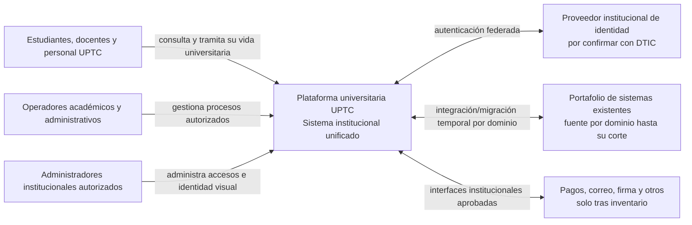
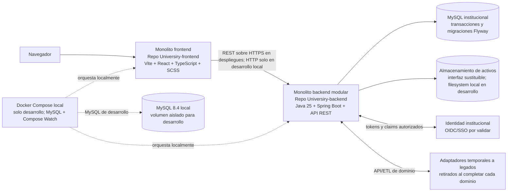
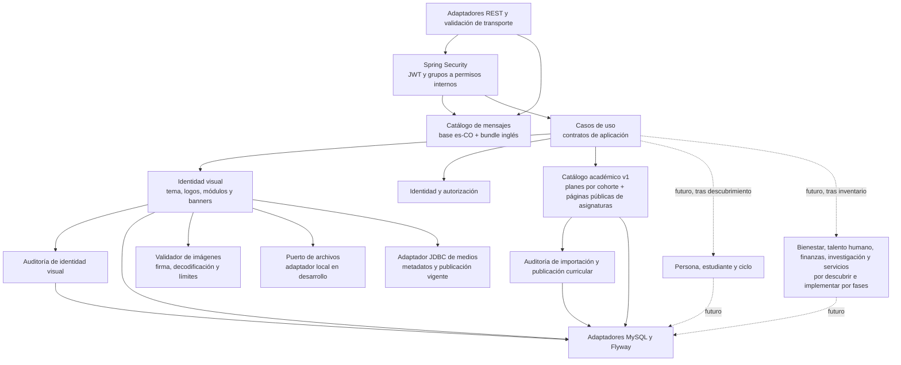

# Arquitectura C4

Los diagramas separan el destino de la plataforma del incremento que existe hoy. Los adaptadores a legados son una estrategia futura y desaparecen por dominio después de cada corte aceptado. La identidad federada es un actor externo por confirmar con DTIC.

## Estado de esta entrega

| Capacidad | Estado comprobado en desarrollo | Límite operativo |
|---|---|---|
| Centro de identidad visual | API, persistencia y cliente local disponibles | La escritura administrativa depende de OIDC y permisos institucionales; Compose no incluye identidad de prueba. |
| Identidad de sesión | Endpoint propio y validación JWT configurada | Emisor, audiencia y grupos reales de UPTC no están configurados. |
| Catálogo académico | Importación CSV a borrador, revisión, publicación protegida, metadata pública y entradas publicadas por páginas de hasta 100 | La ruta React es una vista previa local. `programs.available` sigue en `false`; el catálogo inicia vacío y no está habilitado para operación institucional. |
| Ciclo de vida del estudiante | Descubrimiento documental de pregrado presencial | No hay expediente, admisión, matrícula ni datos personales implementados. |
| Otros dominios y cortes de legado | Planeados | Requieren inventario actual, dueño de datos, contrato y aceptación institucional. |

## Nivel 1 — Contexto

## Nivel 2 — Contenedores

## Nivel 3 — Componentes del backend modular

Los módulos comparten proceso y MySQL al inicio, pero no escriben las tablas de otros dominios sin pasar por contratos de aplicación. El único componente académico implementado en este incremento es el catálogo versionado; no administra matrícula, horarios, prerrequisitos operativos, notas ni grados. Las dependencias sólidas del diagrama son las del incremento existente; las punteadas son capacidades futuras. Branding y academics mantienen sus auditorías separadas. Spring compone límites y persistencia, no delega reglas de negocio a controladores.
