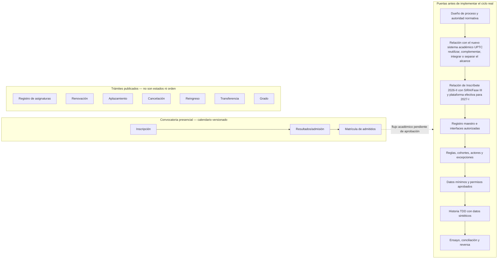
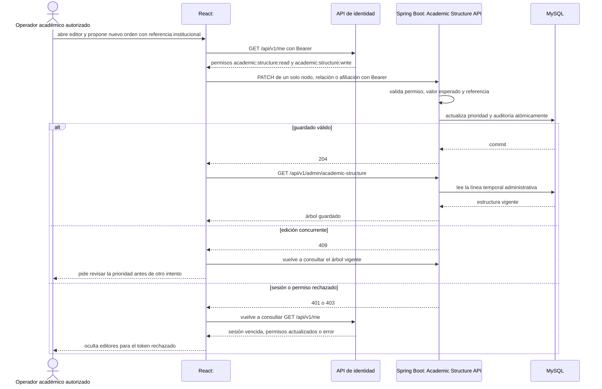
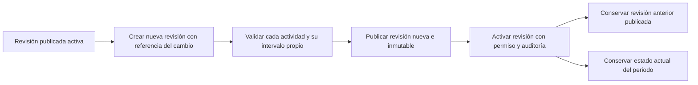
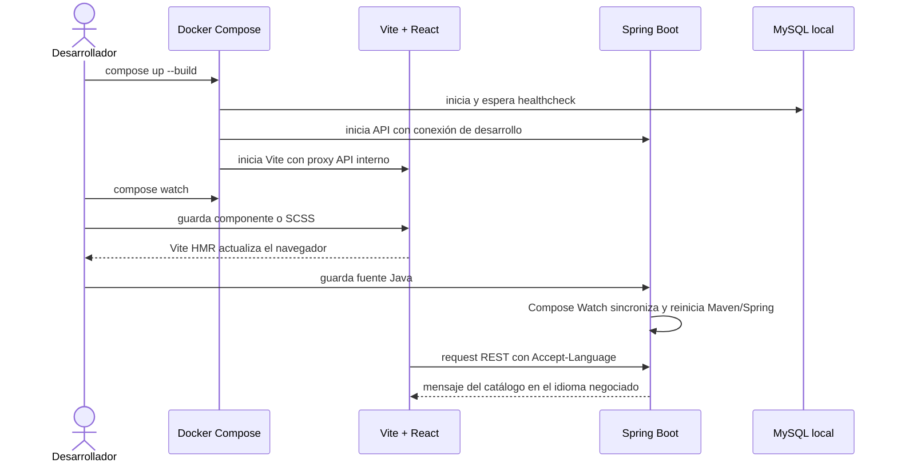
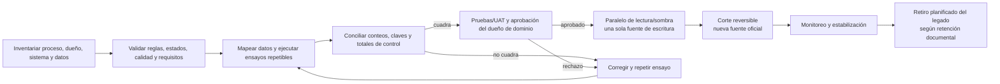

# Procesos transversales

## Edición y publicación de identidad visual

```mermaid
sequenceDiagram
  actor Admin as Administrador de identidad visual
  participant UI as React: Centro de Identidad Visual
  participant API as Spring Boot: Branding API
  participant Auth as Spring Security
  participant Validator as Validador de imágenes
  participant Asset as Puerto de almacenamiento de activos
  participant DB as MySQL
  participant Public as React: app universitaria

  Admin->>UI: cambia paleta, logos, banners o etiquetas
  UI->>API: solicita lectura o cambio autenticado
  API->>Auth: valida token y permiso interno según método/ruta
  Auth-->>API: principal y permiso branding:read o branding:write
  opt Subida de imagen
    UI->>API: envía PNG, JPEG o WebP
    API->>Validator: valida firma, decodificación, tamaño y dimensiones
    Validator-->>API: MIME detectado, dimensiones y huella SHA-256
    API->>Asset: escribe con UUID en staging y publica archivo completo
    Asset-->>API: clave generada; sin nombre original
    API->>DB: transacción: metadatos + evento de auditoría de carga
    DB-->>API: commit o rollback
    opt La escritura de metadatos falla
      API->>Asset: elimina el archivo para evitar huérfanos
    end
  end
  API->>API: valida colores, contraste, etiquetas y fechas
  API->>DB: transacción: versión + configuración + evento de auditoría
  DB-->>API: commit
  API-->>UI: versión publicada y previsualización
  Public->>API: GET de configuración pública versionada
  API-->>Public: configuración sin datos de administración
  Public->>API: solicita el activo de un logo o banner
  API->>DB: confirma que el activo pertenece a la revisión vigente y está en ventana
  DB-->>API: tipo MIME y checksum registrados
  API->>Asset: lee dentro del límite de bytes registrado
  Asset-->>API: bytes verificados por tamaño y SHA-256
  API-->>Public: imagen raster y headers seguros
  Public->>Public: aplica CSS tokens y muestra activos con texto alternativo
```

Si una validación o persistencia falla, no se publica una versión parcial. El API público solo expone configuración visual aprobada; los endpoints de administración requieren permiso comprobado en backend. La lista método/ruta vigente es `GET` y `PUT /api/v1/admin/branding`, `POST /api/v1/admin/branding/rollback` y `POST /api/v1/admin/branding/assets`. Las demás rutas o métodos bajo `/api/v1/admin/**` se deniegan hasta que cada capacidad defina y pruebe su autorización.

## Pregrado presencial y gate de descubrimiento

El alcance de descubrimiento priorizado es pregrado presencial. El catálogo público de trámites del estudiante (registro de asignaturas, renovación, aplazamiento, cancelación, reingreso, transferencia y grado) sigue siendo un inventario, no una secuencia universal. Para admisiones se localizó la cadena pública Acuerdo 130/1998 → Acuerdo 053/2008 (dos opciones y pruebas adicionales) → Resoluciones 19 y 28/2014 (Saber 11, ponderación, equivalencias y llamados), junto con Acuerdo 015/2021, Resolución 2941/2021 y modificación 5362/2025 para cupos especiales. El Acuerdo 031/2021 deroga el artículo 17 del Acuerdo 130; el Acuerdo 015/2021 deroga expresamente los Acuerdos 017/2001 y 120/2006. Además de la actualización SIRA de 2025, el informe UPTC de rendición de cuentas 2025 reporta formulación al 100 % de la Fase III de un nuevo sistema académico alternativo a SIRA y un avance de 50 % frente a la meta de ejecutar el 90 % de las fases de desarrollo ese año; el indicador no expresa porcentaje de producto terminado. Un comunicado de mayo de 2026 anunció por separado «Inscríbete», sistema con PIN y repositorio documental para 2026-II. No se ha establecido si forma parte de SIRA o de la Fase III ni qué portal opera en 2027-I. Antes de diseñar sustitución o integración, DTIC, Vicerrectoría Académica, ACRA, Registro Académico y la instancia institucional del proyecto deben acordar la frontera, sistemas maestros y responsables funcionales/técnicos. El proceso técnico permanece futuro hasta validar la matriz consolidada, operación, contratos y datos. El hallazgo y sus límites están en el [descubrimiento de Inscríbete](../discovery/uptc-inscribete-2026.md).



La flecha punteada hacia el gate es una dependencia por descubrir, no un estado confirmado del estudiante. La lista de servicios se mantiene desconectada deliberadamente hasta que los responsables aprueben el proceso y su relación. El detalle de las fuentes y decisiones pendientes está en [descubrimiento del ciclo](../discovery/student-lifecycle-baseline.md).

### Flujo público de inscripción y selección para 2027-I

El mapa separa fechas y reglas que aparecen en actos públicos de los puntos operativos pendientes. Es una guía para el taller, no una máquina de estados ni autorización para automatizar decisiones. UPTC anunció «Inscríbete» para 2026-II; la Resolución 111/2026 nombra SIRA en el proceso 2027-I. El diagrama conserva esos nombres separados: no afirma que sean el mismo sistema ni que el portal anunciado sea el de 2027-I. ISE, pago y matrícula/asignaturas quedan fuera del primer corte funcional.

```mermaid
flowchart LR
  Call[ACRA publica convocatoria y calendario]
  Register[Venta PIN e inscripción web<br/>21 sep–23 oct<br/>primera y segunda opción]
  ICFES[Verificación ICFES<br/>28–29 oct]
  Assess{Programa o condición<br/>requiere evaluación?}
  Aptitude[Prueba adicional/aptitud<br/>según programa y convocatoria]
  Support[Examen médico/discapacidad<br/>y lengua de señas<br/>según calendario]
  Correction[Revisar errores y actuaciones<br/>hasta 10 nov]
  SIRA[Proceso de admisión SIRA<br/>11–12 nov; estado actual por validar]
  Rank[Aplicar ponderación Saber 11<br/>y reglas/cupos versionados;<br/>aprobar prueba adicional si aplica]
  First[Selección de primera opción]
  RegularSecond[Lista de opcionados a segunda opción<br/>si no admitido en primera y hay cupo]
  Special[Lista de casos especiales<br/>primera y segunda opción<br/>según actos aprobados]
  Results[Publicar admitidos<br/>13 nov]
  SpecialSecond[Asignar cupo especial<br/>en segunda opción<br/>14 dic]
  Calls[Llamados de opcionados<br/>9–15 dic]
  Next[ISE, pagos y registro de asignaturas<br/>etapas posteriores]
  Normalista[Inscripción normalista publicada<br/>4 ciclos + diploma;<br/>vía, convenio y semestre por validar]
  Inscribete[«Inscríbete» anunciado por UPTC<br/>sistema para 2026-II;<br/>PIN + formulario + documentos]
  PlatformGate[Confirmar sistema de inscripción 2027-I<br/>y relación Inscríbete / SIRA / Fase III]
  Gate[Redondeo, empates, apelaciones,<br/>pruebas y excepciones completas<br/>por validar]

  Call --> Register --> ICFES --> Assess
  Register --> Assess
  Assess -->|aptitud| Aptitude --> Correction
  Assess -->|condición especial| Support --> Correction
  Assess -->|ninguna adicional| Correction
  Correction --> SIRA --> Rank --> First --> Results
  Rank --> Special --> Results
  First -->|no obtiene cupo primera opción| RegularSecond --> Calls
  Special -->|no obtiene cupo primera opción| SpecialSecond
  Results --> SpecialSecond --> Calls --> Next
  Results --> Next
  Register -. vía diferenciada publicada .-> Normalista
  Normalista -. no integrar a selección ordinaria sin validación .-> Gate
  Inscribete -. sin relación técnica presumida .-> PlatformGate
  SIRA -. proceso nombrado en Resolución 111/2026 .-> PlatformGate
  PlatformGate -. cerrar frontera antes de construir .-> Gate
  Gate -. define antes de automatizar .-> SIRA
  Renewal[Actualización SIRA reportada por UPTC en 2025<br/>productos y estado actuales por confirmar]
  Renewal -. alinear antes de sustituir .-> Gate
```



El [Acuerdo 053 de 2008](https://apps3.uptc.edu.co/compilacion-normativa-web/#/compilaciones-normativas/detalle-documento/11) resuelve la antigua diferencia del artículo 14 sin modificar: permite primera y segunda opción. El [simulador y tabla que ACRA enlaza actualmente](https://uptc.edu.co/sitio/portal/sitios/universidad/vic_aca/adm_reg/1aspi/pas/asp_simpunt.html) se basan en Saber 11; las [Resoluciones 19 y 28 de 2014](https://www.uptc.edu.co/secretaria_general/consejo_academico/resoluciones_2014/index.html) también describen pruebas adicionales, empates, equivalencias y tres llamados. La relación exacta de esos llamados con el calendario 2027-I se confirma con ACRA.

La [Resolución 111 de 2026](https://apps3.uptc.edu.co/compilacion-normativa-web/#/compilaciones-normativas/detalle-documento/9906) fija verificación por ICFES (28–29 oct.), verificación/anulación por información errada (hasta 10 nov.), proceso SIRA (11–12 nov.), resultados (13 nov.) y asignación de cupos especiales de segunda opción (14 dic.). Para condición especial de discapacidad fija examen/certificación el 27 oct. y prueba de lengua de señas para discapacidad auditiva; para Educación Física fija examen médico y aptitud física en sede del programa el 28–29 oct. Artes Plásticas y Visuales y Música aparecen en el listado de pruebas de aptitud, sin rúbrica o modalidad especificada en esa resolución.

La [Resolución 5362 de 2025](https://apps3.uptc.edu.co/compilacion-normativa-web/#/compilaciones-normativas/detalle-documento/9313) coloca la asignación de segunda opción especial después de admisión/matrícula de admitidos y antes de admitir opcionados; la ventana de opcionados (9–15 dic.) se solapa con la fecha puntual especial (14 dic.). El Acuerdo 015/2021 enumera ocho grupos de política en su artículo 3 y seis categorías de cupo en el artículo 7; la Resolución 2941/2021 describe además una disposición de discapacidad. ACRA/Jurídica deben confirmar cómo operan estas disposiciones sin duplicar cupos ni mezclar caracterización de apoyos con selección. La página ACRA actualizada el 30 de septiembre de 2026 publica además inscripción normalista para 2027-I; las Resoluciones 026/2009, 1577/2019 y 3418/2019 y la Ley 2481/2025 apuntan a una vía diferenciada de articulación/ingreso que debe mapearse por convenio, programa, sede y semestre. El diagrama la separa de la selección ordinaria hasta aclarar sus reglas. También se debe confirmar el orden de segunda opción especial frente a opcionados, y la mención de segundo semestre de 2026 en un considerando de la Resolución 111, cuyo título y artículo primero dicen primer semestre de 2027. El detalle de fuentes, cronograma completo y decisiones pendientes está en la [especificación de descubrimiento de admisiones](../superpowers/specs/2026-09-30-pregrado-admissions-process-discovery.md) y el [plan de implementación propuesto](../superpowers/plans/2026-09-30-pregrado-admissions.md).

## Catálogo académico — importar, revisar y publicar

Este es el flujo académico que sí existe en v1. Representa planes de estudio y asignaturas versionados para pregrado presencial; no da de alta estudiantes ni matrícula. El flujo presupone un principal autorizado en un entorno con el proveedor institucional ya configurado. En Compose las rutas administrativas responden 401 porque no hay proveedor ni token de prueba. El formato de intercambio está en [la plantilla de encabezados CSV](../templates/academic-curriculum-template.csv); no contiene registros oficiales ni filas de ejemplo.

```mermaid
sequenceDiagram
  actor Operador as Operador académico autorizado
  actor Comunidad as Visitante de consulta
  participant UI as React: vista previa del catálogo
  participant API as Spring Boot: Academic Catalog API
  participant Auth as Spring Security
  participant CSV as Parser y validador CSV
  participant UseCase as Casos de uso de academics
  participant Repo as JDBC AcademicCatalogRepository
  participant DB as MySQL 8.4

  Operador->>UI: solicita la plantilla desde el panel
  UI->>API: GET /api/v1/academic-catalog/curriculum-template
  API-->>UI: CSV UTF-8 descargable generado desde CurriculumCsvSchema.HEADERS
  Operador->>UI: carga archivo de una versión curricular
  UI->>API: POST /api/v1/admin/academic-catalog/import-previews (multipart file)
  API->>Auth: autentica y exige academic:catalog:write
  Auth-->>API: sujeto y permiso interno validados en un entorno configurado
  API->>CSV: lee máximo 2 MiB y valida UTF-8, encabezados, filas y límites
  alt Archivo inválido o exceso de límite
    CSV-->>API: error localizado con fila/campo seguro
    API-->>UI: 400 o 413; sin escritura en MySQL
  else Archivo válido
    CSV-->>UseCase: contrato tipado completo + SHA-256 del origen
    UseCase-->>UI: 200 con metadata, conteo, semestres y muestra de hasta 10 filas
    Note over UseCase,DB: La prevalidación no invoca el repositorio ni crea auditoría
    Operador->>UI: revisa la muestra y confirma crear borrador
    UI->>API: POST /api/v1/admin/academic-catalog/imports (multipart file)
    API->>Auth: autentica y exige academic:catalog:write otra vez
    Auth-->>API: sujeto y permiso interno validados
    API->>CSV: vuelve a leer y validar el archivo completo
    CSV-->>UseCase: contrato tipado completo + SHA-256 del origen
    UseCase->>Repo: crear borrador validado
    Repo->>DB: transacción: identidades/revisiones + plan + entradas + evento CURRICULUM_IMPORTED
    DB-->>Repo: commit; el plan queda DRAFT
    Repo-->>UI: 201 con resumen del borrador
    Operador->>UI: abre la cola de borradores
    UI->>API: GET /api/v1/admin/academic-catalog/drafts?pageSize=25
    API->>Auth: exige academic:catalog:read
    API->>Repo: cuenta y solicita la página de DRAFT
    Repo->>DB: COUNT + LIMIT; cursor (created_at, UUID) descendente
    DB-->>Repo: máximo 25 borradores y conteo vigente
    Repo-->>UI: página administrativa de borradores
    Operador->>UI: abre un borrador de la página y revisa sus asignaturas
    UI->>API: GET /api/v1/admin/academic-catalog/curricula/{id}
    API->>Auth: exige academic:catalog:read
    API-->>UI: resumen y entradas del borrador
    Operador->>UI: solicita publicar
    UI->>API: POST /api/v1/admin/academic-catalog/curricula/{id}/publish
    API->>Auth: exige academic:catalog:write
    API->>Repo: transición condicional DRAFT → PUBLISHED
    Repo->>DB: transacción: UPDATE condicional + evento CURRICULUM_PUBLISHED
    alt Borrador publicado por otro operador o no existe
      DB-->>API: conflicto 409 o no encontrado 404
    else Publicación confirmada
      DB-->>Repo: commit
      API-->>UI: versión publicada e inmutable
    UI->>API: recarga la posición vigente con su cursor
    end
  end
  UI->>API: GET /api/v1/academic-catalog/programs
  API->>DB: consulta solo programas con plan PUBLISHED
  DB-->>API: catálogo público; en desarrollo retorna [] hasta una publicación autorizada
  API-->>UI: versiones publicadas y cohortes
  Comunidad->>UI: elige una versión publicada
  UI->>API: GET /api/v1/academic-catalog/curricula/{id}
  API->>UseCase: consultar metadata pública por UUID
  UseCase->>Repo: buscar resumen de versión publicada
  Repo->>DB: leer currículo y programa, sin asignaturas
  DB-->>Repo: metadata y estado
  alt Borrador o versión inexistente
    UseCase-->>API: no encontrada
    API-->>UI: 404 curriculum_not_found
  else Estado PUBLISHED
    UseCase-->>API: resumen público
    API-->>UI: 200 con metadata raíz sin entradas
    UI->>API: GET /api/v1/academic-catalog/curricula/{id}/entries?page=1&pageSize=100
    API->>UseCase: consultar página pública de asignaturas
    UseCase->>Repo: contar y leer la página solicitada
    Repo->>DB: transacción de solo lectura; filtro PUBLISHED y parámetros enlazados
    DB-->>Repo: total filtrado + hasta 100 filas en orden estable
    Repo-->>UseCase: metadata de página y asignaturas
    UseCase-->>API: respuesta acotada
    API-->>UI: página, totalItems, totalPages y filas
    UI->>UI: renderiza solo las asignaturas de la página
    UI-->>Comunidad: muestra tabla accesible de máximo 100 filas
  end
```

La API pública lista programas con un plan publicado y ofrece sus versiones por programa; nunca expone borradores. El detalle público obtiene metadata separada de entradas y consulta páginas filtradas por código/nombre o semestre; solo `PUBLISHED` puede producir conteos o filas, y borradores y UUID inexistentes comparten 404 en ambos endpoints. La consulta de página fija el tamaño máximo en 100, enlaza parámetros, escapa los comodines SQL y mantiene orden `(semester, row_order)`. La interfaz pide la metadata y su primera página en paralelo; espera 250 ms para búsqueda de texto, vuelve a página 1 al cambiar filtros y cancela solicitudes anteriores con `AbortSignal`. `GET` administrativo de borradores y detalle requiere `academic:catalog:read`; la cola de revisión usa cursores anclados en fecha y UUID para que publicar una fila anterior no desplace borradores pendientes. La prevalidación, importación y publicación requieren `academic:catalog:write`. `POST /import-previews` valida el mismo contrato, devuelve metadata, semestres y como máximo 10 filas sin persistir datos ni eventos; `POST /imports` vuelve a validar antes de la transacción de escritura. Cada método/ruta administrativa debe estar allowlisted y probado; un token de lectura no permite escritura. Los nombres actuales son permisos internos de producto, no mapeos aprobados de grupos UPTC. Sin issuer, audience y grupos institucionales el Compose local no puede importar ni publicar. La ruta React `/#programas` está disponible como vista previa, mientras `programs.available` continúa `false`; eso no activa el módulo ni demuestra autorización para operación.

## Orden organizacional y periodos académicos

La estructura mantiene dos ejes independientes: las unidades responsables y los lugares donde se ofrece el programa. Las relaciones se fechan y ordenan; la afiliación apunta al programa existente del catálogo. No se usan los nombres libres históricos de facultad/sede como relaciones canónicas.

```mermaid
sequenceDiagram
  actor Operator as Operador académico autorizado
  participant API as Spring Boot: Academic Structure API
  participant Auth as Spring Security
  participant Structure as Servicio de estructura
  participant DB as MySQL
  Operator->>API: crea unidades y lugares con código, vigencia y orden de raíz
  API->>Auth: exige academic:structure:write
  Auth-->>API: principal autorizado
  API->>Structure: agrega relaciones fechadas con orden entre hermanos y afilia programId existente
  Structure->>Structure: valida referencias, solapamientos y ciclos
  Structure->>DB: guarda cambio + actor + referencia en una transacción
  DB-->>Structure: commit
  Operator->>API: consulta árbol administrativo
  API->>Auth: exige academic:structure:read
  API->>DB: consulta maestros y afiliaciones vigentes con desempates estables
  DB-->>API: raíces por orden de nodo; hijos por orden de relación; programas por orden de afiliación
```

Las raíces organizacionales y territoriales se presentan por `displayOrder` del nodo. Dentro de cada padre, los vínculos se presentan por su `displayOrder`, con orden/código del hijo como desempate estable. Cada afiliación conserva el `displayOrder` independiente del programa, con código/nombre como desempate. V10 migra el orden que ya tenían las relaciones tomando el orden previo del nodo hijo. El programa muestra el lugar de su afiliación vigente, no el campus legado que quedó en el catálogo. El árbol público muestra únicamente relaciones vigentes a la fecha institucional; la consola administrativa consulta la línea temporal completa mediante el endpoint protegido. El maestro de lugares sigue siendo una sección independiente. La pantalla local `/#academia` incluye cinco editores para actualizar una prioridad por solicitud en unidades, sedes, relaciones organizacionales, relaciones de sedes y afiliaciones de programas. También permite crear una facultad raíz con `FACULTY` fijo, un lugar raíz con tipo explícito y relaciones fechadas entre unidades o lugares existentes; las altas raíz no crean jerarquía/afiliación y los vínculos no asignan programas. No carga datos oficiales. Formularios y editores requieren permisos de lectura y escritura de estructura. Las operaciones envían una referencia institucional; el backend audita cada alta/cambio y, tras un alta o una relación, la pantalla vuelve a consultar el snapshot administrativo.

### Alta protegida de una facultad raíz

```mermaid
sequenceDiagram
  actor Operator as Operador académico autorizado
  participant UI as React: #academia
  participant Identity as API de identidad
  participant API as Spring Boot: Academic Structure API
  participant Auth as Spring Security
  participant Service as AcademicStructureService
  participant DB as MySQL

  Operator->>UI: ingresa código, nombre, prioridad, vigencia y referencia
  UI->>Identity: GET /api/v1/me
  Identity-->>UI: permisos academic:structure:read y academic:structure:write
  UI->>API: POST /api/v1/admin/academic-structure/units con Bearer
  API->>Auth: autentica y exige academic:structure:write
  alt sesión o permiso rechazado
    API-->>UI: 401 o 403
    UI->>Identity: revalida GET /api/v1/me y suspende este token para escritura
    UI-->>Operator: oculta controles administrativos hasta revalidar acceso
  else permiso autorizado
    Auth-->>API: sujeto y permiso autorizados
    API->>Service: solicita crear unidad tipo FACULTY
    Service->>Service: valida datos y referencia; el comando no contiene padre
    alt datos inválidos
      Service-->>API: error de validación
      API-->>UI: 400; no se intenta persistir
      UI-->>Operator: conserva el formulario y pide corregir los campos
    else datos válidos
      Service->>DB: inicia transacción e intenta insertar código único
      alt código duplicado u otra restricción de integridad
        DB-->>Service: conflicto; revierte la transacción
        Service-->>API: error de integridad
        API-->>UI: 409; no se duplica la identidad
        UI-->>Operator: conserva el formulario e informa del conflicto
      else alta válida
        DB-->>Service: inserta unidad y evento UNIT_CREATED; commit atómico
        Service-->>API: identidad creada
        API-->>UI: 201 con id de unidad
        UI->>API: GET /api/v1/admin/academic-structure
        API->>DB: consulta snapshot completo ordenado
        DB-->>API: árbol actualizado
        API-->>UI: estructura autoritativa
        UI-->>Operator: muestra facultad después de releer el árbol
      end
    end
  end
```

La interfaz muestra el formulario solo con los permisos de lectura y escritura recibidos de `/api/v1/me`, pero el servidor aplica la regla final en cada `POST`. Un fallo al releer tras `201` se informa como alta aceptada con vista pendiente de recarga; no se repite el comando automáticamente. Este formulario crea únicamente una facultad raíz; un formulario protegido separado crea unidad hija y primera relación en una sola transacción.

### Alta protegida de un lugar raíz

```mermaid
sequenceDiagram
  actor Operator as Operador académico autorizado
  participant UI as React: #academia
  participant Identity as API de identidad
  participant API as Spring Boot: Academic Structure API
  participant Auth as Spring Security
  participant Service as AcademicStructureService
  participant DB as MySQL

  Operator->>UI: elige tipo de lugar e ingresa código, nombre, prioridad, vigencia y referencia
  UI->>Identity: GET /api/v1/me
  Identity-->>UI: permisos academic:structure:read y academic:structure:write
  UI->>API: POST /api/v1/admin/academic-structure/sites con Bearer
  API->>Auth: autentica y exige academic:structure:write
  alt sesión o permiso rechazado
    API-->>UI: 401 o 403
    UI->>Identity: revalida GET /api/v1/me y suspende este token para escritura
    UI-->>Operator: oculta controles administrativos hasta revalidar acceso
  else permiso autorizado
    Auth-->>API: sujeto y permiso autorizados
    API->>Service: solicita crear lugar con tipo explícito
    Service->>Service: valida datos y referencia; el comando no contiene padre
    alt datos inválidos o código en conflicto
      Service-->>API: error de validación o integridad
      API-->>UI: 400 o 409; no se confirma el alta
      UI-->>Operator: conserva el formulario e informa el error
    else alta válida
      Service->>DB: inserta academic_site y evento SITE_CREATED en una transacción
      DB-->>Service: commit atómico
      Service-->>API: identidad creada
      API-->>UI: 201 con id de lugar
      UI->>API: GET /api/v1/admin/academic-structure
      API->>DB: consulta snapshot completo ordenado
      DB-->>API: árbol actualizado
      API-->>UI: estructura autoritativa
      UI-->>Operator: muestra el lugar raíz después de releer el árbol
    end
  end
```

El tipo elegido se valida contra los seis valores del contrato (`CENTRAL`, `SECCIONAL`, `REGIONAL`, `CREAD`, `CAMPUS`, `OTHER`); son categorías técnicas, no un catálogo oficial de sedes aprobado por UPTC. La creación no establece padre ni vincula programas. Un fallo al releer después de `201` se comunica como alta aceptada con actualización visual pendiente; no se repite el comando automáticamente.

### Alta protegida de una unidad hija y su primera relación

El formulario combina el alta y el vínculo para que no quede una unidad huérfana. El intervalo de la relación es el intervalo inicial de la unidad; el backend lo compara con la vigencia del padre. No se define aquí qué combinaciones de tipos de unidad admite cada tipo de padre; esa matriz requiere validación institucional.

```mermaid
sequenceDiagram
  actor Operator as Operador académico autorizado
  participant UI as React: #academia
  participant Identity as API de identidad
  participant API as Spring Boot: Academic Structure API
  participant Auth as Spring Security
  participant Service as AcademicStructureService
  participant DB as MySQL

  Operator->>UI: selecciona padre e ingresa código, tipo, nombre, orden, vigencia y referencia
  UI->>Identity: GET /api/v1/me
  Identity-->>UI: academic:structure:read y academic:structure:write
  UI->>API: POST /units/{parentId}/children con Bearer
  API->>Auth: autentica y exige academic:structure:write
  alt sesión o permiso rechazado
    API-->>UI: 401 o 403
    UI->>Identity: revalida GET /api/v1/me
  else permiso autorizado
    API->>Service: crear unidad hija y relación
    Service->>DB: inicia transacción y bloquea cambios estructurales
    Service->>DB: valida padre activo y contención de vigencias
    alt padre inexistente o vigencia incompatible
      DB-->>Service: 404 o 409; sin inserciones
      Service-->>API: error de dominio
      API-->>UI: error localizado
      UI->>API: relee vistas pública y administrativa tras conflicto 409
    else código duplicado
      DB-->>Service: error de integridad; rollback completo
      Service-->>API: conflicto 409
      API-->>UI: no se crea unidad ni auditoría parcial
    else alta válida
      Service->>DB: inserta unidad y evento UNIT_CREATED
      Service->>DB: inserta relación y evento UNIT_RELATED
      DB-->>Service: commit atómico de ambos registros y eventos
      Service-->>API: id de la unidad
      API-->>UI: 201
      UI->>API: relee estructura pública y snapshot administrativo
      API-->>UI: árboles autoritativos actualizados
    end
  end
```

La ruta requiere `academic:structure:write`; la consola presenta el formulario solo cuando `/api/v1/me` confirma lectura y escritura. La UI ofrece padres activos y acota fechas a su vigencia, pero el servidor conserva la autoridad final. Tras `409` se actualizan ambas vistas y no se repite automáticamente el comando. Sin OIDC institucional la escritura continúa cerrada.

### Crear una relación jerárquica fechada

```mermaid
sequenceDiagram
  actor Operator as Operador académico autorizado
  participant UI as React: #academia
  participant Identity as API de identidad
  participant API as Spring Boot: Academic Structure API
  participant Auth as Spring Security
  participant Structure as AcademicStructureService
  participant DB as MySQL

  Operator->>UI: selecciona unidad/lugar superior e inferior, orden, vigencia y referencia
  UI->>UI: bloquea pares idénticos; exige dos entidades existentes
  UI->>Identity: GET /api/v1/me
  Identity-->>UI: permisos academic:structure:read y academic:structure:write
  UI->>API: POST /units/{parentId}/children/{childId} o /sites/{parentId}/children/{childId}
  API->>Auth: autentica y exige academic:structure:write
  alt sesión o permiso rechazado
    API-->>UI: 401 o 403
    UI->>Identity: revalida GET /api/v1/me y suspende este token para escritura
    UI-->>Operator: conserva el mensaje y revalida acceso antes de continuar
  else permiso autorizado
    Auth-->>API: sujeto y permiso autorizados
    API->>Structure: solicita relación fechada con referencia
    Structure->>DB: bloquea cambios estructurales y comprueba vigencia activa
    Structure->>Structure: valida contención temporal, padre único y ausencia de ciclos
    alt ciclo, padre concurrente o conflicto de vigencia
      Structure-->>API: 409; no inserta relación ni auditoría parcial
      API-->>UI: error de validación o conflicto
      UI->>API: GET /api/v1/admin/academic-structure para actualizar la línea temporal
      API-->>UI: snapshot administrativo con vigencias futuras e históricas
      UI-->>Operator: informa del conflicto y exige revisar antes de reintentar
    else entidad ausente o intervalo inválido
      Structure-->>API: 404 o 400; no inserta relación ni auditoría
      API-->>UI: error localizado
      UI-->>Operator: conserva los datos e informa qué debe revisar
    else relación válida
      Structure->>DB: inserta relación y evento UNIT_RELATED o SITE_RELATED
      DB-->>Structure: commit atómico
      Structure-->>API: relación registrada
      API-->>UI: 201 sin cuerpo
      UI->>API: GET /api/v1/admin/academic-structure
      API->>DB: consulta snapshot completo ordenado
      DB-->>API: jerarquía actualizada
      API-->>UI: estructura autoritativa
      UI-->>Operator: presenta el árbol guardado
    end
  end
```

El formulario de jerarquía no afilia programas. El servicio valida ambas entidades y sus vigencias bajo bloqueo, rechaza ciclos y padres simultáneos incompatibles, y guarda relación/auditoría en la misma transacción. El catálogo oficial, la jerarquía aprobada y los permisos de escritura continúan pendientes de validación institucional.

### Afiliar un programa a una unidad y un lugar

```mermaid
sequenceDiagram
  actor Operator as Operador académico autorizado
  participant UI as React: #academia
  participant Identity as API de identidad
  participant API as Spring Boot: Academic Structure API
  participant Auth as Spring Security
  participant Structure as AcademicStructureService
  participant DB as MySQL

  Operator->>UI: selecciona programa publicado, unidad, lugar, orden, vigencia y referencia
  UI->>Identity: GET /api/v1/me
  Identity-->>UI: permisos academic:structure:read y academic:structure:write
  UI->>API: POST /programs/{programId}/affiliations con Bearer
  API->>Auth: autentica y exige academic:structure:write
  alt sesión o permiso rechazado
    API-->>UI: 401 o 403
    UI->>Identity: revalida GET /api/v1/me
    UI-->>Operator: conserva el mensaje y revalida acceso antes de continuar
  else permiso autorizado
    Auth-->>API: sujeto y permiso autorizados
    API->>Structure: afilia identidad existente con vigencia y referencia
    Structure->>DB: bloquea estructura y valida programa, unidad, lugar e intervalo
    alt entidad ausente o vigencia inválida
      Structure-->>API: 404 o 400 sin persistir
      API-->>UI: error localizado
      UI-->>Operator: informa qué debe revisar
    else ya existe afiliación incompatible en el intervalo
      Structure-->>API: 409 sin duplicar relación ni auditoría
      API-->>UI: conflicto de afiliación
      UI->>API: GET /api/v1/admin/academic-structure para actualizar la línea temporal
      API-->>UI: snapshot administrativo con vigencias futuras e históricas
      UI-->>Operator: informa el conflicto; requiere revisión manual
    else afiliación válida
      Structure->>DB: inserta academic_program_affiliation y PROGRAM_AFFILIATED
      DB-->>Structure: commit atómico
      Structure-->>API: afiliación registrada
      API-->>UI: 201 con identidad del programa
      UI->>API: GET /api/v1/admin/academic-structure
      API-->>UI: snapshot administrativo con la nueva afiliación
      UI-->>Operator: presenta el intervalo en la lista administrativa de adscripciones
    end
  end
```

El formulario protegido consume el listado público del catálogo, por lo que permite elegir programas publicados, y usa únicamente unidades y lugares activos que ya existen. No toma la facultad o el campus de texto legado como relación. El POST reutiliza `academic_program_affiliation` y la auditoría `PROGRAM_AFFILIATED`; el backend exige escritura, valida vigencias y evita afiliaciones simultáneas incompatibles. La vista de gestión exige tanto `academic:structure:read` como `academic:structure:write`: vuelve a consultar el snapshot administrativo completo tras éxito o `409`, así que una afiliación futura o histórica sigue visible en la lista de vigencias con fechas y procedencia. El árbol principal conserva la estructura efectiva del endpoint público; cuando la vigencia comience, la afiliación aparecerá allí automáticamente. Sin permiso de lectura, la aplicación muestra únicamente el árbol público vigente y oculta la línea temporal y los controles de escritura. No repite la mutación automáticamente. Los catálogos y la adscripción oficial siguen pendientes de aprobación institucional.

### Corrección de prioridad organizacional

```mermaid
sequenceDiagram
  actor Operator as Operador académico autorizado
  participant API as Spring Boot: Academic Structure API
  participant Auth as Spring Security
  participant Structure as Servicio de estructura
  participant DB as MySQL
  Operator->>API: PATCH orden con expectedDisplayOrder, displayOrder y referencia
  API->>Auth: exige academic:structure:write
  Auth-->>API: principal autorizado
  API->>Structure: solicita cambio tipado de nodo, relación o afiliación
  Structure->>DB: bloquea control; lee vigencia y orden actual
  alt elemento ausente
    DB-->>API: 404 sin modificación
  else elemento no vigente o expectedDisplayOrder cambió
    DB-->>API: 409 sin auditoría parcial
  else el orden objetivo ya está vigente
    DB-->>API: 204 idempotente sin auditoría duplicada
  else cambio válido
    Structure->>DB: actualiza con orden esperado + inserta auditoría
    DB-->>Structure: commit atómico
    Structure-->>API: 204
  end
```

La ruta no edita afiliaciones si el programa/unidad/sede no coincide y solo cambia metadatos de prioridad; un reordenamiento no reasigna unidades o lugares. La referencia se conserva junto con el actor y los valores anterior/nuevo. El resumen identifica también la pareja padre/hijo de una relación o el ID de la afiliación de programa, evitando eventos ambiguos cuando existen vínculos históricos. Las rutas están en la allowlist de `PATCH`; el backend exige escritura y la consola requiere lectura administrativa y escritura para mostrar los editores.



La interfaz no modifica el árbol de forma optimista. Un fallo al releer después de 204 se informa como escritura aceptada con vista pendiente de recarga; sin permiso de escritura las acciones no aparecen. La recarga del conflicto no repite el comando ni reemplaza la prioridad por una estimación local. Un 401/403 oculta las acciones de inmediato y requiere una sesión nueva para volver a habilitarlas con el mismo token.

### Cerrar una relación organizacional fechada

```mermaid
sequenceDiagram
  actor Operator as Operador académico autorizado
  participant UI as React: #academia
  participant Identity as API de identidad
  participant API as Spring Boot: Academic Structure API
  participant Structure as Servicio de estructura
  participant DB as MySQL
  Operator->>UI: selecciona vínculo, fecha final inclusiva y referencia
  UI->>UI: muestra vista previa; solicita confirmación explícita
  Operator->>UI: confirma el cierre
  UI->>API: PATCH /units/{parentId}/children/{childId}/close con validFrom
  API->>API: exige academic:structure:write; valida intervalo y referencia
  API->>Structure: cierra únicamente la versión identificada por padre, hijo e inicio
  Structure->>DB: bloquea cambios de estructura; lee vigencia actual
  alt relación inexistente
    DB-->>API: 404 sin modificación
  else fecha final extiende un cierre finito
    DB-->>API: 409 sin modificación ni auditoría
  else fecha ya aplicada
    DB-->>API: 204 idempotente sin evento duplicado
  else cierre válido
    Structure->>DB: actualiza valid_through + UNIT_RELATION_CLOSED + actor/referencia
    DB-->>Structure: commit atómico
    API-->>UI: 204
  end
  alt éxito o conflicto concurrente
    UI->>API: relee snapshot público y administrativo autorizado
    API-->>UI: estructura vigente y línea temporal completa
    UI-->>Operator: presenta estado actualizado; no repite la mutación
  else sesión o permiso rechazado
    UI->>Identity: revalida GET /api/v1/me
    Identity-->>UI: sesión o permisos actuales
    UI-->>Operator: suspende el cierre con el token rechazado
  end
```

El control solo aparece con lectura y escritura de estructura. El selector React limita la operación a vínculos actuales o futuros cuyo intervalo pueda acortarse; la fecha final no puede preceder `validFrom` ni ampliar un finito existente. El endpoint acepta una referencia institucional y registra el actor, el instante y `UNIT_RELATION_CLOSED` en la misma transacción que actualiza `valid_through`. La misma fecha es idempotente, un intervalo finito nunca se extiende y las unidades no se borran. Ante `409`, React descarta la confirmación y actualiza ambas vistas sin reintentar; los vínculos vencidos no se ofrecen desde este formulario. El cierre de afiliaciones y relaciones de sedes y la reasignación compuesta siguen pendientes. Esta capacidad local no habilita OIDC ni valida reglas o maestros oficiales de UPTC.

```mermaid
sequenceDiagram
  actor Operator as Operador de calendario autorizado
  participant UI as React: estructura y periodos
  participant API as Spring Boot: Academic Period API
  participant Auth as Spring Security
  participant Period as Servicio de periodo
  participant DB as MySQL
  Operator->>API: crea periodo REGULAR o INTERSEMESTRAL
  API->>Auth: exige academic:period:write
  API->>Period: crea borrador con fechas y actor
  Period->>DB: periodo DRAFT + PERIOD_CREATED
  Operator->>API: crea y publica revisión del calendario con referencia
  API->>Period: valida fechas propias de las actividades; ventanas independientes del rango lectivo
  Period->>DB: revisión publicada inmutable + auditoría
  Operator->>API: POST /{periodId}/approve con revisión y acto aprobatorio
  Period->>DB: DRAFT → APPROVED + actor/instante/referencia
  Operator->>API: POST /{periodId}/open
  Period->>DB: APPROVED → OPEN + auditoría atómica
  API-->>Operator: periodo abierto
  API->>DB: GET público consulta solo OPEN con calendario publicado
  Operator->>UI: abre el control de periodos con permiso de lectura
  UI->>API: GET /api/v1/admin/academic-periods con Bearer
  API->>Auth: exige academic:period:read
  API-->>UI: REGULAR e INTERSEMESTRAL con estados actuales
  Operator->>UI: solicita abrir/cerrar y confirma explícitamente
  UI->>API: POST /{periodId}/open o /close con Bearer
  API->>Auth: exige academic:period:write
  API->>Period: valida el estado actual y la transición solicitada
  Period->>DB: actualiza estado + actor + instante + auditoría
  API-->>UI: periodo con estado nuevo
  Note over UI,DB: La transición solo cambia estado; no publica oferta ni abre matrícula
```

El permiso administrativo se valida en Spring Security por ruta. Aprobar y abrir requieren la revisión publicada más reciente y la referencia aprobatoria separada del acto del calendario. El cierre requiere `OPEN`; cancelar solo se permite antes de abrir y registra su referencia. Las mutaciones usan bloqueo transaccional por periodo y comparan la revisión de calendario observada; si otra solicitud la cambia antes de la transición, la solicitud antigua recibe conflicto sin revertir la enmienda ni escribir auditoría parcial. Ante `409`, React vuelve a consultar los periodos dentro del alcance autorizado, descarta la confirmación antigua y pide revisar el estado antes de intentar otra vez; ante `401/403`, revalida `/api/v1/me` y suspende el token rechazado para escritura. El historial con todas las revisiones, actividades y eventos se consulta mediante una ruta administrativa de solo lectura. React solo ofrece abrir para estados `APPROVED` y cerrar para `OPEN`, pide confirmación y conserva denegadas ambas acciones si falta el permiso de escritura. Sin permiso de lectura, solo muestra periodos públicamente abiertos; el backend sigue siendo la autoridad final.



La modificación de calendario cambia la revisión activa, no reescribe el historial ni reabre/cierra automáticamente el periodo. `INTERSEMESTRAL` identifica un tipo operativo de periodo en el sistema; las fechas, oferta de grupos, cupos y reglas concretas se cargan únicamente después de validación institucional. Los acuerdos públicos sobre cursos intersemestrales se documentan como insumo de descubrimiento en [fuentes y límites](../discovery/academic-structure-and-periods-sources.md), no se automatizan en este incremento.

Las fechas de las actividades no se limitan al inicio/final de instrucción. En el calendario de estudiantes de pregrado 2026-2, ACRA publicó inscripción web del 22 de junio al 10 de julio y clases presenciales desde el 10 de agosto; la implementación conserva esa separación entre ventana de proceso y rango lectivo ([ACRA](https://uptc.edu.co/sitio/portal/sitios/universidad/vic_aca/adm_reg/2estu/est_pre.html)).

## Consulta de identidad propia

```mermaid
sequenceDiagram
  actor User as Persona usuaria
  participant UI as React
  participant IdP as Proveedor OIDC institucional
  participant API as Spring Boot: GET /api/v1/me
  participant Auth as Spring Security

  User->>UI: selecciona iniciar sesión
  UI->>UI: genera state, nonce y PKCE verifier en sessionStorage
  UI->>IdP: redirección Authorization Code + PKCE
  IdP-->>UI: callback local con code y state
  UI->>IdP: canjea code con PKCE verifier
  IdP-->>UI: access token
  UI->>UI: elimina code/state de la URL y conserva sesión en la pestaña
  UI->>API: GET /api/v1/me con Authorization Bearer
  API->>Auth: valida firma, issuer y audience; resuelve mapa exacto de permisos
  Auth-->>API: subject + permisos internos (vacío si no hay mapeo)
  API-->>UI: subject + permisos, Cache-Control no-store
  UI->>UI: presenta controles según permisos del backend
```

La respuesta no reproduce claims de perfil ni datos de otras personas. Sin issuer/audience configurados, el backend responde 401; con autenticación válida y sin rol mapeado, `/api/v1/me` devuelve permisos vacíos y las mutaciones responden 403. React no interpreta grupos ni claims. El callback acepta solo hashes locales conocidos, limpia `code`/`state` de la URL y elimina refresh tokens y claims de perfil no usados antes de persistir la sesión por pestaña. Compose y `.env.example` no incluyen una cuenta, grupo, token o proveedor de demostración.

## Desarrollo local y selección de idioma



El encabezado `Accept-Language` elige el bundle del backend; sin preferencia, se usa `es-CO`. Compose Watch y la base persistente son exclusivamente locales de desarrollo.

## Reemplazo y corte de un dominio


