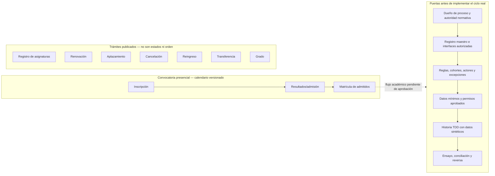
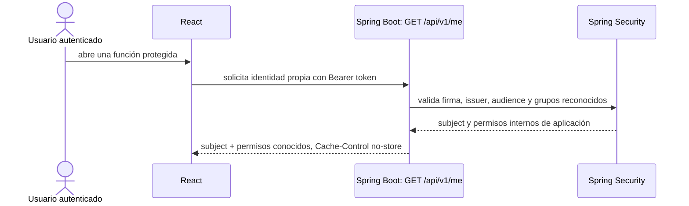
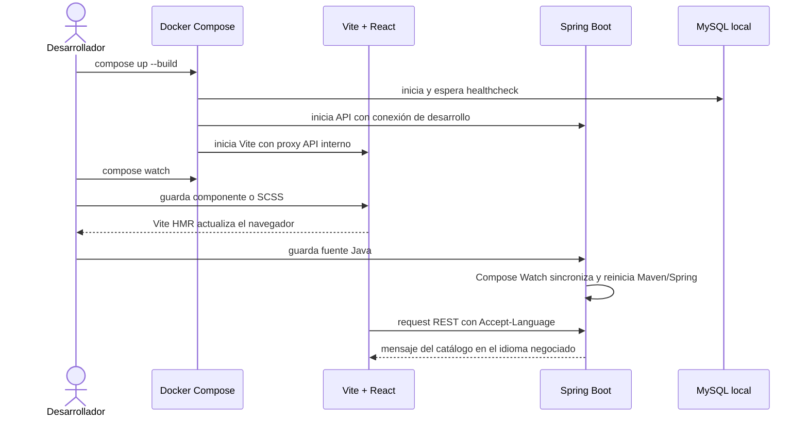
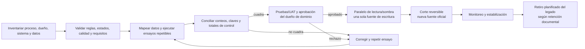

# Procesos transversales

## Edición y publicación de identidad visual

```mermaid
sequenceDiagram
  actor Admin as Administrador de identidad visual
  participant UI as React: Centro de Identidad Visual
  participant API as Spring Boot: Branding API
  participant Auth as Spring Security
  participant Validator as Validador de imágenes
  participant Asset as Puerto de almacenamiento de activos
  participant DB as MySQL
  participant Public as React: app universitaria

  Admin->>UI: cambia paleta, logos, banners o etiquetas
  UI->>API: solicita lectura o cambio autenticado
  API->>Auth: valida token y permiso interno según método/ruta
  Auth-->>API: principal y permiso branding:read o branding:write
  opt Subida de imagen
    UI->>API: envía PNG, JPEG o WebP
    API->>Validator: valida firma, decodificación, tamaño y dimensiones
    Validator-->>API: MIME detectado, dimensiones y huella SHA-256
    API->>Asset: escribe con UUID en staging y publica archivo completo
    Asset-->>API: clave generada; sin nombre original
    API->>DB: transacción: metadatos + evento de auditoría de carga
    DB-->>API: commit o rollback
    opt La escritura de metadatos falla
      API->>Asset: elimina el archivo para evitar huérfanos
    end
  end
  API->>API: valida colores, contraste, etiquetas y fechas
  API->>DB: transacción: versión + configuración + evento de auditoría
  DB-->>API: commit
  API-->>UI: versión publicada y previsualización
  Public->>API: GET de configuración pública versionada
  API-->>Public: configuración sin datos de administración
  Public->>API: solicita el activo de un logo o banner
  API->>DB: confirma que el activo pertenece a la revisión vigente y está en ventana
  DB-->>API: tipo MIME y checksum registrados
  API->>Asset: lee dentro del límite de bytes registrado
  Asset-->>API: bytes verificados por tamaño y SHA-256
  API-->>Public: imagen raster y headers seguros
  Public->>Public: aplica CSS tokens y muestra activos con texto alternativo
```

Si una validación o persistencia falla, no se publica una versión parcial. El API público solo expone configuración visual aprobada; los endpoints de administración requieren permiso comprobado en backend. La lista método/ruta vigente es `GET` y `PUT /api/v1/admin/branding`, `POST /api/v1/admin/branding/rollback` y `POST /api/v1/admin/branding/assets`. Las demás rutas o métodos bajo `/api/v1/admin/**` se deniegan hasta que cada capacidad defina y pruebe su autorización.

## Pregrado presencial y gate de descubrimiento

El alcance de descubrimiento priorizado es pregrado presencial. La fuente pública de ACRA calendariza las etapas de una convocatoria (incluida inscripción, resultados y matrícula de admitidos) y separa el catálogo de trámites del estudiante: registro de asignaturas, renovación, aplazamiento, cancelación, reingreso, transferencia y grado. El catálogo no prueba una secuencia universal ni que cada trámite comparta reglas entre modalidad, sede, programa o cohorte.



La flecha punteada hacia el gate es una dependencia por descubrir, no un estado confirmado del estudiante. La lista de servicios se mantiene desconectada deliberadamente hasta que los responsables aprueben el proceso y su relación. El detalle de las fuentes y decisiones pendientes está en [descubrimiento del ciclo](../discovery/student-lifecycle-baseline.md).

## Catálogo académico — importar, revisar y publicar

Este es el flujo académico que sí existe en v1. Representa planes de estudio y asignaturas versionados para pregrado presencial; no da de alta estudiantes ni matrícula. El flujo presupone un principal autorizado en un entorno con el proveedor institucional ya configurado. En Compose las rutas administrativas responden 401 porque no hay proveedor ni token de prueba. El formato de intercambio está en [la plantilla de encabezados CSV](../templates/academic-curriculum-template.csv); no contiene registros oficiales ni filas de ejemplo.

```mermaid
sequenceDiagram
  actor Operador as Operador académico autorizado
  actor Comunidad as Visitante de consulta
  participant UI as React: vista previa del catálogo
  participant API as Spring Boot: Academic Catalog API
  participant Auth as Spring Security
  participant CSV as Parser y validador CSV
  participant UseCase as Casos de uso de academics
  participant Repo as JDBC AcademicCatalogRepository
  participant DB as MySQL 8.4

  Operador->>UI: solicita la plantilla desde el panel
  UI->>API: GET /api/v1/academic-catalog/curriculum-template
  API-->>UI: CSV UTF-8 descargable generado desde CurriculumCsvSchema.HEADERS
  Operador->>UI: carga archivo de una versión curricular
  UI->>API: POST /api/v1/admin/academic-catalog/import-previews (multipart file)
  API->>Auth: autentica y exige academic:catalog:write
  Auth-->>API: sujeto y permiso interno validados en un entorno configurado
  API->>CSV: lee máximo 2 MiB y valida UTF-8, encabezados, filas y límites
  alt Archivo inválido o exceso de límite
    CSV-->>API: error localizado con fila/campo seguro
    API-->>UI: 400 o 413; sin escritura en MySQL
  else Archivo válido
    CSV-->>UseCase: contrato tipado completo + SHA-256 del origen
    UseCase-->>UI: 200 con metadata, conteo, semestres y muestra de hasta 10 filas
    Note over UseCase,DB: La prevalidación no invoca el repositorio ni crea auditoría
    Operador->>UI: revisa la muestra y confirma crear borrador
    UI->>API: POST /api/v1/admin/academic-catalog/imports (multipart file)
    API->>Auth: autentica y exige academic:catalog:write otra vez
    Auth-->>API: sujeto y permiso interno validados
    API->>CSV: vuelve a leer y validar el archivo completo
    CSV-->>UseCase: contrato tipado completo + SHA-256 del origen
    UseCase->>Repo: crear borrador validado
    Repo->>DB: transacción: identidades/revisiones + plan + entradas + evento CURRICULUM_IMPORTED
    DB-->>Repo: commit; el plan queda DRAFT
    Repo-->>UI: 201 con resumen del borrador
    Operador->>UI: abre el borrador y revisa sus asignaturas
    UI->>API: GET /api/v1/admin/academic-catalog/curricula/{id}
    API->>Auth: exige academic:catalog:read
    API-->>UI: resumen y entradas del borrador
    Operador->>UI: solicita publicar
    UI->>API: POST /api/v1/admin/academic-catalog/curricula/{id}/publish
    API->>Auth: exige academic:catalog:write
    API->>Repo: transición condicional DRAFT → PUBLISHED
    Repo->>DB: transacción: UPDATE condicional + evento CURRICULUM_PUBLISHED
    alt Borrador publicado por otro operador o no existe
      DB-->>API: conflicto 409 o no encontrado 404
    else Publicación confirmada
      DB-->>Repo: commit
      API-->>UI: versión publicada e inmutable
    end
  end
  UI->>API: GET /api/v1/academic-catalog/programs
  API->>DB: consulta solo programas con plan PUBLISHED
  DB-->>API: catálogo público; en desarrollo retorna [] hasta una publicación autorizada
  API-->>UI: versiones publicadas y cohortes
  Comunidad->>UI: elige una versión publicada
  UI->>API: GET /api/v1/academic-catalog/curricula/{id}
  API->>UseCase: consultar metadata pública por UUID
  UseCase->>Repo: buscar resumen de versión publicada
  Repo->>DB: leer currículo y programa, sin asignaturas
  DB-->>Repo: metadata y estado
  alt Borrador o versión inexistente
    UseCase-->>API: no encontrada
    API-->>UI: 404 curriculum_not_found
  else Estado PUBLISHED
    UseCase-->>API: resumen público
    API-->>UI: 200 con metadata raíz sin entradas
    UI->>API: GET /api/v1/academic-catalog/curricula/{id}/entries?page=1&pageSize=100
    API->>UseCase: consultar página pública de asignaturas
    UseCase->>Repo: contar y leer la página solicitada
    Repo->>DB: transacción de solo lectura; filtro PUBLISHED y parámetros enlazados
    DB-->>Repo: total filtrado + hasta 100 filas en orden estable
    Repo-->>UseCase: metadata de página y asignaturas
    UseCase-->>API: respuesta acotada
    API-->>UI: página, totalItems, totalPages y filas
    UI->>UI: renderiza solo las asignaturas de la página
    UI-->>Comunidad: muestra tabla accesible de máximo 100 filas
  end
```

La API pública lista programas con un plan publicado y ofrece sus versiones por programa; nunca expone borradores. El detalle público obtiene metadata separada de entradas y consulta páginas filtradas por código/nombre o semestre; solo `PUBLISHED` puede producir conteos o filas, y borradores y UUID inexistentes comparten 404 en ambos endpoints. La consulta de página fija el tamaño máximo en 100, enlaza parámetros, escapa los comodines SQL y mantiene orden `(semester, row_order)`. La interfaz pide la metadata y su primera página en paralelo; espera 250 ms para búsqueda de texto, vuelve a página 1 al cambiar filtros y cancela solicitudes anteriores con `AbortSignal`. `GET` administrativo de borradores y detalle requiere `academic:catalog:read`; la prevalidación, importación y publicación requieren `academic:catalog:write`. `POST /import-previews` valida el mismo contrato, devuelve metadata, semestres y como máximo 10 filas sin persistir datos ni eventos; `POST /imports` vuelve a validar antes de la transacción de escritura. Cada método/ruta administrativa debe estar allowlisted y probado; un token de lectura no permite escritura. Los nombres actuales son permisos internos de producto, no mapeos aprobados de grupos UPTC. Sin issuer, audience y grupos institucionales el Compose local no puede importar ni publicar. La ruta React `/#programas` está disponible como vista previa, mientras `programs.available` continúa `false`; eso no activa el módulo ni demuestra autorización para operación.

## Consulta de identidad propia



La respuesta no reproduce claims de perfil ni datos de otras personas. Sin un token OIDC institucional válido, la API responde 401; Compose no incluye una cuenta ni proveedor de demostración.

## Desarrollo local y selección de idioma



El encabezado `Accept-Language` elige el bundle del backend; sin preferencia, se usa `es-CO`. Compose Watch y la base persistente son exclusivamente locales de desarrollo.

## Reemplazo y corte de un dominio


