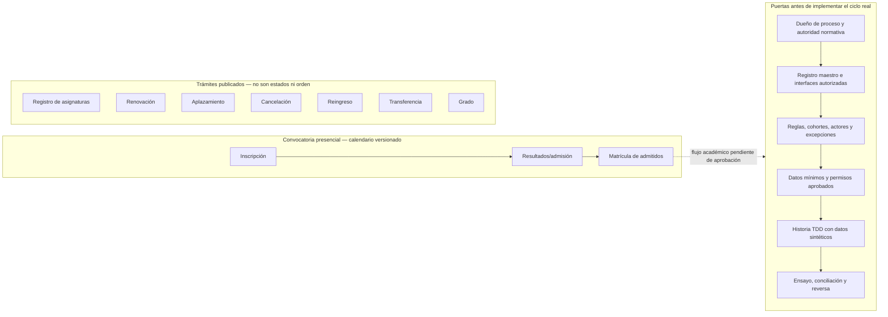
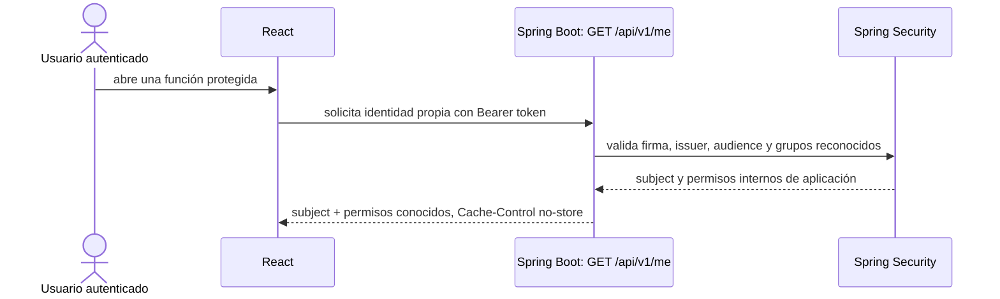
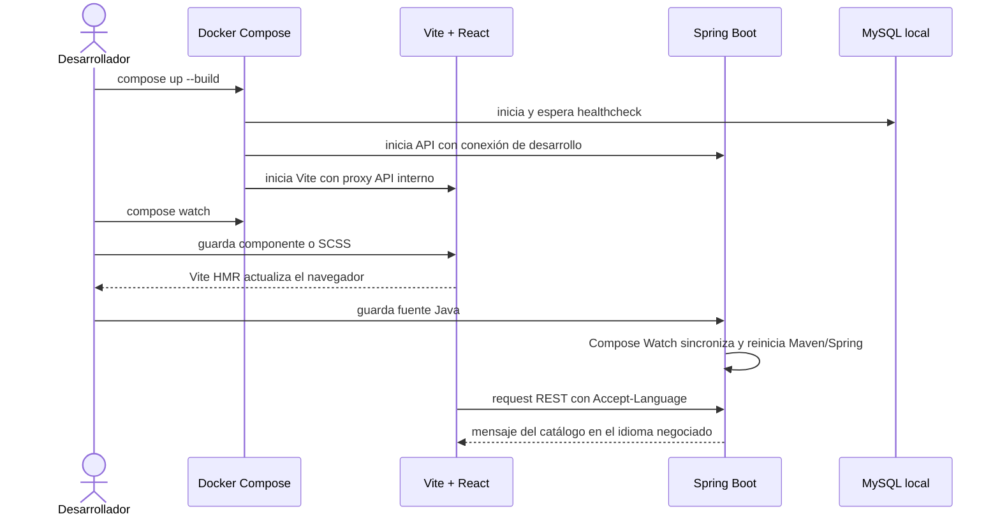
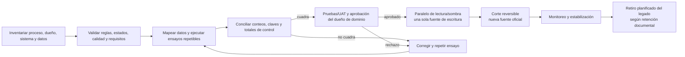

# Procesos transversales

## Edición y publicación de identidad visual

```mermaid
sequenceDiagram
  actor Admin as Administrador de identidad visual
  participant UI as React: Centro de Identidad Visual
  participant API as Spring Boot: Branding API
  participant Auth as Spring Security
  participant Validator as Validador de imágenes
  participant Asset as Puerto de almacenamiento de activos
  participant DB as MySQL
  participant Public as React: app universitaria

  Admin->>UI: cambia paleta, logos, banners o etiquetas
  UI->>API: solicita lectura o cambio autenticado
  API->>Auth: valida token y permiso interno según método/ruta
  Auth-->>API: principal y permiso branding:read o branding:write
  opt Subida de imagen
    UI->>API: envía PNG, JPEG o WebP
    API->>Validator: valida firma, decodificación, tamaño y dimensiones
    Validator-->>API: MIME detectado, dimensiones y huella SHA-256
    API->>Asset: escribe con UUID en staging y publica archivo completo
    Asset-->>API: clave generada; sin nombre original
    API->>DB: transacción: metadatos + evento de auditoría de carga
    DB-->>API: commit o rollback
    opt La escritura de metadatos falla
      API->>Asset: elimina el archivo para evitar huérfanos
    end
  end
  API->>API: valida colores, contraste, etiquetas y fechas
  API->>DB: transacción: versión + configuración + evento de auditoría
  DB-->>API: commit
  API-->>UI: versión publicada y previsualización
  Public->>API: GET de configuración pública versionada
  API-->>Public: configuración sin datos de administración
  Public->>API: solicita el activo de un logo o banner
  API->>DB: confirma que el activo pertenece a la revisión vigente y está en ventana
  DB-->>API: tipo MIME y checksum registrados
  API->>Asset: lee dentro del límite de bytes registrado
  Asset-->>API: bytes verificados por tamaño y SHA-256
  API-->>Public: imagen raster y headers seguros
  Public->>Public: aplica CSS tokens y muestra activos con texto alternativo
```

Si una validación o persistencia falla, no se publica una versión parcial. El API público solo expone configuración visual aprobada; los endpoints de administración requieren permiso comprobado en backend. La lista método/ruta vigente es `GET` y `PUT /api/v1/admin/branding`, `POST /api/v1/admin/branding/rollback` y `POST /api/v1/admin/branding/assets`. Las demás rutas o métodos bajo `/api/v1/admin/**` se deniegan hasta que cada capacidad defina y pruebe su autorización.

## Pregrado presencial y gate de descubrimiento

El alcance de descubrimiento priorizado es pregrado presencial. La fuente pública de ACRA calendariza las etapas de una convocatoria (incluida inscripción, resultados y matrícula de admitidos) y separa el catálogo de trámites del estudiante: registro de asignaturas, renovación, aplazamiento, cancelación, reingreso, transferencia y grado. El catálogo no prueba una secuencia universal ni que cada trámite comparta reglas entre modalidad, sede, programa o cohorte.



La flecha punteada hacia el gate es una dependencia por descubrir, no un estado confirmado del estudiante. La lista de servicios se mantiene desconectada deliberadamente hasta que los responsables aprueben el proceso y su relación. El detalle de las fuentes y decisiones pendientes está en [descubrimiento del ciclo](../discovery/student-lifecycle-baseline.md).

## Consulta de identidad propia



La respuesta no reproduce claims de perfil ni datos de otras personas. Sin un token OIDC institucional válido, la API responde 401; Compose no incluye una cuenta ni proveedor de demostración.

## Desarrollo local y selección de idioma



El encabezado `Accept-Language` elige el bundle del backend; sin preferencia, se usa `es-CO`. Compose Watch y la base persistente son exclusivamente locales de desarrollo.

## Reemplazo y corte de un dominio


