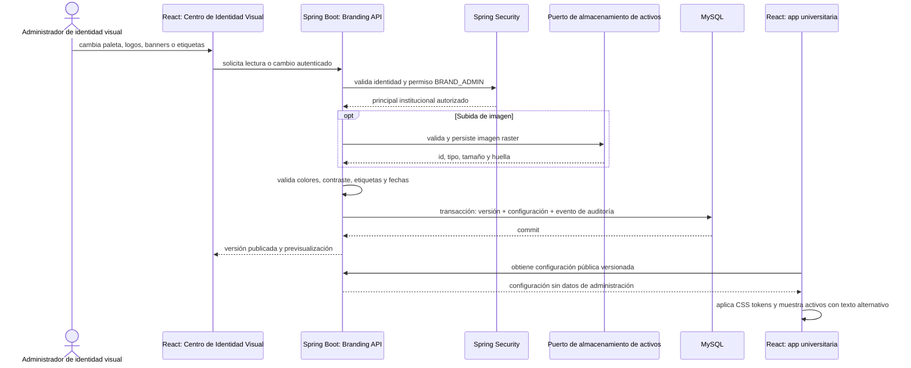
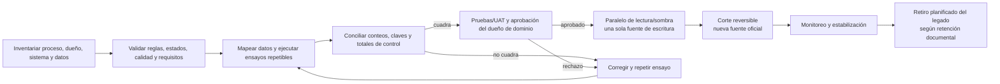

# Procesos transversales

## Edición y publicación de identidad visual

Si una validación o persistencia falla, no se publica una versión parcial. El API público solo expone configuración visual aprobada; los endpoints de administración requieren permiso comprobado en backend.

## Reemplazo y corte de un dominio

