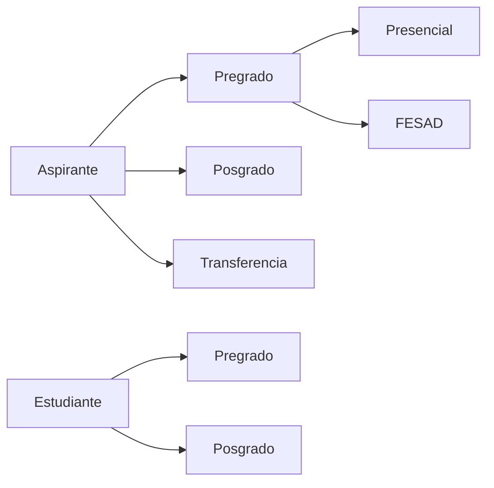

# Descubrimiento inicial: identidad y ciclo del estudiante

**Corte de fuentes públicas:** 2026-09-29  
**Estado:** insumo preliminar; requiere validación con dueños de proceso UPTC  
**Datos personales:** ninguno

## Hechos observables en fuentes oficiales

| Evidencia | Observación publicada | Límite |
|---|---|---|
| [Admisiones y Control de Registro Académico (ACRA)](https://uptc.edu.co/sitio/portal/sitios/universidad/vic_aca/adm_reg/) | La página separa aspirantes de pregrado, posgrado y transferencia; y estudiantes de pregrado y posgrado. La página indica actualización al 22 de septiembre de 2026. | La navegación pública no especifica todas las transiciones internas ni identifica los sistemas que hoy son fuente oficial. |
| [Aspirante de pregrado y calendario 2027-1](https://uptc.edu.co/sitio/portal/sitios/universidad/vic_aca/adm_reg/1aspi/pre/) | Publica convocatorias, resoluciones y calendarios distintos para pregrado presencial y FESAD. Advierte que los nombres y el código SNP deben coincidir con los datos de ICFES. La página indica actualización al 15 de septiembre de 2026. | Calendarios y requisitos son vigentes por convocatoria; no deben codificarse como constantes ni generalizarse a posgrado o transferencias. |
| [Reglamento estudiantil de pregrado](https://www.uptc.edu.co/sitio/portal/sitios/universidad/vic_aca/adm_reg/2estu/regest_pre.html) y [documento de reglamento de posgrado](https://www.uptc.edu.co/sitio/portal/sitios/estudiantes/.content/doc/foll_reg_estud_posg.pdf) | UPTC publica referencias reglamentarias separadas para pregrado y posgrado. La página de pregrado indica actualización al 11 de julio de 2024. | Hay que validar con Secretaría General y los dueños académicos qué versiones, acuerdos por cohorte y modificaciones están vigentes para cada proceso. |

## Mapa de rutas publicado

El diagrama resume únicamente la separación visible en la navegación de ACRA. No representa estados, requisitos, autorizaciones ni una máquina de estados aprobada.

## Decisiones que bloquean la implementación del ciclo real

1. Priorizar alcance inicial: pregrado presencial, FESAD, posgrado, transferencias o una cohorte acotada.
2. Nombrar al dueño de proceso y a la autoridad normativa para cada ruta; obtener reglamentos, acuerdos, resoluciones, calendarios y excepciones vigentes, con fecha de vigencia y cohortes afectadas.
3. Confirmar el registro maestro actual para aspirantes, personas y estudiantes, sus sistemas, propietarios, identificadores estables e interfaces autorizadas.
4. Aprobar los datos personales mínimos para cada etapa, su propósito, acceso por rol, trazabilidad, retención y corrección. No importar documentos, datos sensibles ni expedientes reales a desarrollo.
5. Acordar transiciones válidas, actores responsables, reversas, recursos y efectos en matrícula para la ruta priorizada.
6. Confirmar grupos y claims del proveedor institucional; mapearlos a permisos internos de lectura, actualización y administración.
7. Definir datasets de ensayo sintéticos/anonimizados, totales de conciliación, aceptación del dueño de datos y rollback antes de cualquier ensayo de migración.

## Guardas de implementación

- No crear un enum global de estado del estudiante antes de validar las diferencias de nivel, modalidad, cohorte y norma.
- Mantener aplicaciones, admisiones, matrícula y condición de estudiante como conceptos por aclarar; no suponer que son el mismo registro o una sola transición.
- Mantener las autorizaciones en el backend. El backend ya tiene permisos internos de aplicación, pero los nombres de grupos actuales son ejemplos técnicos y no equivalen a roles UPTC confirmados.
- No conectar la plataforma a producción ni reemplazar una fuente oficial con base en las páginas públicas.

## Próximo resultado verificable

Un mapa de contexto por ruta priorizada, catálogo de eventos y reglas aprobado por responsables, contrato de datos minimizado, matriz actor-permiso y criterios de migración/conciliación. Solo después se planifica la primera historia TDD del expediente estudiantil con fixtures sintéticos.
