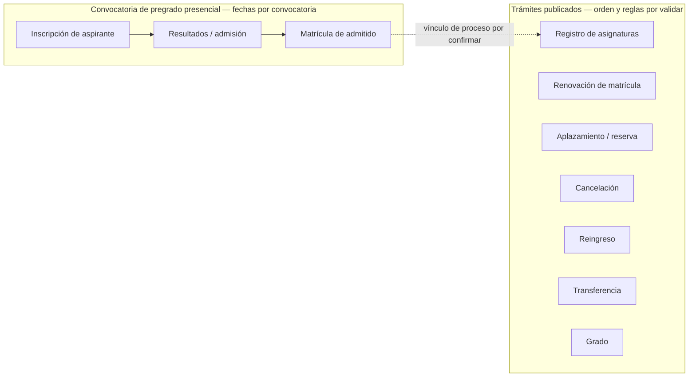
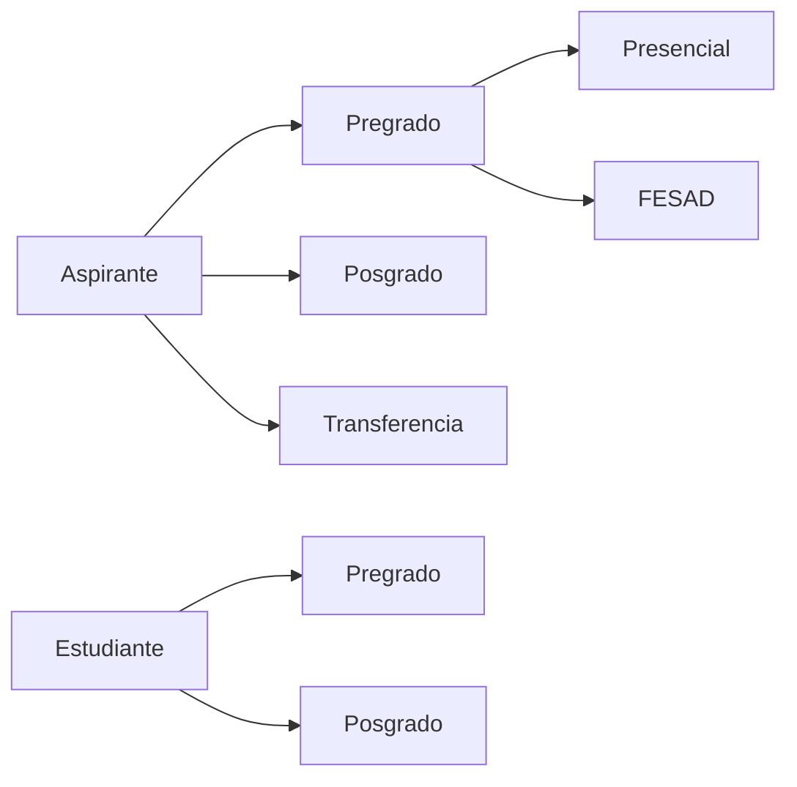

# Descubrimiento inicial: identidad y ciclo del estudiante

**Corte de fuentes públicas:** 2026-09-30 
**Estado:** insumo preliminar; requiere validación con dueños de proceso UPTC  
**Datos personales:** ninguno

## Alcance priorizado

La primera ruta a descubrir es **pregrado presencial**, por decisión del patrocinador del proyecto. El primer subproceso priorizado es **inscripción y selección de aspirantes**. FESAD/virtual y posgrado quedan fuera de este primer corte. La transferencia hacia programas presenciales se mantiene como un borde por definir con el dueño del proceso; no se le aplicarán automáticamente reglas de admisión ordinaria. Esto prioriza investigación; no constituye aprobación de reglas, datos o reemplazo de SIRA.

## Límite de implementación actual

La entrega de catálogo académico relacionada con esta ruta solo organiza programas y planes curriculares versionados por cohorte, con sus asignaturas. No modela aspirantes, personas, admisión, matrícula ni estado estudiantil; el módulo `students` continúa sin implementar. La vista `/#programas` es un preview local, la lista pública no incluye borradores y la marca institucional `programs.available` permanece deshabilitada. No se han cargado programas oficiales ni datos personales. Para implementar el ciclo del estudiante siguen siendo obligatorios los gates de proceso, datos, norma, permisos y autoridad descritos abajo.

## Hechos observables en fuentes oficiales

| Evidencia | Observación publicada | Límite |
|---|---|---|
| [Admisiones y Control de Registro Académico (ACRA)](https://uptc.edu.co/sitio/portal/sitios/universidad/vic_aca/adm_reg/) | La página separa aspirantes de pregrado, posgrado y transferencia; y estudiantes de pregrado y posgrado. La página indica actualización al 22 de septiembre de 2026. | La navegación pública no especifica todas las transiciones internas ni identifica los sistemas que hoy son fuente oficial. |
| [Aspirante de pregrado y calendario 2027-1](https://uptc.edu.co/sitio/portal/sitios/universidad/vic_aca/adm_reg/1aspi/pre/) | Publica convocatorias, resoluciones y calendarios distintos para pregrado presencial y FESAD. Advierte que los nombres y el código SNP deben coincidir con los datos de ICFES. La página indica actualización al 15 de septiembre de 2026. | Calendarios y requisitos son vigentes por convocatoria; no deben codificarse como constantes ni generalizarse a posgrado o transferencias. |
| [Reglamento estudiantil de pregrado](https://www.uptc.edu.co/sitio/portal/sitios/universidad/vic_aca/adm_reg/2estu/regest_pre.html) | UPTC publica el Acuerdo 130 de 1998 para pregrado presencial. La página indica actualización al 11 de julio de 2024. | Hay que validar con Secretaría General y los dueños académicos qué versiones, acuerdos por cohorte y modificaciones están vigentes para cada proceso. |
| [Inscripción de pregrado presencial](https://uptc.edu.co/sitio/portal/sitios/universidad/vic_aca/adm_reg/1aspi/pre/p2_aspreg_preg.html) | La página de registro indica que se requiere documento y PIN; permite consultar el registro y corregirlo hasta el cierre, salvo el número de documento. | Es el comportamiento publicado para la inscripción en ese canal; la propiedad y el sistema maestro de estos datos no se identifican allí. No implementar captura/corrección de datos personales sin contrato institucional. |
| [Calendario de aspirantes de pregrado](https://uptc.edu.co/sitio/portal/sitios/universidad/vic_aca/adm_reg/1aspi/pre/) | La convocatoria 2027-1 distingue presencial de FESAD, publica Resolución 111 de 2026 para presencial y señala que nombres/apellidos y código SNP deben corresponder a ICFES. | Fechas, requisitos y reglas son propios de la convocatoria; deben venir de una fuente administrable/versionada y no quedar como constantes de código. |
| [ACRA — estudiante de pregrado](https://uptc.edu.co/sitio/portal/sitios/universidad/vic_aca/adm_reg/2estu/est_pre.html) | La página de 2026-2 publica por separado inscripción de asignaturas, pagos/matrícula y cancelaciones; cita Acuerdo 032 de 2020 para cancelación y enumera resoluciones que modifican calendario. | Las fechas y reglas operativas dependen del calendario aprobado y sus modificaciones; no son una máquina de estados universal. |
| [Catálogo institucional de trámites](https://uptc.edu.co/sitio/portal/sitios/universidad/taip/ntaip/05_tram/) | ACRA/portal institucional publica, entre otros, matrícula de admitidos de pregrado, aplazamiento, cancelación, registro de asignaturas, reingreso, renovación, transferencia y grado. | El catálogo confirma capacidades/trámites publicados, pero no establece su orden total, criterios de elegibilidad, actores, sistemas ni excepciones. |
| [Normatividad estudiantil UPTC](https://dsp.uptc.edu.co/sitio/portal/sitios/universidad/vic_aca/vic_acad/asu_est/normest.html), [Acuerdo 130 de 1998](https://cnormativa.uptc.edu.co/DocCompNormativa/130DE1998.pdf), [índice de acuerdos de 2020](https://www.uptc.edu.co/secretaria_general/consejo_superior/acuerdos_2020/index.html) | La UPTC publica el Acuerdo 130 de 1998 como reglamento de pregrado y el Acuerdo 032 de 2020 como modificación de su artículo 40. | La norma base y una modificación visible no bastan para afirmar que se tiene la compilación jurídica vigente completa. Secretaría General y los dueños deben confirmar versiones, alcance, vigencias, transitorios y reglas por cohorte. |

### Actualización de fuentes consultadas el 30 de septiembre de 2026

- La página ACRA de aspirantes informa que la convocatoria presencial 2027-1 abre la venta de PIN del 21 de septiembre al 21 de octubre de 2026; el registro de inscripción aparece hasta el 23 de octubre, las pruebas especiales el 28 y 29 de octubre, la publicación de resultados el 13 de noviembre, el formulario ISE del 17 al 27 de noviembre y el pago ordinario de matrícula del 23 de noviembre al 10 de diciembre. La misma página enlaza la Resolución 111 de 2026 para presencial y la 112 de 2026 para distancia. Son fechas publicadas por convocatoria, no valores para constantes de software. [Fuente ACRA — aspirante de pregrado](https://uptc.edu.co/sitio/portal/sitios/universidad/vic_aca/adm_reg/1aspi/pre/)
- La página ACRA de estudiantes para 2026-2 combina información de presencial, FESAD y sedes. Publica, entre otros, inscripción web de asignaturas del 22 de junio al 10 de julio, cancelación presencial hasta el 30 de octubre (distancia: 31 de octubre) y fin de clases presencial el 27 de noviembre. El listado visible de calendario incluye las resoluciones 145 de 2025, 146 de 2025, 054 de 2026, 079 de 2026 y 104 de 2026. Antes de atribuir fechas a una población/cohorte o codificar reglas hay que leer cada acto aplicable y confirmar cuál versión rige. [Fuente ACRA — estudiante de pregrado](https://dsp.uptc.edu.co/sitio/portal/sitios/universidad/vic_aca/adm_reg/2estu/est_pre.html)
- ACRA indica además que, para la convocatoria presencial 2027-1, los nombres y apellidos deben coincidir con ICFES y debe verificarse el código SNP; el portal advierte que los errores pueden anular la inscripción. Esto orienta preguntas sobre validación y fuente de datos, pero no autoriza replicar la captura, corrección o decisión de anulación sin contrato institucional y validación normativa. [Fuente ACRA — aspirante de pregrado](https://uptc.edu.co/sitio/portal/sitios/universidad/vic_aca/adm_reg/1aspi/pre/)

La fecha de consulta y la fecha de actualización que muestra cada página no son equivalentes. Este corte registra lo que el portal público mostraba el 30 de septiembre de 2026 y debe releerse durante el descubrimiento; los actos normativos originales y la confirmación del dueño del proceso prevalecen sobre un resumen web.

## Mapa público de pregrado presencial

El calendario vigente de la convocatoria y el catálogo de trámites permiten identificar dos grupos de capacidades. El primer grupo (inscripción, publicación de resultados y matrícula de admitidos) aparece calendarizado para convocatorias específicas. El segundo enumera trámites de estudiantes; la información pública consultada no demuestra que todos apliquen a la misma modalidad/cohorte ni define una secuencia única.

Las cajas del segundo grupo son un inventario de nombres publicados, no estados de persona/estudiante ni transiciones autorizadas. El vínculo punteado marca una hipótesis de descubrimiento y debe sustituirse por el flujo aprobado por ACRA, Vicerrectoría Académica, Secretaría General y los programas participantes. La ruta de admisión también requiere los documentos vigentes de selección, calendario, cupos, novedades y reclamaciones.

## Primer subproceso priorizado: inscripción y selección

Para el proceso publicado de primer semestre de 2027, ACRA presenta venta de PIN, inscripción, pruebas especiales para programas señalados, publicación de resultados, formulario ISE, pago de matrícula y llamado de opcionados. Los hitos tienen ventanas y actores que se solapan; el diagrama anterior los muestra como hitos de convocatoria, no como una única máquina de estados. La página vigente enlaza la Resolución 111 de 2026 para la modalidad presencial y advierte que el aspirante debe contar con resultados Saber 11, que los nombres deben coincidir con ICFES y que se debe validar el código SNP.

Antes de implementar formularios o una selección automática, ACRA y la autoridad normativa deben confirmar en la resolución y sus anexos: requisitos y datos por aspirante, programas/opciones, cupos, reglas de puntaje y desempate, pruebas especiales, novedades, anulaciones, reclamaciones, listas de opcionados, vigencias y cambios posteriores. También deben confirmar la fuente maestra y las interfaces autorizadas con ICFES y con el sistema institucional que hoy administra el proceso. Ninguna regla de selección se deduce de la secuencia de fechas de la página pública.

La solución deberá versionar cada convocatoria y su calendario con referencia al acto oficial que los respalda; no deberá convertir las fechas de 2027-I en constantes ni mezclar una corrección posterior con el acto original. Hasta confirmar contrato de datos, finalidad, controles de acceso, retención y responsables, las pruebas usarán registros ficticios y no se almacenarán documentos, PIN, datos ICFES ni expedientes reales.

## Mapa de rutas publicado

El diagrama resume únicamente la separación visible en la navegación de ACRA. No representa estados, requisitos, autorizaciones ni una máquina de estados aprobada.

## Decisiones que bloquean la implementación del ciclo real

1. Nombrar al dueño de proceso y autoridad normativa para pregrado presencial; entregar reglamento compilado, acuerdos, resoluciones y calendarios vigentes, incluyendo transitorios, vigencias y cohortes afectadas.
2. El patrocinador priorizó inscripción y selección para pregrado presencial. Falta que ACRA y la autoridad normativa delimiten si el primer corte cubre solo un tramo de la convocatoria o también matrícula inicial; además deben identificar sedes, programas y cohorte(s) piloto.
3. Confirmar el registro maestro actual para aspirantes, personas y estudiantes, sistemas responsables, identificadores estables, contratos de integración y política de conciliación. Referencias históricas a SIRA son antecedentes, no prueba de estado actual.
4. Aprobar los datos personales mínimos para cada etapa, su propósito, acceso por rol, trazabilidad, retención y corrección. No importar documentos, datos sensibles ni expedientes reales a desarrollo.
5. Acordar transiciones válidas, actores responsables, excepciones, reversas, recursos y efectos en matrícula, asignaturas y obligaciones financieras.
6. Confirmar grupos y claims del proveedor institucional; mapearlos a permisos internos de lectura, actualización y administración.
7. Definir datasets de ensayo sintéticos/anonimizados, totales de conciliación, aceptación del dueño de datos y rollback antes de cualquier ensayo de migración.

## Guardas de implementación

- No crear un enum global de estado del estudiante antes de validar las diferencias de nivel, modalidad, cohorte y norma.
- Mantener aplicaciones, admisiones, matrícula y condición de estudiante como conceptos por aclarar; no suponer que son el mismo registro o una sola transición.
- Mantener las autorizaciones en el backend. El backend ya tiene permisos internos de aplicación, pero los nombres de grupos actuales son ejemplos técnicos y no equivalen a roles UPTC confirmados.
- No conectar la plataforma a producción ni reemplazar una fuente oficial con base en las páginas públicas.

## Próximo resultado verificable

Un mapa de proceso de pregrado presencial y fuentes normativas confirmado por responsables, catálogo de eventos y reglas aprobado, contrato de datos minimizado, matriz actor-permiso y criterios de migración/conciliación. Solo después se planifica la primera historia TDD de expediente estudiantil con fixtures sintéticos. La fuente pública sirve para orientar el taller; no sustituye el acta de aprobación institucional.

Para reunir esas decisiones en una sesión, usar la [plantilla de validación institucional de pregrado presencial](pregrado-presencial-validacion-institucional.md). Sus campos quedan intencionalmente vacíos hasta que los responsables UPTC los confirmen.
