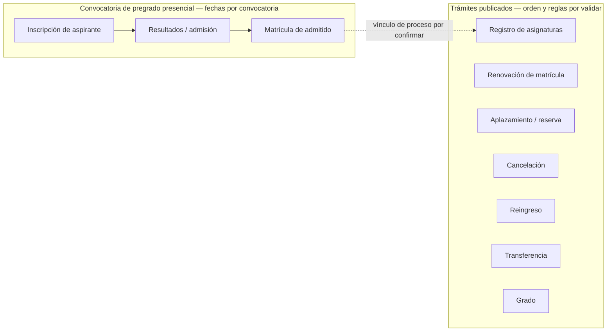
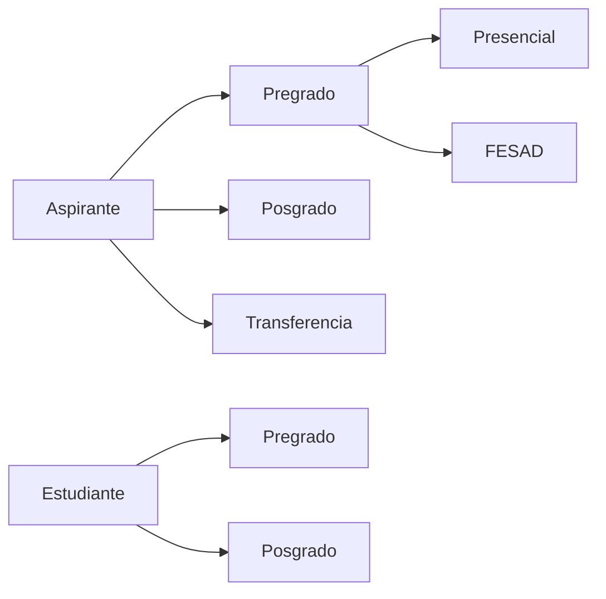

# Descubrimiento inicial: identidad y ciclo del estudiante

**Corte de fuentes públicas:** 2026-10-01 (admisiones/normativa: 2026-09-30; sistemas y gobierno de datos: 2026-10-01) 
**Estado:** insumo preliminar; requiere validación con dueños de proceso UPTC  
**Datos personales:** ninguno

## Alcance priorizado

La primera ruta a descubrir es **pregrado presencial**, por decisión del patrocinador del proyecto. El primer subproceso priorizado es **inscripción y selección de aspirantes**. FESAD/virtual y posgrado quedan fuera de este primer corte. La transferencia hacia programas presenciales se mantiene como un borde por definir con el dueño del proceso; no se le aplicarán automáticamente reglas de admisión ordinaria. Esto prioriza investigación; no constituye aprobación de reglas, datos o reemplazo de SIRA.

## Límite de implementación actual

La entrega de catálogo académico relacionada con esta ruta solo organiza programas y planes curriculares versionados por cohorte, con sus asignaturas. No modela aspirantes, personas, admisión, matrícula ni estado estudiantil; el módulo `students` continúa sin implementar. La vista `/#programas` es un preview local, la lista pública no incluye borradores y la marca institucional `programs.available` permanece deshabilitada. No se han cargado programas oficiales ni datos personales. Los boletines UPTC de 2025 describen actualización de SIRA para PAE, planes, oferta y horarios; además, el informe anual de rendición de cuentas reporta la formulación al 100 % de la Fase III para un nuevo sistema académico alternativo a SIRA y 50 % de avance para la meta 2025 de ejecutar el 90 % de las fases de desarrollo; ese indicador no equivale al porcentaje de sistema construido. Su estado actual y relación con esta plataforma requieren decisión institucional antes de ampliar módulos coincidentes. El catálogo local no se tratará como fuente institucional ni recibirá carga oficial. Para implementar el ciclo del estudiante siguen siendo obligatorios los gates de proceso, datos, norma, permisos y autoridad descritos abajo.

## Hechos observables en fuentes oficiales

| Evidencia | Observación publicada | Límite |
|---|---|---|
| [Admisiones y Control de Registro Académico (ACRA)](https://uptc.edu.co/sitio/portal/sitios/universidad/vic_aca/adm_reg/) | La página separa aspirantes de pregrado, posgrado y transferencia; y estudiantes de pregrado y posgrado. La página indica actualización al 22 de septiembre de 2026. | La navegación pública no especifica todas las transiciones internas ni identifica los sistemas que hoy son fuente oficial. |
| [Actualización SIRA — boletines de Vicerrectoría Académica de 2025](https://www.uptc.edu.co/sitio/export/sites/default/portal/sitios/universidad/vic_aca/vic_acad/inf/doc/2025/001_bolvicacad_2025.pdf), [rendición de cuentas UPTC 2025](https://www.uptc.edu.co/sitio/export/sites/default/portal/sitios/universidad/rectoria/planeacion/rdc/.content/doc/2026/aud_pub/infrdc_2025.pdf), [app móvil institucional (2023)](https://www.uptc.edu.co/sitio/portal/cal_not_eve/noticias/det/Aplicaciones-de-la-UPTC-ahora-disponibles-en-Google-Play/) | Los boletines describen para 2025 bases de datos, carga de planes, migración y trabajo con DTIC para PAE, planes de estudio, prerrequisitos, créditos de libre elección, oferta/programación de cursos y horarios. El informe anual reporta Fase III del nuevo sistema alternativo a SIRA formulada al 100 % y 50 % de avance en la meta de ejecutar el 90 % de las fases de desarrollo durante 2025; describe alcance, arquitectura propuesta y hoja de ruta. El de 2023 describe acceso móvil a Web Estudiante, Web Docente, Mesa de Servicio, consultas, calificaciones y horarios. | Los informes confirman hitos de planificación/ejecución reportados en 2025, no qué quedó desplegado en 2026. La nota de app es de 2023. Ninguna fuente sustituye inventario actual, contratos ni confirmación de sistemas propietarios. |
| [Aspirante de pregrado y calendario 2027-1](https://uptc.edu.co/sitio/portal/sitios/universidad/vic_aca/adm_reg/1aspi/pre/) y [Resolución 111 de 2026](https://apps3.uptc.edu.co/compilacion-normativa-web/#/compilaciones-normativas/detalle-documento/9906) | Publica convocatorias separadas para presencial y FESAD. La Resolución 111 fija para pregrado presencial 2027-I las ventanas de PIN, inscripción, verificación ICFES, SIRA, resultados, ISE y opcionados. | Calendario propio de la cohorte; incluye una mención errada de segundo semestre 2026 en un considerando y una ventana de cupo especial que se solapa con opcionados. Confirmar si fue corregido. |
| [Ley 2367 de 2024](https://www.funcionpublica.gov.co/eva/gestornormativo/norma.php?i=244756), [Decreto 0617 de 2026 (MEN)](https://www.mineducacion.gov.co/1780/articles-429281_recurso_1.pdf), [preguntas frecuentes del MEN](https://www.mineducacion.gov.co/portal/Educacion-superior/Politica-de-Gratuidad-Puedo-Estudiar/428345:Preguntas-Frecuentes) y [anuncio MEN de implementación](https://www.mineducacion.gov.co/portal/salaprensa/Comunicados/429279:Gobierno-Nacional-anuncia-la-gratuidad-en-la-inscripcion-y-derechos-de-grado-en-la-educacion-superior-publica) | El Decreto 0617 firmado enumera jóvenes de 14–28 años, nacionalidad colombiana, no estar matriculados en un programa profesional universitario desde su entrada en vigor, no tener título profesional universitario y pertenecer a grupos A/B/C del Sisbén IV o instrumento sucesor; el acceso se limita a tres derechos y se implementa progresivamente según presupuesto, empezando por grupo A en el primer año. Validación y asignación corresponden al MEN bajo el reglamento operativo. MEN anuncia inicio en el primer semestre de 2027 y describe postulación en línea, notificación por correo y consulta posterior en su plataforma. La FAQ aclara que el beneficio cubre la inscripción, no garantiza admisión y es distinto de la gratuidad de matrícula. | El comunicado llama “0616” al decreto de inscripción (el PDF firmado es 0617; la página MEN de derechos de grado identifica 0616 para ese beneficio) y resume elegibilidad como Sisbén A o censo indígena, además de excluir a quienes hayan estado matriculados previamente; esos criterios no coinciden literalmente con el texto firmado. Confirmar el reglamento operativo y la aplicación a UPTC/2027-I, los recursos, la conciliación con el PIN y el intercambio mínimo de datos. El beneficio no puntúa aspirantes. |
| [Reglamento estudiantil de pregrado](https://www.uptc.edu.co/sitio/portal/sitios/universidad/vic_aca/adm_reg/2estu/regest_pre.html) | UPTC publica el Acuerdo 130 de 1998 para pregrado presencial. La página indica actualización al 11 de julio de 2024. | Hay que validar con Secretaría General y los dueños académicos qué versiones, acuerdos por cohorte y modificaciones están vigentes para cada proceso. |
| [Inscripción de pregrado presencial](https://uptc.edu.co/sitio/portal/sitios/universidad/vic_aca/adm_reg/1aspi/pre/p2_aspreg_preg.html) | La página de registro indica que se requiere documento y PIN; permite consultar el registro y corregirlo hasta el cierre, salvo el número de documento. | Es el comportamiento publicado para la inscripción en ese canal; la propiedad y el sistema maestro de estos datos no se identifican allí. No implementar captura/corrección de datos personales sin contrato institucional. |
| [Calendario de aspirantes de pregrado](https://uptc.edu.co/sitio/portal/sitios/universidad/vic_aca/adm_reg/1aspi/pre/) | La convocatoria 2027-1 distingue presencial de FESAD, publica Resolución 111 de 2026 para presencial y señala que nombres/apellidos y código SNP deben corresponder a ICFES. | Fechas, requisitos y reglas son propios de la convocatoria; deben venir de una fuente administrable/versionada y no quedar como constantes de código. |
| [ACRA — simulador y ponderaciones](https://uptc.edu.co/sitio/portal/sitios/universidad/vic_aca/adm_reg/1aspi/pas/asp_simpunt.html), [tabla publicada](https://www.uptc.edu.co/sitio/export/sites/default/portal/sitios/universidad/vic_aca/adm_reg/.content/doc/sim/ponderados_v3.pdf), [Resoluciones 19 y 28 de 2014](https://www.uptc.edu.co/secretaria_general/consejo_academico/resoluciones_2014/index.html) | ACRA indica actualmente selección basada en Saber 11 y enlaza una tabla de ponderación por programa. Las resoluciones de 2014 contemplan adicionalmente aptitudes, equivalencias históricas, desempates y varios llamados. | Deben validarse versión de la tabla, mapeo de códigos/programas, resultados históricos, rúbricas de pruebas y la regla efectiva de desempate por cohorte. |
| [Acuerdo 053 de 2008](https://apps3.uptc.edu.co/compilacion-normativa-web/#/compilaciones-normativas/detalle-documento/11) | Modifica los artículos 14 y 16 del Acuerdo 130: permite inscribir dos opciones y describe cómo compiten opcionados por la segunda. | Resuelve el contraste del texto base no modificado con instrucciones antiguas del portal; falta revisar la cadena normativa completa de la convocatoria 2027-I. |
| [Acuerdo 031 de 2021](https://www.uptc.edu.co/export/sites/default/secretaria_general/consejo_superior/acuerdos_2021/Acuerdo_031_2021.pdf) | Deroga expresamente el artículo 17 del Acuerdo 130, que contenía beneficios de mérito/territorio. Sus considerandos relacionan el antiguo literal d) con la política de inclusión del Acuerdo 015/2021. | El artículo 17 derogado no se modela como regla vigente. El alcance de otras disposiciones del reglamento base debe revisarse aparte. |
| [Acuerdo 015 de 2021](https://www.uptc.edu.co/secretaria_general/consejo_superior/acuerdos_2021/Acuerdo_015_2021.pdf), [Resolución 2941 de 2021](https://www.uptc.edu.co/secretaria_general/rectoria/resoluciones_2021/Resolucion_2941_2021.pdf) y [Resolución 5362 de 2025](https://apps3.uptc.edu.co/compilacion-normativa-web/#/compilaciones-normativas/detalle-documento/9313) | Política inclusiva, requisitos especiales y asignación de primera/segunda opción. El Acuerdo 015 deroga expresamente los Acuerdos 017/2001 y 120/2006; la Resolución 2941 contiene una disposición de cupo por programa para discapacidad y la 5362 modifica su artículo 8. | El Acuerdo 015 enumera ocho grupos en su artículo 3, pero distribuye seis cupos entre seis categorías en su artículo 7. Se requiere interpretación sobre grupos sin categoría de cupo propia y sobre el régimen adicional de discapacidad antes de diseñar captura/selección. |
| [Resolución 026/2009](https://www.uptc.edu.co/export/sites/default/secretaria_general/consejo_academico/resoluciones_2009/resolucion_26_2009.pdf), [Resoluciones 1577/2019 y 3418/2019](https://dsp.uptc.edu.co/sitio/portal/sitios/universidad/vic_aca/vic_acad/regi/index.html), [ACRA: cupos especiales](https://reportes.uptc.edu.co/sitio/portal/sitios/universidad/vic_aca/adm_reg/1aspi/pas/p1_cupsaesp.html) | ACRA publica para 2027-I una ruta normalista con certificados de cuatro ciclos complementarios y diploma. Regionalización lista reglas de ingreso al quinto semestre de programas de licenciatura y de egresados de normales bajo convenio. | Es una vía de ingreso distinta de primer semestre ordinario y de los seis cupos de 015. Deben confirmarse convenios, alcance por programa/sede, semestre, reconocimiento, selección y recepción documental; la página especial mezcla referencias a plataforma y correo. |
| [Ley 2481 de 2025](https://www.funcionpublica.gov.co/eva/gestornormativo/norma.php?i=260801) y [Regionalización UPTC](https://dsp.uptc.edu.co/sitio/portal/sitios/universidad/vic_aca/vic_acad/regi/index.html) | La ley establece el marco de las Escuelas Normales Superiores y la página UPTC la enlaza con la ruta de articulación institucional. | Jurídica debe confirmar su impacto en convenios y normas de ingreso de normalistas, junto con la reglamentación posterior. |
| [ACRA — estudiante de pregrado](https://uptc.edu.co/sitio/portal/sitios/universidad/vic_aca/adm_reg/2estu/est_pre.html) | La página de 2026-2 publica por separado inscripción de asignaturas, pagos/matrícula y cancelaciones; cita Acuerdo 032 de 2020 para cancelación y enumera resoluciones que modifican calendario. | Las fechas y reglas operativas dependen del calendario aprobado y sus modificaciones; no son una máquina de estados universal. |
| [Catálogo institucional de trámites](https://uptc.edu.co/sitio/portal/sitios/universidad/taip/ntaip/05_tram/) | ACRA/portal institucional publica, entre otros, matrícula de admitidos de pregrado, aplazamiento, cancelación, registro de asignaturas, reingreso, renovación, transferencia y grado. | El catálogo confirma capacidades/trámites publicados, pero no establece su orden total, criterios de elegibilidad, actores, sistemas ni excepciones. |
| [Normatividad estudiantil UPTC](https://dsp.uptc.edu.co/sitio/portal/sitios/universidad/vic_aca/vic_acad/asu_est/normest.html), [Acuerdo 130 de 1998](https://cnormativa.uptc.edu.co/DocCompNormativa/130DE1998.pdf), [índice de acuerdos de 2020](https://www.uptc.edu.co/secretaria_general/consejo_superior/acuerdos_2020/index.html) | La UPTC publica el Acuerdo 130 de 1998 como reglamento de pregrado y el Acuerdo 032 de 2020 como modificación de su artículo 40. | La norma base y una modificación visible no bastan para afirmar que se tiene la compilación jurídica vigente completa. Secretaría General y los dueños deben confirmar versiones, alcance, vigencias, transitorios y reglas por cohorte. |

### Actualización de fuentes consultadas el 30 de septiembre de 2026

- La página ACRA de estudiantes para 2026-2 combina información de presencial, FESAD y sedes. Publica, entre otros, inscripción web de asignaturas del 22 de junio al 10 de julio, cancelación presencial hasta el 30 de octubre (distancia: 31 de octubre) y fin de clases presencial el 27 de noviembre. El listado visible de calendario incluye las resoluciones 145 de 2025, 146 de 2025, 054 de 2026, 079 de 2026 y 104 de 2026. Antes de atribuir fechas a una población/cohorte o codificar reglas hay que leer cada acto aplicable y confirmar cuál versión rige. [Fuente ACRA — estudiante de pregrado](https://dsp.uptc.edu.co/sitio/portal/sitios/universidad/vic_aca/adm_reg/2estu/est_pre.html)
- La [Resolución 111 de 2026](https://apps3.uptc.edu.co/compilacion-normativa-web/#/compilaciones-normativas/detalle-documento/9906), aprobada por el Consejo Académico para 2027-I, fija PIN del 21 sep. al 21 oct.; registro al 23 oct.; revisión ICFES 28–29 oct.; corrección/anulación de inscripciones erradas hasta 10 nov.; proceso SIRA 11–12 nov.; resultados 13 nov.; y ventanas posteriores de ISE, pago, asignaturas, segunda opción especial y opcionados. El documento cita Educación Física, Artes Plásticas y Música como pruebas de aptitud; solo detalla examen médico y aptitud física para Educación Física. La transcripción completa y las fechas se encuentran en el [descubrimiento de admisiones](../superpowers/specs/2026-09-30-pregrado-admissions-process-discovery.md).
- El [Decreto 0617 de 2026](https://www.mineducacion.gov.co/1780/articles-429281_recurso_1.pdf) reglamenta la Ley 2367/2024 para financiar progresivamente hasta tres derechos de inscripción. Su texto firmado establece edad de 14–28 años, nacionalidad colombiana, no estar matriculado en un programa profesional universitario desde su entrada en vigor, no tener título profesional y pertenecer a grupos A/B/C del Sisbén IV o instrumento sucesor; la progresividad comienza por el grupo A el primer año y depende del presupuesto. La asignación y validación corresponden al MEN según el reglamento operativo; el decreto también exige confidencialidad de datos de beneficiarios. El MEN anuncia inicio en el primer semestre de 2027; su [FAQ](https://www.mineducacion.gov.co/portal/Educacion-superior/Politica-de-Gratuidad-Puedo-Estudiar/428345:Preguntas-Frecuentes) indica postulación gratuita, notificación por correo y consulta del beneficio en la plataforma del Ministerio; aclara que no garantiza admisión y que es distinto a la gratuidad de matrícula.
- Hay una discrepancia que requiere aclaración formal antes de codificar: el [comunicado del MEN](https://www.mineducacion.gov.co/portal/salaprensa/Comunicados/429279:Gobierno-Nacional-anuncia-la-gratuidad-en-la-inscripcion-y-derechos-de-grado-en-la-educacion-superior-publica) atribuye el beneficio de inscripción al Decreto 0616, mientras el PDF firmado es el 0617 y la página MEN [Derechos de Grado Gratis](https://mineducacion.gov.co/portal/Educacion-superior/Politica-de-Gratuidad-Puedo-Estudiar/428386:Derechos-de-Grado-Gratis) relaciona el 0616 con derechos de grado. El comunicado describe Sisbén A o censo indígena y excluye personas que hayan estado matriculadas antes; el Decreto 0617 presenta cobertura Sisbén A/B/C de forma progresiva, focalización inicial en A y requisito de no estar matriculado en un programa profesional desde su vigencia. Se registra la diferencia sin declarar cuál es un error: Jurídica/MEN deben confirmar la regla aplicable y el reglamento operativo.
- ACRA publica para 2027-I la venta de PIN y su calendario de admisiones. Eso no prueba por sí mismo que UPTC carezca del beneficio ni que todos los PIN estén cubiertos; ACRA/Jurídica deben conciliar la convocatoria, los recursos, el canal MEN y la liquidación. No desactivar la venta de PIN ni mezclar financiación con ranking, puntaje, cupos o decisiones académicas. El Decreto 0617 no reglamenta la Ley 2481/2025 de Escuelas Normales Superiores.
- El MEN informó el 6 de agosto de 2026 que socializó un [**proyecto** de decreto reglamentario de la Ley 2481/2025](https://www.mineducacion.gov.co/portal/salaprensa/Comunicados/430204:Ministerio-de-Educacion-Nacional-socializo-el-proyecto-de-decreto-que-reglamentara-la-Ley-2481-de-2025-para-fortalecer-las-Escuelas-Normales-Superiores) para Escuelas Normales Superiores. En las fuentes consultadas no se localizó un decreto final específico; el proyecto no se trata como norma vigente y su impacto sobre la vía normalista UPTC queda pendiente de Jurídica.
- El Acuerdo 053 de 2008 modifica expresamente los artículos 14 y 16 del Acuerdo 130: dos opciones por aspirante, pruebas adicionales cuando apliquen, concurso por la segunda opción si hay cupos y criterios de empate. Las Resoluciones 19 y 28 de 2014 agregan la estructura Saber 11 de cinco áreas, ponderaciones por programa, equivalencias para resultados históricos, pruebas adicionales, empates y hasta tres llamados. ACRA sigue enlazando su tabla de ponderaciones y simulador en la página actualizada el 18 de septiembre de 2026. El contraste de “una o dos opciones” queda resuelto por el acto de 2008 en las fuentes localizadas; la vigencia consolidada y reglas 2027 aún requieren confirmación institucional.
- La política del Acuerdo 015/2021 enumera ocho grupos en su artículo 3 y seis categorías de cupo en el artículo 7. El artículo 12 deroga expresamente los Acuerdos 017/2001 y 120/2006 (además del Acuerdo 029/2015 y la Resolución 2404/2016); por eso esos dos esquemas históricos no son reglas activas por defecto. El Acuerdo 031/2021 deroga el artículo 17 del Acuerdo 130. Aún deben interpretarse la relación entre grupos de política y categorías de cupo, y la disposición de discapacidad del artículo 2 de la Resolución 2941. La modificación 5362/2025 regula primera y segunda opción; para segunda opción ordena asignar después de admisión/matrícula de admitidos y antes de admitir opcionados. La Resolución 111 agenda ese paso para 14 de diciembre, dentro de la ventana de opcionados del 9 al 15; ACRA debe confirmar el orden operativo.
- El Acuerdo 61 de 2000 contempla un régimen transitorio para resultados antiguos, y la Resolución 28 de 2014 trata pruebas 2012-1 a 2014-1 recalificadas por ICFES y pruebas 2000-1 a 2011-2. La Resolución 19 prevé equivalencias de áreas y exámenes equivalentes en el exterior avalados por ICFES. La aplicabilidad por tipo y año de prueba debe verificarse para la convocatoria concreta.
- El Acuerdo 030/2007 (hasta tres cupos por municipio bajo definición semestral del Consejo Académico) permanece como antecedente cuya vigencia no se pudo confirmar. Para normalistas se localizaron las Resoluciones 026/2009, 1577/2019 y 3418/2019 y una ruta operativa ACRA publicada para 2027-I; debe validarse como vía diferenciada, incluyendo la incidencia de la Ley 2481/2025. La referencia a los antiguos Acuerdos 017/2001 y 120/2006 se conserva solo como historia: ambos fueron derogados expresamente por el Acuerdo 015/2021.
- La Resolución 111 contiene un considerando que cita “Segundo Semestre de 2026” aunque título y artículo primero dicen “Primer Semestre de 2027”; además repite la numeración 2 para pago de matrícula. Jurídica/ACRA deben confirmar corrección del considerando y orden de asignación especial frente a opcionados.

La fecha de consulta y la fecha de actualización que muestra cada página no son equivalentes. El apartado anterior registra fuentes de admisiones y normativa consultadas el 30 de septiembre de 2026; releerlas durante el descubrimiento y obtener confirmación institucional sigue siendo necesario. La actualización de sistemas y gobierno consultada el 1 de octubre se registra a continuación.

### SIRA y nuevo sistema académico UPTC — consulta del 1 de octubre de 2026

La [Vicerrectoría Académica informó en enero de 2025](https://www.uptc.edu.co/sitio/export/sites/default/portal/sitios/universidad/vic_aca/vic_acad/inf/doc/2025/001_bolvicacad_2025.pdf) que el equipo de Desarrollo de DTIC lideraba, junto con la Línea de Gestión para la Transformación Curricular, un plan de actualización de SIRA para enero–junio de 2025. Entre las prioridades publicadas estaban terminar etapas previas de bases de datos y herramientas de cargue de planes, migrar datos e implementar funcionalidades de gestión académica.

El [boletín de mayo de 2025](https://www.uptc.edu.co/sitio/export/sites/default/portal/sitios/universidad/vic_aca/vic_acad/inf/doc/2025/005_bolvicaca_2025.pdf) informa que una comisión designada por el Consejo Académico el 21 de abril de 2025 trabajaba con DTIC en la actualización de SIRA para implementar el Acuerdo 030 de 2021. Describe una plataforma para PAE, planes de estudio, prerrequisitos, créditos de libre elección, oferta/programación de cursos, horarios y selección de cursos por horario. La nota institucional de [UPTConecta de julio de 2025](https://www.uptc.edu.co/sitio/portal/cal_not_eve/noticias/det/UPTConecta-la-App-institucional-incorpora-nuevos-servicios-para-la-comunidad-upetecista/) dice que la app daba acceso a SIRA para estudiantes y docentes. Son pruebas de iniciativa y alcance comunicado, no de qué componentes quedaron desplegados después de 2025.

El [informe UPTC de rendición de cuentas 2025, publicado en 2026](https://www.uptc.edu.co/sitio/export/sites/default/portal/sitios/universidad/rectoria/planeacion/rdc/.content/doc/2026/aud_pub/infrdc_2025.pdf) agrega que la formulación de la Fase III del nuevo sistema se reportó al 100 % y un avance de 50 % frente a la meta 2025 de ejecutar el 90 % de las fases de desarrollo; el informe no declara ese valor como porcentaje total construido. El informe dice que la formulación entregó alcance funcional/técnico, arquitectura propuesta y hoja de ruta, y que estos insumos permitirían planear etapas posteriores y aprobar la inversión requerida. No verifica aprobación de esa inversión, despliegue, releases ni situación posterior al periodo reportado. La rendición UPTC de 2024 describió además una ruta curricular con capacidades de ingreso, admitidos, caracterización socioeconómica y riesgo/retención; esos temas no definen datos aprobados. Ver el [control de solapamiento](uptc-new-academic-system-phase-iii.md). Este es un proyecto institucional relacionado que debe alinearse con la presente plataforma antes de codificar capacidades coincidentes.

DTIC y Vicerrectoría Académica deben entregar productos desplegados, sistemas autoritativos por entidad e interfaces autorizadas antes de diseñar una carga oficial, un segundo catálogo o una sustitución de SIRA. La respuesta del patrocinador sugiere ACRA y Registro Académico como áreas funcionales para validar proceso/fuente/campos del ciclo del estudiante, pero su titularidad y la fuente maestra actual deben confirmarse formalmente. La relación entre proyectos, preguntas abiertas y evidencia mínima está en el [control de solapamiento de Fase III](uptc-new-academic-system-phase-iii.md) y la [plantilla de validación institucional](pregrado-presencial-validacion-institucional.md).

La página pública de DTIC consultada para privacidad y seguridad se había actualizado el 14 de agosto de 2025. Relaciona las Resoluciones 3842/2013 (tratamiento de datos), 1372/2023 (Oficial de Protección de Datos), 4529/2023 (roles y responsabilidades de seguridad) y 1375/2025 (gestión de servicios TI y seguridad). Estas referencias sirven para preparar la validación; no asignan por sí solas responsabilidades al proyecto ni acreditan la vigencia consolidada de cada instrumento. Véase también [Gobierno del tratamiento de datos personales](#gobierno-del-tratamiento-de-datos-personales).

## Gobierno del tratamiento de datos personales

En la consulta pública del 1 de octubre de 2026, la [página de la DTIC de la UPTC](https://dsp.uptc.edu.co/sitio/portal/sitios/universidad/rectoria/dtics/02_presentacion.html), cuya información indica actualización al 14 de agosto de 2025, relaciona la Resolución 3842 de 2013 como política de tratamiento de datos personales, la Resolución 1372 de 2023 sobre el Oficial de Protección de Datos Personales, la Resolución 4529 de 2023 sobre roles y responsabilidades de seguridad de la información y la Resolución 1375 de 2025 sobre los sistemas de gestión de servicios TI y seguridad de la información. La página de [términos institucionales](https://www.uptc.edu.co/sitio/portal/sitios/universidad/taip/ntaip/term_condiciones) y el [aviso del formulario público de inscripción](https://registro.uptc.edu.co/valida_entrada.jsp?tipoUsuarioInscripcion=1) también remiten a la Resolución 3842 de 2013. El aviso del formulario explica que se recogen datos personales, sociales y académicos para procesar admisión y registro, realizar estudios de población estudiantil y apoyar estrategias de integración; además menciona que la Universidad puede ampliar información con otras entidades para selección y admisión.

La [Ley 1581 de 2012 en el Gestor Normativo de Función Pública](https://www1.funcionpublica.gov.co/eva/gestornormativo/norma.php?i=49981) incluye una regla específica para que el Estado y las entidades educativas informen y capaciten a representantes legales y tutores sobre riesgos del tratamiento de datos personales de niños, niñas y adolescentes. Esto importa para formularios de aspirantes que puedan ser menores de edad.

Este inventario acredita lo que las páginas institucionales consultadas publican; no confirma por sí solo que la política de 2013 siga íntegra y vigente, ni autoriza reutilizar para una plataforma de reemplazo todos los campos, propósitos o intercambios descritos en un formulario existente. Antes de diseñar el expediente o cargar personas, el Oficial de Protección de Datos, el dueño del proceso y el dueño de cada fuente deben validar la política vigente y sus cambios, la base/finalidad por etapa, los campos mínimos, el tratamiento de menores y datos sensibles, los destinatarios e integraciones, los plazos de conservación y eliminación, las correcciones, los derechos del titular y la matriz de acceso/auditoría. El desarrollo y las pruebas siguen usando únicamente datos sintéticos; no se importan identificaciones, soportes, PIN ni registros reales.

## Alcance curricular: malla y PAE

El [anexo institucional al Acuerdo 004 de 2024](https://www.uptc.edu.co/export/sites/default/secretaria_general/consejo_superior/acuerdos_2024/Anexo_Acuerdo_004.pdf) describe el currículo como dinámico y presenta la estructura curricular como aquello que se concreta en un plan de estudios, remitiendo al Acuerdo 070 de 2015, al Acuerdo 030 de 2021 y al Acuerdo 070 de 2023, además de normas que los modifiquen o sustituyan. La [Vicerrectoría Académica, en su boletín de 2025](https://www.uptc.edu.co/sitio/export/sites/default/portal/sitios/universidad/vic_aca/vic_acad/inf/doc/2025/004_bolvicaca_2025.pdf), describe una ruta de cuatro pasos (Institucionalidad, Contexto, Gestión y Acción) para transformar, ajustar o crear programas académicos.

**Implicación de diseño, no regla aprobada:** la carga CSV implementada cubre una malla/plan de estudios versionado con asignaturas, semestre, créditos, espacio y componente; no captura por sí sola el PAE completo ni acredita aprobación curricular. Mantener “malla / plan de estudios” como nombre del alcance técnico actual y confirmar con los responsables qué artefactos PAE, relaciones (por ejemplo, prerrequisitos), aprobaciones y versiones deben gestionarse antes de ampliar el modelo o presentar la carga como currículum institucional completo.

## Mapa público de pregrado presencial

El calendario vigente de la convocatoria y el catálogo de trámites permiten identificar dos grupos de capacidades. El primer grupo (inscripción, publicación de resultados y matrícula de admitidos) aparece calendarizado para convocatorias específicas. El segundo enumera trámites de estudiantes; la información pública consultada no demuestra que todos apliquen a la misma modalidad/cohorte ni define una secuencia única.

Las cajas del segundo grupo son un inventario de nombres publicados, no estados de persona/estudiante ni transiciones autorizadas. El vínculo punteado marca una hipótesis de descubrimiento y debe sustituirse por el flujo aprobado por ACRA, Vicerrectoría Académica, Secretaría General y los programas participantes. La ruta de admisión también requiere los documentos vigentes de selección, calendario, cupos, novedades y reclamaciones.

## Primer subproceso priorizado: inscripción y selección

Para 2027-I se localizaron el calendario oficial, las reglas de primera/segunda opción del Acuerdo 053/2008, la estructura Saber 11 y ponderaciones de Resoluciones 19/28 de 2014, y la asignación de casos especiales de Resolución 5362/2025. Estas fuentes explican buena parte del proceso; no resuelven por sí solas la vigencia consolidada, la versión actual de cada regla, el cálculo exacto, el acceso a fuentes o el procedimiento de recursos. Los hitos del calendario tienen ventanas que se solapan y no son una única máquina de estados.

El primer subproceso priorizado es **inscripción y selección de aspirantes**. ISE y matrícula inicial quedan fuera de su primer corte funcional. El [mapa preliminar y lista de reglas por validar](../superpowers/specs/2026-09-30-pregrado-admissions-process-discovery.md) y el [cronograma relativo propuesto](../superpowers/plans/2026-09-30-pregrado-admissions.md) documentan esta separación; aún no constituyen requisitos institucionales aprobados.

Antes de implementar formularios o una selección automática, ACRA y la autoridad normativa deben validar la matriz completa de actos; ponderaciones/programas/códigos; cálculo y redondeo; empates; pruebas adicionales y accesibilidad; cupos ordinarios y especiales; resultados históricos/extranjeros; correcciones, anulaciones y recursos; y secuencia de llamados. También deben confirmar la fuente maestra y las interfaces autorizadas con ICFES y con el sistema institucional que hoy administra el proceso. La evidencia encontrada orienta el contrato, pero no completa sus decisiones operativas.

La solución deberá versionar cada convocatoria y su calendario con referencia al acto oficial que los respalda; no deberá convertir las fechas de 2027-I en constantes ni mezclar una corrección posterior con el acto original. Hasta confirmar contrato de datos, finalidad, controles de acceso, retención y responsables, las pruebas usarán registros ficticios y no se almacenarán documentos, PIN, datos ICFES ni expedientes reales.

## Mapa de rutas publicado

El diagrama resume únicamente la separación visible en la navegación de ACRA. No representa estados, requisitos, autorizaciones ni una máquina de estados aprobada.

## Decisiones que bloquean la implementación del ciclo real

1. Nombrar al dueño de proceso y autoridad normativa para pregrado presencial; validar el reglamento compilado y la cadena de acuerdos, resoluciones, transitorios y calendarios aplicables a cada cohorte.
2. El patrocinador priorizó inscripción y selección para pregrado presencial; matrícula inicial queda como etapa posterior. ACRA y la autoridad normativa deben confirmar esta frontera, sedes, programas y cohorte(s) piloto, y decidir si la vía normalista publicada entra en el primer corte como proceso diferenciado.
3. DTIC y Vicerrectoría Académica deben confirmar los productos desplegados y el estado vigente de la actualización SIRA, su alcance para PAE/planes/oferta y el inventario de sistemas maestros/interfaces por entidad. ACRA y Registro Académico son áreas funcionales sugeridas para el ciclo del estudiante, con autoridad y reparto pendientes de designación. Definir identificadores estables, contratos de integración y conciliación. Los boletines públicos de 2025 no prueban el estado de 2026.
4. Aprobar los datos personales mínimos para cada etapa, su propósito, acceso por rol, trazabilidad, retención y corrección. No importar documentos, datos sensibles ni expedientes reales a desarrollo.
5. Acordar transiciones válidas, actores responsables, excepciones, reversas, recursos y efectos en matrícula, asignaturas y obligaciones financieras.
6. Confirmar grupos y claims del proveedor institucional; mapearlos a permisos internos de lectura, actualización y administración.
7. Definir datasets de ensayo sintéticos/anonimizados, totales de conciliación, aceptación del dueño de datos y rollback antes de cualquier ensayo de migración.

## Guardas de implementación

- No crear un enum global de estado del estudiante antes de validar las diferencias de nivel, modalidad, cohorte y norma.
- Mantener aplicaciones, admisiones, matrícula y condición de estudiante como conceptos por aclarar; no suponer que son el mismo registro o una sola transición.
- Mantener las autorizaciones en el backend. El backend ya tiene permisos internos de aplicación, pero los nombres de grupos actuales son ejemplos técnicos y no equivalen a roles UPTC confirmados.
- No conectar la plataforma a producción ni reemplazar una fuente oficial con base en las páginas públicas.

## Próximo resultado verificable

Una matriz de actos y reglas confirmada por responsables, mapa de inscripción y selección aprobado, contrato de datos minimizado, matriz actor-permiso y criterios de conciliación. Solo después se implementa la primera historia TDD de admisiones con fixtures sintéticos. Las fuentes públicas ya permiten preparar el taller; no sustituyen la aceptación institucional.

Para reunir esas decisiones en una sesión, usar la [plantilla de validación institucional de pregrado presencial](pregrado-presencial-validacion-institucional.md). Sus campos quedan intencionalmente vacíos hasta que los responsables UPTC los confirmen.
