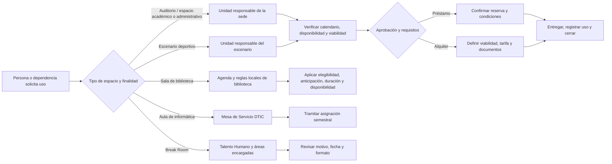

# Préstamo y alquiler de espacios UPTC — descubrimiento público

**Consulta de fuentes:** 1 y 4 de octubre de 2026 
**Estado:** preliminar; no designa responsables ni autoriza recibir reservas institucionales. 
**Datos personales:** ninguno recolectado.

## Hallazgo principal

UPTC publica varios procesos para ocupar espacios. Los auditorios/espacios académicos y administrativos, los escenarios deportivos y las salas de biblioteca tienen responsables, reglas de anticipación, elegibilidad y aprobación diferentes. El producto futuro necesita inventario y políticas por recurso/servicio; una única regla global de “reservar salón” no refleja lo publicado.

La [guía pública de espacios de esta plataforma](../../README.md) combina el directorio de ubicaciones (6 sedes, 11 CREAD y 7 puntos informativos de servicio/espacios) con cinco rutas informativas hacia fuentes oficiales: préstamo/alquiler académico o administrativo, escenarios deportivos, salas de biblioteca, asignación de aulas de informática y uso interno del Break Room. No contiene inventario físico vigente, disponibilidad, dotación, responsables completos ni tarifas; no recibe solicitudes ni habilita reservas o alquiler. La ficha de Música presenta de forma separada las capacidades anunciadas en marzo de 2026 y deja visible la diferencia de ubicación con la página de Biblioteca, que aún requiere conciliación institucional. La guía también enlaza el comunicado público de apertura del Auditorio Goranchacha y distingue su capacidad aproximada de una disponibilidad real.

La vista enlaza únicamente a los canales y normas publicados y explica que la vigencia y la disponibilidad deben confirmarse con la unidad responsable. La discrepancia del aforo de La Saleta (24 en la página de servicio y 25 en el PDF de condiciones) aparece como advertencia, no como dato resuelto. Ningún formulario ni endpoint de escritura se añade para estos trámites.

## Evidencia institucional localizada

| Servicio | Evidencia oficial | Lo que sí publica | Límite para el diseño |
|---|---|---|---|
| Auditorios y espacios académicos/administrativos | [Resolución 7181 de 2017](https://www.uptc.edu.co/export/sites/default/secretaria_general/rectoria/resoluciones_2017/Resolucion_7181_2017.pdf), [Departamento de Servicios Docente Asistenciales](https://www.uptc.edu.co/sitio/portal/sitios/universidad/vic_aca/sd_asistenciales/index.html) | Las unidades administrativas/académicas de las sedes responden por los espacios a su cargo. La solicitud se remite a la unidad responsable con al menos 3 días de antelación; esta revisa disponibilidad, viabilidad técnica y documentos. El formato por sí solo no garantiza aprobación. El alquiler depende del área y servicios solicitados. | La Resolución es de 2017 y no fija en esta evidencia una tarifa vigente para 2026, inventario actual, API ni canal único. Verificar vigencia, modificaciones, responsables por espacio, requisitos, liquidación y pagos con las áreas competentes. |
| Escenarios deportivos | [Resolución 7189 de 2017](https://www.uptc.edu.co/export/sites/default/secretaria_general/rectoria/resoluciones_2017/Resolucion_7189_2017.pdf) | El interesado presenta solicitud ante la unidad responsable con al menos 8 días hábiles; la unidad verifica disponibilidad y viabilidad técnica e informa valor/documentación antes del alquiler. | Es un acto separado de la Resolución 7181. No copiar plazos, elegibilidad ni precios al modelo de préstamo académico; confirmar vigencia y dependencias responsables por escenario. |
| Salas de Biblioteca Jorge Palacios Preciado y biblioteca seccional (inventario publicado) | [Página institucional de préstamo de salas](https://www.uptc.edu.co/sitio/portal/sitios/universidad/vic_aca/bibl/3_seesco/serv.html), [página presencial de bibliotecas](https://www.uptc.edu.co/sitio/portal/sitios/universidad/vic_aca/bibl/4_bpd/blbl_pres.html), [condiciones de uso](https://www.uptc.edu.co/sitio/export/sites/default/portal/sitios/universidad/vic_aca/bibl/.content/doc/2022/cond_uso_salas_blb.pdf) | La publicación consultada indica que el auditorio Clímaco Hernández, las salas de colectividad y La Saleta se rigen por reglamentos internos y la Resolución 7181/2017. Lista Tunja: auditorio (120), dos colectividades (25 y 40), La Saleta (24) y tres seminarios (11); Duitama: dos salas colaborativas (12). Las condiciones PDF indican uso académico, comunidad UPTC, reserva con al menos 24 horas, una reserva diaria por persona, préstamo de hasta 2 horas, tolerancia de 15 minutos y renovación sujeta a disponibilidad. | La Saleta aparece con aforo 25 en el PDF y 24 en la página de servicio. La página general y páginas de seccionales muestran canales e inventarios distintos; no se verificó una API común ni una agenda que consolide toda la red. Confirmar aforo de seguridad, canal vigente, identidad y requisitos por biblioteca antes de operar. |
| Préstamo de salas de biblioteca durante 2025 | [Informe de gestión del Sistema de Bibliotecas 2025](https://www.uptc.edu.co/sitio/export/sites/default/portal/sitios/universidad/vic_aca/bibl/5_gest/.galleries/doc/inf_blb_ec_2025.pdf) | Informa 9 salas disponibles entre Tunja (auditorio, dos colectividades, tres seminarios y la sala de cine) y Duitama (dos salas), con 2.026 préstamos registrados durante 2025. | Es un dato histórico de 2025, no disponibilidad o inventario vigente completo ni autorización para replicar los datos del sistema que lo produjo. |
| Biblioteca Especializada en Música y sala de estudio | [Comunicado UPTC del 24 de marzo de 2026](https://www.uptc.edu.co/sitio/mercury-demo/detail-pages/article/Escuela-de-Musica-de-la-UPTC-estrena-biblioteca-y-sala-de-estudio-nuevos-espacios-para-la-formacion-y-la-creacion-artistica/), [página presencial de bibliotecas](https://www.uptc.edu.co/sitio/portal/sitios/universidad/vic_aca/bibl/4_bpd/blbl_pres.html) | El comunicado anuncia biblioteca especializada y sala de estudio en el segundo piso del Edificio de Música: área de estudio teórico para 30, atención central para 8 y sala de estudio para 25. La página de bibliotecas todavía ubica la Biblioteca Especializada en Música en el primer piso. | Confirmar si la ubicación antigua sigue vigente, el nombre oficial de cada ambiente, público habilitado, horario y si requiere reserva. No sumar aforos ni presentar el anuncio como inventario reservable. |
| Auditorio Goranchacha | [Comunicado UPTC n.º 230 del 9 de septiembre de 2026](https://uptc.edu.co/sitio/portal/cal_not_eve/noticias/det/Nuevo-Auditorio-Goranchacha-de-la-UPTC-abrio-sus-puertas-a-la-comunidad-universitaria/), [referencia institucional de UPTC Radio](https://dsp.uptc.edu.co/sitio/portal/cal_not_eve/noticias/det/UPTC-Radio-celebra-25-anos-al-aire-como-voz-academica-cultural-e-institucional-de-la-Universidad/) | El comunicado de apertura lo ubica en el Edificio de Posgrados de la Sede Central en Tunja y reporta capacidad aproximada para 450 personas. | La cifra es aproximada y no indica cupos habilitados ni disponibilidad. No se publica aquí dirección postal, coordenadas, accesibilidad ni canal de reserva. La consulta web del 4 de octubre encontró el comunicado institucional indexado, pero la apertura directa devolvió caché no disponible. |
| Espacios de bienestar e integración de la Facultad de Ciencias de la Salud | [Comunicado UPTC n.º 252 del 1 de octubre de 2026](https://uptc.edu.co/sitio/portal/cal_not_eve/noticias/det/Facultad-de-Ciencias-de-la-Salud-de-la-UPTC-estrena-espacios-para-el-bienestar-e-integracion-de-sus-estudiantes/) | La nota identifica Tunja e informa la puesta en funcionamiento de “canchas multifuncional y de voleibol arena”, un kiosco, un coworking y nueve mesas exteriores. | No publica dirección postal, aforo ni disponibilidad. La guía muestra el anuncio y enlaza la fuente, sin habilitar reservas ni inferir una ubicación cartográfica. El texto pudo revisarse en el resultado del portal institucional; la apertura directa devolvió caché no disponible el 4 de octubre. |
| Break Room de personal administrativo | [Comunicado UPTC sobre el Break Room](https://www.uptc.edu.co/sitio/portal/cal_not_eve/noticias/det/UPTC-invierte-en-comodidad-y-productividad-para-sus-funcionarios-con-el-nuevo-Break-Room/) | El uso se gestiona con una solicitud previa a Talento Humano indicando motivo, fecha y hora; se menciona coordinación entre Talento Humano, Bienestar y Planeación y un formato de ingreso/salida. | Es un recurso de uso interno con autoridad local publicada. No extender esta política a visitantes, aulas, bibliotecas o alquiler externo. |
| Aulas de informática | [Catálogo de servicios DTIC](https://www.uptc.edu.co/sitio/portal/sitios/universidad/rectoria/dtics/04_catserv/aulas.html) | La asignación semestral de aulas de informática se canaliza por Mesa de Servicio. | No define el proceso completo de horarios de clase, programación de salones ordinarios ni asignación de cupos por grupo. Requiere el inventario de servicios actual de DTIC. |

## Revalidación de ubicación de Música — 2026-10-03

La búsqueda de fuentes oficiales de UPTC consultada el 3 de octubre de 2026 conserva dos descripciones distintas:

- El [comunicado del 24 de marzo de 2026 sobre la Biblioteca de Música y la sala de estudio](https://www.uptc.edu.co/sitio/mercury-demo/detail-pages/article/Escuela-de-Musica-de-la-UPTC-estrena-biblioteca-y-sala-de-estudio-nuevos-espacios-para-la-formacion-y-la-creacion-artistica/) ubica las áreas en el segundo piso del Edificio de Música. Anuncia por separado una zona teórico-histórica con capacidad para 30 estudiantes, atención central para 8 usuarios y una sala de estudio para 25 estudiantes.
- La [página de Biblioteca Presencial](https://www.uptc.edu.co/sitio/portal/sitios/universidad/vic_aca/bibl/4_bpd/blbl_pres.html) indexada en la misma consulta todavía ubica la Biblioteca Especializada en Música en el primer piso. La página no declara una fecha de actualización para este dato.

La consulta directa de ambas URL devolvió HTTP 502 durante esta revalidación. Por tanto, el contraste se basa en el texto indexado de los dominios oficiales, no en una lectura directa completada ni en una confirmación de la unidad responsable. La página de pruebas de admisión que también menciona el primer piso se refiere al lugar de una prueba, no a la biblioteca, y no resuelve la discrepancia.

La guía muestra esta información como anuncio con capacidades separadas (30, 8 y 25), referencias y advertencia visible sobre la ubicación pendiente de confirmar. No las suma ni las presenta como cupos actuales, disponibilidad o autorización de reserva. No inferir dirección postal, coordenadas, accesibilidad o recorrido interior a partir de estas fuentes.

## Revalidación de ubicación de Música — 2026-10-04

La consulta de resultados indexados de los dominios oficiales UPTC el 4 de octubre de 2026 conserva la diferencia:

- El [comunicado del 24 de marzo de 2026](https://www.uptc.edu.co/sitio/mercury-demo/detail-pages/article/Escuela-de-Musica-de-la-UPTC-estrena-biblioteca-y-sala-de-estudio-nuevos-espacios-para-la-formacion-y-la-creacion-artistica/) ubica los nuevos espacios anunciados en el segundo piso y describe capacidades separadas de 30, 8 y 25 personas.
- La [Biblioteca Especializada en Música, en la página de Biblioteca presencial](https://www.uptc.edu.co/sitio/portal/sitios/universidad/vic_aca/bibl/4_bpd/blbl_pres.html) sigue indexada en el primer piso. La página de [Bibliotecas de facultad](https://www.uptc.edu.co/sitio/portal/sitios/universidad/vic_aca/bibl/7secc/06fac/index.html) también presenta el primer piso y muestra actualización al 10 de octubre de 2024.

La apertura directa de las tres páginas volvió a fallar con HTTP 502 durante esta revisión; por tanto, la evidencia directa disponible es el contenido indexado, no una respuesta de las unidades responsables. Las fuentes no permiten determinar si se refieren al mismo recinto, a espacios distintos o a una reubicación. Se conserva el aviso de discrepancia en la guía; no se cambia la ubicación ni se infieren reservas, aforo disponible o accesibilidad.

## Anuncio de espacios de bienestar en Ciencias de la Salud — 2026-10-04

El resultado del portal oficial de noticias UPTC para el [Comunicado n.º 252](https://uptc.edu.co/sitio/portal/cal_not_eve/noticias/det/Facultad-de-Ciencias-de-la-Salud-de-la-UPTC-estrena-espacios-para-el-bienestar-e-integracion-de-sus-estudiantes/) identifica la fecha de publicación como 1 de octubre de 2026 y Tunja como lugar de la nota. Informa la apertura de “canchas multifuncional y de voleibol arena”, un kiosco, un coworking y nueve mesas exteriores.

La solicitud `GET /api/v1/spaces` incorpora un único punto informativo con la descripción del anuncio y su fuente atribuida. La publicación no ofrece una dirección postal, aforo ni disponibilidad para estas instalaciones; por eso la entrada no tiene dirección, búsqueda de mapa ni bloque de capacidad. La apertura directa de la página devolvió caché no disponible durante esta revisión; el detalle se contrastó con el texto indexado en el portal oficial. No se interpreta como inventario reservable ni como autorización de préstamo.

## Flujo preliminar por familia

Este diagrama resume publicaciones de 2017–2026 y no sustituye un procedimiento actual aprobado. La disponibilidad nunca equivale a aprobación automática; el alquiler añade tarifa y requisitos, y cada espacio conserva su unidad responsable.

## Requisitos para diseñar una entrega funcional

1. Nombrar responsables/inventario por sede y por recurso; diferenciar espacio reservable, asignable a clases, prestable y alquilable.
2. Conciliar la Resolución 7181/2017 y 7189/2017 con normas posteriores y tarifas vigentes. No codificar los precios que aparezcan en actos antiguos.
3. Identificar los sistemas y calendarios existentes de biblioteca, DTIC, servicios docente-asistenciales, escenarios deportivos, Talento Humano y las facultades; confirmar interfaces autorizadas y fuente de disponibilidad.
4. Validar capacidad máxima, accesibilidad, dotación, preparación, horarios de apertura, mantenimiento, restricciones de seguridad y bloqueos por evento.
5. Aprobar estados de solicitud, actor que decide, prioridades, cancelaciones, cambios, lista de espera, conflicto concurrente, registro de entrega/devolución y responsabilidad por daños.
6. Definir requisitos y finalidad para personas externas, pólizas/listas de asistentes, datos de contacto, cobro y conciliación antes de capturar o conservarlos.
7. Separar programación académica (grupos/horarios/aulas) de préstamo/alquiler de espacios; publicar una única disponibilidad solo cuando sus fuentes y reservas cruzadas estén conciliadas.
8. Conciliar las páginas de biblioteca que discrepan en aforo, canales y ubicación de los espacios de Música anunciados en 2026; revisar cada sede por separado.

La primera fase del producto debe limitarse a una consulta del inventario confirmado o al trámite de una sola familia cuyo dueño valide el flujo. No se abre reservas ni se cobra alquiler con la guía actual. La fila de reservas en el [roadmap](../ROADMAP.md#entregas-funcionales-que-siguen) conserva estos gates.
