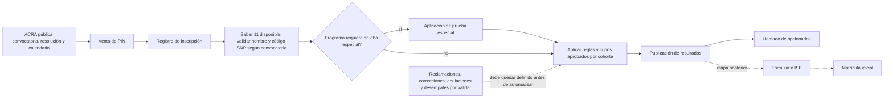

# Inscripción y selección de aspirantes — descubrimiento inicial

**Corte de fuentes:** 30 de septiembre de 2026
**Estado:** alcance priorizado; requisitos funcionales y reglas institucionales sin aprobar
**Ruta:** pregrado presencial
**Datos personales:** ninguno; no se capturan ni se copian aspirantes reales

## Propósito y límite

El patrocinador priorizó el subproceso de inscripción y selección de aspirantes presenciales. Este documento convierte la información pública disponible en un mapa de descubrimiento y en una lista de decisiones para ACRA y la autoridad normativa. No es una especificación aprobada ni autoriza a reemplazar el sistema actual.

La página de ACRA para 2027-I publica un calendario, la Resolución 111 de 2026 para pregrado presencial y requisitos de consistencia con ICFES. El comunicado institucional dice que Saber 11 es el único requisito de selección, y a la vez anuncia pruebas de aptitud para ciertos programas. Las fuentes visibles no resuelven por sí solas cómo interactúan las pruebas con elegibilidad y orden de selección. Por eso no se implementará cálculo de puntajes, asignación de cupos, desempate, anulación automática ni lista de opcionados hasta validar la resolución completa y sus anexos.

## Hechos publicados para la convocatoria 2027-I

| Hito publicado | Fecha o alcance publicado | Uso en este proyecto |
|---|---|---|
| Venta de PIN presencial | 21 de septiembre a 21 de octubre de 2026 | Evidencia de una ventana administrada por convocatoria; no es constante del sistema. |
| Registro de inscripción presencial | Hasta el 23 de octubre de 2026 | La ventana debe poder versionarse por convocatoria después de validar quién es dueño de su publicación. |
| Pruebas especiales | 28 y 29 de octubre para Artes Plásticas y Visuales, Licenciatura en Educación Física, Recreación y Deporte, y Licenciatura en Música | El catálogo de programas afectados y el efecto de la prueba en selección requieren la Resolución 111 y validación de ACRA. |
| Publicación de resultados presencial | 13 de noviembre de 2026 | La página informa la fecha, pero no identifica formato, actor, fuente ni procedimiento de corrección o reclamación. |
| Formulario ISE | 17 a 27 de noviembre de 2026 | Etapa posterior a resultados; queda fuera del primer flujo funcional de inscripción y selección. |
| Pago ordinario de matrícula | 23 de noviembre a 10 de diciembre de 2026 | Matrícula inicial queda fuera del primer corte funcional, aunque se conserva como dependencia posterior. |
| Llamado de opcionados | 9 a 15 de diciembre de 2026 | La existencia del hito está publicada; reglas de elegibilidad, orden y aceptación siguen por validar. |

Fuentes primarias: [calendario ACRA de aspirantes](https://uptc.edu.co/sitio/portal/sitios/universidad/vic_aca/adm_reg/1aspi/pre/) y [comunicado UPTC del 22 de septiembre de 2026](https://uptc.edu.co/sitio/portal/cal_not_eve/noticias/det/UPTC-abre-inscripciones-para-estudiar-un-pregrado-presencial-a-distancia-o-virtual-el-proximo-semestre/). Las fechas corresponden a una convocatoria concreta y no deben quedar codificadas como defaults.

La página de ACRA indica que al registrar la inscripción el aspirante ya debe tener resultados Saber 11, que nombres y apellidos deben coincidir con ICFES y que debe verificarse el código SNP; advierte que los errores pueden anular la inscripción. Esto es una advertencia publicada, no autorización para replicar validaciones, acceder a ICFES o anular solicitudes automáticamente. [ACRA — aspirante de pregrado](https://uptc.edu.co/sitio/portal/sitios/universidad/vic_aca/adm_reg/1aspi/pre/)

## Mapa provisional del proceso

El diagrama refleja hitos que ACRA publica; no establece una máquina de estados de software ni ordena operaciones que se solapan. La caja de selección está deliberadamente sin fórmula.

## Conflictos y decisiones que no se pueden inferir

| Tema | Evidencia pública encontrada | Decisión requerida |
|---|---|---|
| Cantidad de programas/opciones por aspirante | El texto base del [Acuerdo 130 de 1998](https://cnormativa.uptc.edu.co/DocCompNormativa/130DE1998.pdf) señala en su artículo 14 que el aspirante solo puede inscribirse a un programa. Una [instrucción del portal de registro](https://registro.uptc.edu.co/Instrucciones_web.htm) describe primera y segunda opción. | Confirmar si esa instrucción sigue vigente, qué acto la soporta y qué dispone la Resolución 111 de 2026 para 2027-I. No modelar una o dos opciones por inferencia. |
| Base de selección | El comunicado 2027-I dice que se usa Saber 11; el texto base del Acuerdo 130 describe orden por puntaje y cupos. | Obtener fórmula vigente por convocatoria, componentes Saber 11, normalización, criterios diferenciales y trazabilidad del cálculo. |
| Pruebas especiales | ACRA publica tres programas y fechas; el comunicado mantiene la referencia a Saber 11 como criterio de selección. | Aclarar requisito de participación, escala, umbral, efecto en elegibilidad/orden, accesibilidad, ausencia y reprogramación. |
| Cupos y desempates | Las páginas describen resultados y opcionados, pero no publican la configuración completa por sede/cohorte. | Obtener acto y fuente de cupos; fijar reglas deterministas y escenarios frontera con aprobación funcional. |
| Identidad y corrección | ACRA exige coincidencia de nombres y SNP y advierte posible anulación. | Definir fuente maestra, cómo corregir discrepancias, quién puede hacerlo, evidencia, revisión humana y notificación. |
| Resultados, recursos y opcionados | El calendario anuncia resultados y llamados posteriores. | Documentar publicación, reclamaciones, corrección de errores, orden y aceptación de opcionados, auditoría y reversas. |
| Datos e integración | Las páginas no identifican contrato actual, API ni sistema maestro de aspirantes/Saber 11. | Confirmar propietario, identificadores, campos mínimos, propósito, retención, seguridad y autorización de intercambio. |

## Diseño técnico propuesto, sujeto a aprobación

- El futuro módulo `admissions` vivirá dentro del monolito Spring Boot y compartirá MySQL con límites de escritura explícitos. No se introduce microservicio ni motor genérico de reglas sin necesidad demostrada.
- No unificar aspirante, persona y estudiante ni reutilizar una identidad canónica hasta que el dueño de datos confirme identificadores y ciclo de vida.
- Versionar convocatoria, reglas, cupos y resultados de selección con referencia al acto aprobado que los origina. Un resultado deberá poder reproducirse con la versión exacta de reglas y datos de entrada autorizados.
- Mantener la captura y modificación bajo permisos de backend. El mapeo de grupos institucionales, documentos personales, retención y auditoría deben estar aprobados antes de almacenar datos reales.
- Si se construye antes una vista de calendario, será una capacidad acotada, versionada y de solo lectura pública; no presentará aspirantes, admisión ni elegibilidad como funcionales.

## Criterios de entrada a implementación

1. ACRA y la autoridad normativa entregan y confirman Resolución 111 de 2026, anexos, modificaciones, vigencias y reglas por cohorte.
2. Quedan definidos programa(s), sede(s), cohorte y el punto final del primer corte; la decisión actual cubre inscripción y selección, no matrícula inicial.
3. El dueño de proceso aprueba el mapa de estados, reglas, excepciones, recursos, actores y salidas, incluida la relación entre Saber 11 y pruebas especiales.
4. Dueños de datos y seguridad aprueban sistema fuente, identificadores, campos mínimos, integración, permisos, retención y casos de corrección.
5. Los casos de aceptación AAA contienen fixtures sintéticos y cubren cupos, empates, repetidos, datos discordantes, reintentos y concurrencia que correspondan a las reglas aprobadas.

Hasta que se cumplan estos criterios, se permite documentación, arquitectura y prototipos sin PII; no se codifica una decisión de admisión.
