# Inscripción y selección de aspirantes — descubrimiento inicial

**Fuentes normativas y de calendario:** consultadas al 30 de septiembre de 2026 
**Fuentes de sistema y gobierno de datos:** revisión complementaria del 1 de octubre de 2026 
**Estado:** investigación normativa pública ampliada; reglas y contratos aún no aprobados por los responsables institucionales 
**Ruta:** pregrado presencial 
**Datos personales:** ninguno; no se capturan ni se copian aspirantes reales

**Responsables propuestos por el patrocinador:** ACRA y Registro Académico participarán en la validación de la fuente maestra y los campos del expediente estudiantil. Su asignación es una propuesta de trabajo, no confirma aún el sistema autoritativo, el contrato de aspirante/estudiante ni la autorización de tratamiento.

## Propósito, alcance y límite

El patrocinador priorizó el subproceso de **inscripción y selección de aspirantes de pregrado presencial**. Este documento registra los actos oficiales y las instrucciones públicas consultadas para preparar la validación con ACRA, Secretaría General, Jurídica y los programas académicos. No es una interpretación jurídica aprobada ni autoriza reemplazar SIRA, procesar aspirantes reales o publicar una decisión automática.

La convocatoria 2027-I ya está en curso: la venta de PIN comenzó el 21 de septiembre de 2026, la inscripción cierra el 23 de octubre y los resultados están previstos para el 13 de noviembre. Por calendario y por las aprobaciones faltantes, esta convocatoria sirve como evidencia de descubrimiento; no se asume como cohorte objetivo de reemplazo.

## Hallazgos complementarios de sistemas y gobierno de datos

- Boletines de Vicerrectoría Académica de enero y mayo de 2025 describen una actualización de SIRA con liderazgo técnico de DTIC, trabajo de Transformación Curricular y una comisión académica. El alcance publicado incluye migración de datos, PAE, planes de estudio, prerrequisitos, créditos de libre elección, oferta/programación de cursos, horarios y selección de cursos ([enero](https://www.uptc.edu.co/sitio/export/sites/default/portal/sitios/universidad/vic_aca/vic_acad/inf/doc/2025/001_bolvicacad_2025.pdf), [mayo](https://www.uptc.edu.co/sitio/export/sites/default/portal/sitios/universidad/vic_aca/vic_acad/inf/doc/2025/005_bolvicaca_2025.pdf)). No confirman qué se desplegó después de 2025. DTIC y Vicerrectoría Académica deben precisar estado, arquitectura, fuentes autoritativas e interfaces antes de diseñar un catálogo paralelo o una sustitución.
- Una noticia de UPTC de 2023 describió la aplicación móvil SIRA y accesos a Web Estudiante, Web Docente y Mesa de Servicio, con consultas, calificaciones, horarios e información académica ([noticia institucional](https://www.uptc.edu.co/sitio/portal/cal_not_eve/noticias/det/Aplicaciones-de-la-UPTC-ahora-disponibles-en-Google-Play/)). Un informe público de acreditación de Ingeniería Civil también atribuye a SIRA la consulta de registro académico del programa ([informe institucional](https://www.uptc.edu.co/export/sites/default/facultades/f_ingenieria/pregrado/civil/documentos/DOCUMENTO_VS5.pdf)). Son descripciones institucionales con fecha y alcance propios, no una verificación del inventario de 2026 ni de todas las facultades.
- El portal público de ACRA separa rutas de aspirante (pregrado, posgrado y transferencia) y estudiante (pregrado y posgrado); su página de aspirante publica el calendario 2027-I ([ACRA](https://www.uptc.edu.co/sitio/portal/sitios/universidad/vic_aca/adm_reg/index.html), [pregrado](https://uptc.edu.co/sitio/portal/sitios/universidad/vic_aca/adm_reg/1aspi/pre/)). La navegación pública no acredita el modelo interno de identidades, el ciclo de conversión aspirante-estudiante ni las APIs de SIRA.
- El aviso visible en el formulario público de inscripción declara tratamiento de datos personales, sociales y académicos para admisión y posterior Registro Académico y remite a la Resolución 3842 de 2013 ([aviso de privacidad](https://registro.uptc.edu.co/valida_entrada.jsp?tipoUsuarioInscripcion=1), [resolución](https://www.uptc.edu.co/sitio/export/sites/default/portal/sitios/universidad/cam_virt/por_dig/.content/docs/Resolucion_3842_2013.pdf)). La página pública de DTIC lista además la Resolución 1372 de 2023 sobre el Oficial de Protección de Datos Personales y la Resolución 4529 de 2023 sobre roles de seguridad ([DTIC: normatividad](https://uptc.edu.co/sitio/portal/sitios/universidad/rectoria/dtics/02_presentacion.html)). No se deriva de esos textos un conjunto de campos aprobado: Jurídica, Oficial de Protección de Datos, ACRA, Registro Académico y DTIC deben confirmar política vigente, finalidades, responsable/encargado, retención, población menor de edad, accesos y contratos antes de capturar datos.

**Implicación de gobierno:** el patrocinador sugiere ACRA y Registro Académico para validar proceso y datos del ciclo del estudiante. Esto no determina por sí mismo quién es dueño funcional de cada dominio, custodio técnico, operador de SIRA ni responsable del tratamiento. Las fuentes de 2025 atribuyen a DTIC el liderazgo técnico de la actualización y a Vicerrectoría Académica/una comisión la coordinación curricular; sus responsabilidades actuales deben confirmarse. No se agregan campos, datos de muestra personales ni conexiones a SIRA/ICFES.

## Fuentes oficiales localizadas

| Fuente | Hecho que aporta | Límite que sigue vigente |
|---|---|---|
| [Acuerdo 130 de 1998, registro 1 de Compilación Normativa](https://apps3.uptc.edu.co/compilacion-normativa-web/#/compilaciones-normativas/detalle-documento/1) | Reglamento estudiantil base. El artículo 14 fue modificado por Acuerdo 053/2008; el artículo 17, que contenía beneficios de mérito y territorio, fue derogado expresamente por Acuerdo 031/2021. | No usar el texto original como regla consolidada. El alcance actual del artículo 18 y sus relaciones normativas requieren revisión separada. |
| [Acuerdo 053 de 2008, registro 11](https://apps3.uptc.edu.co/compilacion-normativa-web/#/compilaciones-normativas/detalle-documento/11) | Modifica los artículos 14 y 16 del Acuerdo 130: permite dos opciones (primera y segunda), regula la competencia por la segunda opción y contempla pruebas adicionales y desempate. | No confirma por sí solo la versión completa aplicable a la cohorte 2027-I ni todas las reglas específicas por programa. |
| [Acuerdo 031 de 2021](https://www.uptc.edu.co/export/sites/default/secretaria_general/consejo_superior/acuerdos_2021/Acuerdo_031_2021.pdf) | Deroga expresamente el artículo 17 del Acuerdo 130. Sus considerandos dicen que el régimen antiguo no se aplicaba desde 2000 salvo el literal d) y explican que la población allí descrita quedó comprendida en la política del Acuerdo 015/2021. | No trasladar beneficios del artículo 17 derogado al motor de admisión. El texto fuente y la autoridad deben confirmar el alcance residual de otras disposiciones del Acuerdo 130. |
| [Resolución 19 de 2014, registro 481](https://apps3.uptc.edu.co/compilacion-normativa-web/#/compilaciones-normativas/detalle-documento/481) y [Resolución 28 de 2014, registro 482](https://apps3.uptc.edu.co/compilacion-normativa-web/#/compilaciones-normativas/detalle-documento/482) | Adoptan las cinco áreas Saber 11, ponderaciones por programa, homologación de pruebas anteriores, pruebas adicionales, desempates y publicación de resultados en tres llamados. La Resolución 28 agrega tratamiento de resultados recalificados y de aplicaciones 2000-1 a 2011-2. | Son actos de 2014. Hay que comprobar vigencia, modificaciones posteriores, precisión/ redondeo y aplicación a cada resultado de examen. |
| [Tabla de ponderaciones enlazada actualmente por ACRA](https://www.uptc.edu.co/sitio/export/sites/default/portal/sitios/universidad/vic_aca/adm_reg/.content/doc/sim/ponderados_v3.pdf) y [simulador ACRA](https://uptc.edu.co/sitio/portal/sitios/universidad/vic_aca/adm_reg/1aspi/pas/asp_simpunt.html) | La tabla se identifica como proceso de admisiones desde 2015 bajo Resolución 19 de 2014. La página actual de ACRA, actualizada el 18 de septiembre de 2026, indica que la selección usa Saber 11 y enlaza la tabla, simulador, manual y resultados de referencia de 2026. | Los resultados de referencia son históricos, no reglas ni cupos futuros. La tabla publicada debe validarse por versión, código de programa, sede y jornada antes de parametrizarla. |
| [Resolución 111 de 2026, registro 9906](https://apps3.uptc.edu.co/compilacion-normativa-web/#/compilaciones-normativas/detalle-documento/9906) | Calendario concreto de inscripción, admisión y matrícula de pregrado presencial para 2027-I; identifica revisiones ICFES, SIRA, programas con pruebas de aptitud y etapas de opcionados/cupos especiales. | Es un calendario de cohorte, no una regla reutilizable en otras convocatorias. Contiene una mención contradictoria en un considerando que se debe aclarar. |
| [Ley 2367 de 2024](https://www.funcionpublica.gov.co/eva/gestornormativo/norma.php?i=244756), [Decreto 0617 de 2026 (MEN)](https://www.mineducacion.gov.co/1780/articles-429281_recurso_1.pdf), [FAQ MEN](https://www.mineducacion.gov.co/portal/Educacion-superior/Politica-de-Gratuidad-Puedo-Estudiar/428345:Preguntas-Frecuentes) y [anuncio MEN](https://www.mineducacion.gov.co/portal/salaprensa/Comunicados/429279:Gobierno-Nacional-anuncia-la-gratuidad-en-la-inscripcion-y-derechos-de-grado-en-la-educacion-superior-publica) | El Decreto 0617, publicado el 18 de junio de 2026 y vigente desde el día siguiente, adiciona al Decreto 1075 reglas para financiar progresivamente hasta tres derechos de inscripción de jóvenes elegibles en pregrados de IES estatales u oficiales. El texto firmado establece requisitos de edad (14–28), nacionalidad colombiana, no estar matriculado en un programa profesional universitario desde su entrada en vigor, no tener título profesional universitario y pertenecer a grupos A/B/C del Sisbén IV o instrumento sucesor; inicia la progresividad por grupo A el primer año y la sujeta a presupuesto. El MEN anuncia inicio en el primer semestre de 2027. Su FAQ indica que la postulación es gratuita, el resultado se notifica por correo, el derecho asignado se consulta en plataforma MEN, la financiación no garantiza admisión y es distinta de la gratuidad de matrícula. | Hay una discrepancia documental: el anuncio denomina “0616” al decreto de inscripción; el acto firmado disponible es el 0617 y la página MEN de derechos de grado asocia el 0616 a ese otro beneficio. El anuncio resume elegibilidad como Sisbén A o censo indígena y excluye a personas que hayan estado matriculadas previamente; esas condiciones no coinciden literalmente con el texto firmado. Jurídica/MEN deben identificar la regla y el reglamento operativo vigentes. ACRA debe confirmar aplicabilidad y recursos para UPTC/2027-I y cómo se concilia con el PIN. No mezclar el beneficio financiero con selección ni usar datos Sisbén para puntuar/ordenar aspirantes. |
| [Acuerdo 015 de 2021](https://www.uptc.edu.co/secretaria_general/consejo_superior/acuerdos_2021/Acuerdo_015_2021.pdf), [Resolución 2941 de 2021](https://www.uptc.edu.co/secretaria_general/rectoria/resoluciones_2021/Resolucion_2941_2021.pdf) y [Resolución 5362 de 2025, registro 9313](https://apps3.uptc.edu.co/compilacion-normativa-web/#/compilaciones-normativas/detalle-documento/9313) | El Acuerdo 015 adopta la política inclusiva, enumera poblaciones y asigna seis cupos por programa bajo su artículo 7; su artículo 12 deroga expresamente los Acuerdos 017/2001, 120/2006 y 029/2015, además de la Resolución 2404/2016. La Resolución 2941 reglamenta requisitos y contiene una disposición propia para discapacidad; la Resolución 5362 modifica su artículo 8 para asignación en primera/segunda opción. | Hay que confirmar cómo se aplican conjuntamente el Acuerdo 015, los artículos 1–2 de la Resolución 2941 y la modificación 5362; la lista de poblaciones del artículo 3 de 015 no coincide literalmente con las seis categorías de cupo del artículo 7. No almacenar soportes sensibles antes de aprobar finalidad, campos, permisos y retención. |
| [Acuerdo 61 de 2000, registro 44](https://apps3.uptc.edu.co/compilacion-normativa-web/#/compilaciones-normativas/detalle-documento/44) | Establece un régimen transitorio para resultados antiguos, modalidades numérica/cualitativa y selección ponderada, incluidas pruebas adicionales. | La población y la fórmula transitoria que aún puedan presentarse en una convocatoria actual requieren confirmación; no se infiere un puntaje mínimo desde páginas de FESAD. |
| [Acuerdo 019 de 2000](https://www.uptc.edu.co/secretaria_general/consejo_superior/acuerdos_2000/Acuerdo_019_2000.pdf) | Establece un régimen transitorio para quienes presentaron el examen en marzo de 2000, con resultados de Núcleo Común ponderados, cupos proporcionales a inscritos y pruebas adicionales si aplica. | Regla con fecha/población histórica; conservar solo como caso de examen transitorio si ACRA confirma que la cohorte puede incluirlo. |
| [Acuerdo 17 de 2001, registro 48](https://apps3.uptc.edu.co/compilacion-normativa-web/#/compilaciones-normativas/detalle-documento/48) y [Acuerdo 120 de 2006](https://www.uptc.edu.co/secretaria_general/consejo_superior/acuerdos_2006/Acuerdo_120_2006.pdf) | Los actos contemplaban cupos diferenciales para personas reinsertadas/desplazadas y grupos territoriales, respectivamente. | El artículo 12 del Acuerdo 015/2021 los deroga expresamente. Se conservan como antecedente normativo, no como reglas activas por defecto. |
| [Resolución 026 de 2009](https://www.uptc.edu.co/export/sites/default/secretaria_general/consejo_academico/resoluciones_2009/resolucion_26_2009.pdf), Resoluciones [1577/2019 (registro 1872)](https://apps3.uptc.edu.co/compilacion-normativa-web/#/compilaciones-normativas/detalle-documento/1872) y [3418/2019 (registro 4097)](https://apps3.uptc.edu.co/compilacion-normativa-web/#/compilaciones-normativas/detalle-documento/4097), [Regionalización UPTC](https://dsp.uptc.edu.co/sitio/portal/sitios/universidad/vic_aca/vic_acad/regi/index.html) y [ACRA: cupos especiales](https://reportes.uptc.edu.co/sitio/portal/sitios/universidad/vic_aca/adm_reg/1aspi/pas/p1_cupsaesp.html) | La Resolución 026 modifica la Resolución 01/2000: contempla ingreso a quinto semestre en programas determinados y otras vías de ingreso a licenciaturas para normalistas con convenios; exige reglas de admisión, y deja ubicación en el plan a homologación/validación del Comité de Currículo. Su artículo 8 encarga a ACRA verificar requisitos. Regionalización sigue listando 1577/2019 (quinto semestre de Licenciatura en Educación Infantil o Básica Primaria) y 3418/2019 (normalistas graduados bajo convenio). La página ACRA, actualizada el 30 de septiembre de 2026, publica el PIN de 2027-I y pide certificados de cuatro ciclos complementarios y diploma de Normalista Superior. | Ruta distinta del ingreso ordinario a primer semestre y de los seis cupos del Acuerdo 015. Confirmar qué disposiciones de 026/2009 subsisten tras 1577/2019, 3418/2019 y Ley 2481/2025; validar convenio, programa/sede, semestre, reconocimiento, selección y canal documental. |
| [Ley 2481 de 2025 — Gestor Normativo de Función Pública](https://www.funcionpublica.gov.co/eva/gestornormativo/norma.php?i=260801), [MEN: proyecto socializado el 6 de agosto de 2026](https://www.mineducacion.gov.co/portal/salaprensa/Comunicados/430204:Ministerio-de-Educacion-Nacional-socializo-el-proyecto-de-decreto-que-reglamentara-la-Ley-2481-de-2025-para-fortalecer-las-Escuelas-Normales-Superiores), [MEN — Escuelas Normales Superiores](https://www.mineducacion.gov.co/portal/adelante-maestros/Formacion/Escuelas-Normales-Superiores/) y [Regionalización UPTC](https://dsp.uptc.edu.co/sitio/portal/sitios/universidad/vic_aca/vic_acad/regi/index.html) | La ley crea un marco nacional para las ENS y modifica el artículo 112 de la Ley 115; su artículo 14 dispone reglamentación dentro de un año desde el 16 de julio de 2025. El 6 de agosto de 2026 el MEN informó que socializó un proyecto de decreto reglamentario. | En las consultas realizadas al 30 de septiembre de 2026 no se localizó decreto final específico para las ENS. La noticia acredita socialización de un proyecto, no su expedición ni vigencia. Confirmar versión final, transición, convenios y reconocimiento de ciclos con Jurídica/MEN; no convertir la ley o el proyecto en admisión automática. |
| [Acuerdo 030 de 2007, índice anual del Consejo Superior](https://www.uptc.edu.co/secretaria_general/consejo_superior/acuerdos_2007/index.html) | El índice institucional identifica el acto como cupos de ingreso por mérito para estudiantes de los 123 municipios de Boyacá; documentos curriculares UPTC también lo citan como antecedente. El texto localizado prevé hasta tres cupos por municipio para bachilleres de estratos 1–2, sujeto a definición semestral del Consejo Académico. | Las menciones históricas y el índice anual no acreditan vigencia consolidada. No se encontró una derogatoria ni una confirmación de aplicación actual; no modelar la vía como activa hasta validar la cadena normativa. |

Los identificadores de Compilación Normativa corresponden a los registros visibles en el servicio institucional de UPTC consultado. El corte encontró derogatorias expresas de los Acuerdos 017/2001 y 120/2006 por el artículo 12 del Acuerdo 015/2021, y del artículo 17 del Acuerdo 130/1998 por el Acuerdo 031/2021. La autoridad institucional debe confirmar el estado consolidado de los actos restantes, cualquier modificación posterior y su aplicación a la cohorte.

### Calidad y conflictos entre fuentes web

- Para fechas 2027-I se priorizaron la Resolución 111/2026 y las páginas ACRA actualizadas para esa convocatoria. El antiguo sitio de Registro aún aparece en búsquedas con instrucciones de otras épocas: publica umbrales para exámenes anteriores a 2000 y páginas de preguntas frecuentes con fechas históricas. No usar esos textos como reglas 2027-I sin que ACRA confirme su vigencia y fundamento.
- El plazo de un año del artículo 14 de la Ley 2481/2025 venció el 16 de julio de 2026. El MEN informó el 6 de agosto que socializó un proyecto reglamentario para las ENS; en la revisión del 30 de septiembre no se localizó reglamentación final específica en los índices oficiales consultados. Es un resultado acotado, no prueba de inexistencia: Jurídica debe confirmar la publicación en Diario Oficial/SUIN/MEN y la versión aplicable. El Decreto 0617/2026 reglamenta la gratuidad progresiva de derechos de inscripción bajo la Ley 2367/2024, no la Ley 2481/2025.
- La documentación MEN del beneficio de inscripción no es totalmente consistente. El PDF normativo firmado es el Decreto 0617/2026; el comunicado de implementación le atribuye el número 0616 y resume elegibilidad de forma distinta. La página MEN de gratuidad de derechos de grado identifica el Decreto 0616/2026 para ese otro beneficio. La FAQ explica que postulación y validación se tramitan por MEN, se notifica por correo y se consulta el derecho asignado en su plataforma; el beneficio cubre inscripción y no decide admisión. Antes de diseñar captura o integración se debe obtener el reglamento operativo vigente y aclaración formal MEN/UPTC sobre elegibilidad, datos intercambiados, fondos por convocatoria y conciliación con PIN. ACRA publica PIN para 2027-I y MEN anuncia implementación en el primer semestre de 2027, pero esas fuentes no explican el tratamiento operativo UPTC para esa cohorte. No inferir gratuidad universal ni usar condición socioeconómica en puntaje, cupos u orden de mérito.
- El índice UPTC de Acuerdos 2007 y documentos curriculares que mencionan el Acuerdo 030/2007 son referencias, no certificación de vigencia. ACRA/Secretaría General deben aportar la compilación normativa consolidada y el criterio operativo por cohorte.

### Efectos de derogatoria localizados

- El [Acuerdo 015 de 2021](https://www.uptc.edu.co/secretaria_general/consejo_superior/acuerdos_2021/Acuerdo_015_2021.pdf), artículo 12, deroga expresamente los Acuerdos 017/2001 y 120/2006, el Acuerdo 029/2015 y la Resolución 2404/2016. Por tanto, no se modelan las fórmulas antiguas de los acuerdos 017/2001 y 120/2006 como rutas activas. El Acuerdo 030/2007 requiere consulta separada porque no aparece en esa enumeración expresa.
- El [Acuerdo 031 de 2021](https://www.uptc.edu.co/export/sites/default/secretaria_general/consejo_superior/acuerdos_2021/Acuerdo_031_2021.pdf) deroga expresamente el artículo 17 del Acuerdo 130/1998. Sus considerandos remiten la población del antiguo literal d) a la política de inclusión adoptada por el Acuerdo 015/2021.
- El artículo 3 del Acuerdo 015 enumera ocho grupos poblacionales y su artículo 7 distribuye seis cupos excepcionales entre seis condiciones. Los literales sobre mujeres en condición de vulnerabilidad y población diversa en perspectiva de género/orientación sexual figuran en el artículo 3, pero no como categorías separadas de cupo en la lista del artículo 7. La norma operativa y los apoyos que correspondan requieren interpretación formal; no se inferirán cupos adicionales.
- El artículo 7 del Acuerdo 015 asigna un cupo por condición, incluido uno para discapacidad. El artículo 2 de la Resolución 2941 regula además un cupo especial por programa para personas con discapacidad física, visual o auditiva y una caracterización de necesidades de apoyo que declara no afectar el puntaje. El cruce entre estas disposiciones y su total de cupos queda abierto para validación jurídica/ACRA.

## Hechos publicados para la convocatoria 2027-I

| Hito de la Resolución 111 | Fecha o alcance publicado | Implicación para el diseño |
|---|---|---|
| Promoción en página web y emisora universitaria | 21 sep.–23 oct. 2026 | Configuración versionada por convocatoria; fuente operativa por confirmar. |
| Venta de PIN | 21 sep.–21 oct. 2026 | Separar pago/derecho de inscripción del formulario. Confirmar el tratamiento de la financiación progresiva de la Ley 2367/2024 y el Decreto 0617/2026; no asumir integración ni sistema fuente. |
| Inscripción vía web | 21 sep.–23 oct. 2026 | La norma de 2008 permite hasta dos programas, primera y segunda opción. |
| Examen médico para aspirantes en condición especial de discapacidad; certificado EPS | 27 oct. 2026 | Requiere ruta accesible y tratamiento de evidencia de salud bajo política aprobada. |
| Prueba de lengua de señas para aspirantes con discapacidad auditiva | 27 oct. 2026 | La resolución no especifica resultado, rúbrica, reprogramación ni efecto de esta prueba. |
| Pruebas de aptitud para Licenciatura en Educación Física, Recreación y Deporte | Examen médico y aptitud física en la sede del programa, 28–29 oct. 2026 | La resolución da fecha/sede para aptitud física; ACRA debe confirmar condición de aprobación, accesibilidad y efecto en selección. |
| Artes Plásticas y Visuales y Licenciatura en Música | Incluidas bajo “Aplicación de Pruebas de aptitud”; 28–29 oct. 2026 en el calendario | La Resolución 111 consultada no detalla el tipo ni la rúbrica de prueba de esos dos programas. No inventar modalidad ni efecto. |
| Verificación de información a través de ICFES | 28–29 oct. 2026 | Definir contrato, campos mínimos, corrección, autorización de consulta y manejo de indisponibilidad de ICFES. |
| Verificación y anulación de inscripciones con información errada | Hasta 10 nov. 2026 | Es una facultad/proceso calendarizado; no autoriza anulación automática sin causal, revisión humana, notificación y recurso aprobados. |
| Aplicación del proceso de admisión SIRA | 11–12 nov. 2026 | La resolución nombra SIRA en este hito; el rol actual de SIRA como fuente maestra o sistema de registro requiere confirmar con ACRA/DTIC. |
| Publicación de resultados de admitidos | 13 nov. 2026 | Confirmar firma, datos expuestos, canal, correcciones y reclamaciones. |
| Formulario ISE y entrega de documentos | 17–27 nov. 2026 | Etapa posterior al primer corte funcional de inscripción/selección. |
| Subsanación de información/documentos según ISE | 18 nov.–4 dic. 2026 | Definir reglas, actor, evidencia y cierre de subsanación. |
| Pago de derechos pecuniarios | 23 nov.–10 dic. 2026 | Etapa posterior; requiere fuente e integración de pagos autorizadas. |
| Inscripción de asignaturas por las Escuelas | 9–14 dic. 2026 | Límite con matrícula/ciclo académico; fuera del primer corte funcional. |
| Asignación de cupos especiales en programas de segunda opción | 14 dic. 2026, según Resolución 5362 de 2025 | El acto 5362 sitúa este paso después de admisión/matrícula de admitidos y antes de admisión de opcionados; el calendario ubica la ventana de llamados de opcionados entre 9–15 dic. Se debe precisar el orden operativo dentro de fechas que se solapan. |
| Llamado/etapa de opcionados | 9–15 dic. 2026 | La selección, orden, aceptación y efecto de renuncias deben tener reglas versionadas. |
| ISE/documentos de opcionados; subsanación; pagos; asignaturas | 9–15 dic.; 10–16 dic.; 10–17 dic.; 10–18 dic. respectivamente | Flujo posterior y de alcance aparte, aunque depende de la misma convocatoria. |
| Pago de matrícula | Según el calendario académico 2027-I o su modificación | La Resolución 111 no fija aquí una fecha concreta. |

La Resolución 111 (10 de septiembre de 2026) tiene un considerando que dice que se establecieron fechas para “Segundo Semestre de 2026”, mientras su título y artículo primero fijan el calendario para “Primer Semestre de 2027”. El artículo primero es explícito sobre la cohorte, pero ACRA/Jurídica deben confirmar si se emitió corrección. La tabla además repite la numeración “2” en “Pago de matrícula”; registrar como errata editorial, no como una nueva actividad. La resolución fue proyectada por ACRA y revisada por Dirección de TICs, Vicerrectoría Académica y Dirección Jurídica.

Fuentes principales del calendario: [Resolución 111 de 2026](https://apps3.uptc.edu.co/compilacion-normativa-web/#/compilaciones-normativas/detalle-documento/9906) y [página de aspirantes de ACRA](https://uptc.edu.co/sitio/portal/sitios/universidad/vic_aca/adm_reg/1aspi/pre/). La página de ACRA también advierte sobre coincidencia de nombres/apellidos y código SNP con ICFES; eso no constituye autorización para conectarse a ICFES ni para anular registros automáticamente.

La página vigente de [cupos para casos especiales](https://reportes.uptc.edu.co/sitio/portal/sitios/universidad/vic_aca/adm_reg/1aspi/pas/p1_cupsaesp.html), actualizada el 30 de septiembre de 2026, dice que el PIN corresponde a 2027-I y publica una vía de aspirante normalista con certificados de cuatro ciclos complementarios y diploma de Normalista Superior. El texto combina “cargar en la plataforma” con entrega “a los siguientes correos”; ACRA debe confirmar canal, comprobante y fecha límite. La misma página incluye la vía normalista bajo “cupos para casos especiales”, pero los actos 015/2021–2941/2021–5362/2025 no identifican normalista entre las seis categorías de cupo del artículo 7 del Acuerdo 015. Se registra como una vía separada por aclarar, no como un séptimo cupo ni como parte de la selección ordinaria por inferencia.

## Reglas públicas localizadas, aún pendientes de confirmación de vigencia/aplicación

### Opciones, ponderación, pruebas y orden

- **Opciones:** el Acuerdo 053 de 2008 reemplaza el artículo 14 del Acuerdo 130: el aspirante puede inscribirse únicamente a **dos programas presenciales de pregrado**, informados como primera y segunda opción. Si no se admite en la primera, entra al grupo de opcionados de la segunda y compite con el puntaje obtenido para esa opción, si hay cupo y supera las pruebas adicionales aplicables. Esto resuelve la diferencia antigua entre el artículo 14 sin modificar y las instrucciones del portal; queda por verificar en la compilación completa qué actos posteriores afectan el caso.
- **Selección ordinaria:** la página vigente de simulador ACRA dice que la selección usa Saber 11. La Resolución 19 de 2014 adopta cinco áreas y una tabla por programa; la tabla pública actualmente enlazada señala que el cálculo multiplica cada resultado Saber 11 por su ponderación y suma los valores. Pesos publicados para programas relacionados con pruebas de aptitud:

  | Programa/código según la tabla pública | Sede/jornada publicada | Lectura crítica | Ciencias naturales | Sociales y ciudadanas | Matemáticas | Inglés |
  |---|---|---:|---:|---:|---:|---:|
  | Lic. Educación Física, Recreación y Deportes / 31 | Tunja / D | 25% | 25% | 20% | 15% | 15% |
  | Lic. Educación Física, Recreación y Deportes / 94 | Chiquinquirá / D | 25% | 25% | 20% | 15% | 15% |
  | Lic. Música / 38 | Tunja / D, anual primer semestre | 45% | 5% | 25% | 5% | 20% |
  | Lic. Artes Plásticas / 108 | Tunja / E, anual primer semestre | 35% | 15% | 40% | 5% | 5% |

  La tabla es la versión actualmente enlazada por ACRA y está identificada como efectiva desde 2015; nombres/códigos y equivalencia con las denominaciones 2027 deben confirmarse antes de importar datos o automatizar resultados. Los resultados de referencia 2026 publicados por ACRA son históricos y no sustituyen tabla de cupos ni puntajes de corte de una futura convocatoria.
- **Homologación de resultados históricos:** Resolución 19 regula la equivalencia entre el examen previo de ocho áreas y el Saber 11 de cinco áreas a partir de 2015, con promedios simples para Lectura Crítica y Ciencias Naturales. Resolución 28 agrega que pruebas 2012-1 a 2014-1 toman resultados recalificados del ICFES y que pruebas 2000-1 a 2011-2 siguen la equivalencia del artículo 4. Acuerdo 61 de 2000 contempla un régimen transitorio para resultados antiguos numéricos/cualitativos; Acuerdo 019 de 2000 se refiere a quienes presentaron la prueba en marzo de ese año. También se prevé revisar exámenes similares en el exterior avalados por ICFES, con evaluación por Comités de Currículo y recomendación de consejos. La población vigente, datos y fórmula de cada caso siguen por validar.
- **Pruebas adicionales:** Acuerdo 053/2008 y Resolución 19/2014 establecen, cuando el programa las requiere, preselección por examen de aptitud y definición de admitidos por mejor ponderado ICFES entre quienes aprobaron. La Resolución 111 calendariza evaluaciones para Educación Física, Artes Plásticas y Música; no da rúbricas ni reglas de aprobación para todas. La frase pública “Saber 11 como único parámetro” debe leerse junto con esta etapa adicional; no se concluye que la aptitud sea irrelevante ni que el resultado de aptitud reemplace el puntaje ponderado.
- **Empates:** Acuerdo 053/2008 dice que se dirimen por el puntaje mayor en el área de conocimiento correspondiente al programa, con criterios del Consejo de Facultad aprobados por el Consejo Académico. Resolución 19/2014 establece una secuencia: Lectura Crítica, Matemáticas, Ciencias Naturales y Sociales y Ciudadanas. La regla efectiva hoy y su interacción con criterios por programa no debe decidirse por inferencia; ACRA/Jurídica deben identificar la norma vigente y resolver casos de empate completo.
- **Llamados:** Resolución 19/2014 dispone publicación en tres etapas/llamados hasta completar cupos; la Resolución 111/2026 calendariza resultados iniciales y una ventana de opcionados. ACRA debe explicar el mecanismo operativo actual, especialmente cómo cada llamado se relaciona con vacantes, aceptación, matrícula y Resolución 5362.

### Cupos especiales y poblaciones con tratamiento diferencial

- El artículo 3 del Acuerdo 015/2021 enumera ocho grupos de la política inclusiva: étnicos, víctimas, desmovilizados en reinserción, habitantes de frontera/difícil acceso, personas con discapacidad, mujeres en condición de vulnerabilidad, población diversa en perspectiva de género/orientación sexual y veteranos. Su artículo 7 distribuye seis cupos excepcionales —uno por condición— entre población étnica, víctimas, desmovilizados, frontera/difícil acceso, discapacidad y veteranos; no crea cupos separados con nombre propio para los dos grupos de mujeres y población diversa. La política puede contener otras medidas de inclusión, pero no se inferirá una asignación de cupo que el artículo no especifica.
- La Resolución 2941/2021 establece requisitos y documentos. Su artículo 2 describe además un cupo especial por programa para personas con discapacidad física, visual o auditiva, su verificación por Bienestar Universitario y ACRA, pruebas y caracterización de apoyos. Declara que la caracterización no altera el puntaje de selección. Se debe interpretar con el cupo único para discapacidad del artículo 7 del Acuerdo 015 y con la asignación en primera/segunda opción de la Resolución 5362; no sumar cupos ni mezclar datos de apoyo con selección por inferencia.
- La página ACRA de [cupos especiales](https://reportes.uptc.edu.co/sitio/portal/sitios/universidad/vic_aca/adm_reg/1aspi/pas/p1_cupsaesp.html) publica soportes por condición y remite a la Resolución 5362/2025. Las instrucciones de página son operativas secundarias y deben cotejarse con el calendario 2027-I y el acto aplicable antes de configurar campos o plazos. La evidencia no debe convertirse en una etiqueta de clasificación no autorizada.
- Resolución 5362/2025 modifica el artículo 8 de la Resolución 2941. Para primera opción fija máximo seis cupos especiales por programa, uno por condición, soporte documental antes del cierre, mayor puntaje ponderado ICFES-UPTC y aprobación de pruebas adicionales cuando apliquen. Quien no obtiene cupo en primera opción queda en una lista de casos especiales de segunda opción, ordenada en forma descendente por ponderado entre las condiciones.
- Para segunda opción, la Resolución 5362 sitúa la asignación después de completar admisión y matrícula de los admitidos y antes de admitir opcionados; ACRA revisa cupos disponibles y asigna uno por condición si no hay ya una persona admitida/matriculada de esa condición en el programa, con mejor ponderado y pruebas superadas cuando apliquen. La Resolución 111 agenda esta asignación para 14 de diciembre de 2026.
- El Acuerdo 015/2021, artículo 12, deroga expresamente los Acuerdos 017/2001 y 120/2006, además del Acuerdo 029/2015 y la Resolución 2404/2016. El Acuerdo 031/2021 deroga el artículo 17 del Acuerdo 130/1998, cuyos beneficios ya no deben tratarse como vigentes. El Acuerdo 030/2007 prevé hasta tres cupos por municipio para bachilleres de estratos 1–2 de Boyacá bajo definición semestral del Consejo Académico; no se halló una derogatoria o confirmación de vigencia. Para normalistas se localizó la Resolución 026/2009 y la UPTC publica también las Resoluciones 1577/2019 y 3418/2019, además de una vía normalista en ACRA para 2027-I. Esto demuestra una ruta operativa separada, pero no aclara su relación con el proceso ordinario, el semestre aplicable a cada programa/sede, los convenios vigentes ni los criterios de selección.

Las condiciones especiales implican información sensible y soportes de terceros. Antes de crear captura/almacenamiento se necesitan propósito y base jurídica, minimización de campos, personal autorizado, segregación, auditoría, retención, eliminación y controles para que los datos de caracterización de apoyos no alteren la selección académica.

## Mapa provisional del proceso

El diagrama representa reglas y fechas **publicadas**, no una máquina de estados lista para codificar. Las fechas corresponden a 2027-I y el calendario contiene fases que se solapan.

```mermaid
flowchart LR
  Publish[ACRA publica convocatoria y calendario versionado]
  Pin[Venta de PIN<br/>21 sep–21 oct]
  Benefit[Postulación y beneficio de inscripción<br/>canal del MEN; anuncia inicio 2027-I<br/>decreto/reglamento y operación por conciliar]
  Register[Inscripción web<br/>21 sep–23 oct<br/>primera y segunda opción]
  Verify[Verificación por ICFES<br/>28–29 oct]
  Exams{Programa o condición<br/>requiere evaluación?}
  Aptitude[Pruebas adicionales/aptitud<br/>según programa y convocatoria]
  Disability[Examen médico / lengua de señas<br/>según condición y calendario]
  Correct[Revisión de datos errados<br/>y actuaciones hasta 10 nov]
  SIRA[Proceso de admisión SIRA<br/>11–12 nov; estado actual por validar]
  Rank[Aplicar ponderación Saber 11<br/>y cupos aprobados; aptitud aprobada cuando aplica]
  First[Admitir primera opción<br/>por orden/reglas vigentes]
  Second[Opcionados a segunda opción<br/>si no admitido en primera y hay cupos]
  Special[Lista de casos especiales<br/>primera/segunda opción según 015/2021,<br/>2941/2021 y 5362/2025]
  Results[Publicar resultados admitidos<br/>13 nov]
  Special2[Asignar cupos especiales de segunda opción<br/>14 dic; antes de admitir opcionados]
  Calls[Llamados de opcionados<br/>9–15 dic]
  ISE[ISE, documentos y subsanación]
  Tuition[Pagos y registro de asignaturas]
  Open[Recursos, redondeo, duplicados,<br/>revisión humana y datos fuente<br/>por confirmar]

  Publish --> Pin --> Register --> Verify --> Exams
  Benefit -. financiación o reconocimiento<br/>momento e integración por validar .-> Pin
  Exams -->|sí, aptitud| Aptitude --> Correct
  Exams -->|sí, condición de discapacidad| Disability --> Correct
  Exams -->|no| Correct
  Verify --> Correct --> SIRA --> Rank --> First --> Results
  Rank --> Special --> Results
  First -->|no obtiene cupo primera opción| Second --> Results
  Results --> ISE --> Tuition
  Results --> Special2 --> Calls --> ISE
  Open -. define controles previos .-> SIRA
  Renewal[Actualización SIRA reportada por UPTC en 2025<br/>productos y estado actuales por confirmar]
  Renewal -. alinear antes de sustituir .-> Open
```

## Decisiones que siguen abiertas para ACRA, Registro Académico, DTIC, Jurídica, Secretaría General y privacidad

| Tema | Lo que ya se encontró | Confirmación requerida |
|---|---|---|
| Vigencia e integridad normativa | Actos base y varias modificaciones/actos relevantes localizados en Compilación Normativa. | Descargar/conciliar la compilación actual completa, cadena de modificaciones, derogatorias, regímenes transitorios y vigencia específica para 2027-I. |
| Códigos y tabla de puntajes | ACRA enlaza tabla de ponderaciones basada en Resolución 19/2014 y la página actual dice que Saber 11 determina selección. | Confirmar archivo vigente, programa/sede/jornada y código, cálculo decimal/redondeo, actualización por cohorte y procedimiento reproducible. |
| Pruebas adicionales y accesibilidad | 2008/2014 contemplan aptitud; Resolución 111 agenda pruebas para tres programas y actividades ligadas a discapacidad. | Rúbrica, prueba válida, criterio de aprobación, ajustes razonables, inasistencia, reprogramación y efecto exacto sobre elegibilidad/orden. |
| Empates y múltiples llamados | Normas 2008/2014 publican criterios distintos de desempate y llamados; calendario 2027 fija fechas concretas. | Regla prevalente por cohorte/programa y secuencia de tres llamados/opcionados, renuncias, vacantes y notificación. |
| Cupos especiales | Acuerdo 015/2021, Resolución 2941/2021, modificación 5362/2025 y acto histórico 017/2001 localizados. | Vigencia, número total por programa, relación entre cupo de discapacidad y categoría diferencial, coexistencia con normas previas, evidencia requerida y orden de asignación. |
| Gratuidad del derecho de inscripción | Ley 2367/2024 y Decreto 0617/2026 regulan un beneficio progresivo y financiado, con validación/asignación MEN y reglamento operativo. ACRA publica venta de PIN para 2027-I. | Confirmar aplicabilidad a UPTC/2027-I, grupos y recursos asignados, reglamento vigente, elegibilidad y evidencia mínima, canal de consulta, momento de aplicación al PIN, conciliación/reintegro y responsables; segregar datos socioeconómicos del motor de selección. |
| Errores/recursos | Resolución 111 establece verificación/anulación hasta 10 nov.; portal advierte coincidencia de nombres y SNP con ICFES. | Quién corrige/anula, causales, validación humana, aviso, recursos, reinstalación y trazabilidad. |
| Exámenes antiguos/extranjeros | Acuerdo 61/2000, Resoluciones 19/2014 y 28/2014 contemplan equivalencias y casos externos. | Qué tipos/años de pruebas acepta la convocatoria actual, equivalencias vigentes y autoridad que resuelve. |
| Sistemas, actualización SIRA y datos | Resolución 111 menciona proceso SIRA y verificación por ICFES. Boletines UPTC de 2025 describen actualización SIRA con migración de datos y alcance de PAE/planes/oferta/horarios. | DTIC y Vicerrectoría Académica entregan estado, alcance, arquitectura y productos vigentes; ACRA/Registro/DTIC identifican sistema maestro actual, dueños funcionales y custodios técnicos, APIs/autorizaciones, contrato mínimo, identificadores, conciliación, continuidad y tiempos de respuesta. |
| Resolución 111 | Título/artículo primero dicen primer semestre 2027; un considerando dice segundo semestre 2026. | Confirmar fe de erratas o interpretación formal y orden exacto de la asignación especial frente a la ventana de opcionados que se solapa. |

## Diseño técnico propuesto, sujeto a gates

- El futuro módulo `admissions` residirá en el monolito Spring Boot. No se introducen microservicios ni un motor genérico de reglas sin una necesidad medida.
- Separar convocatoria, persona/aspirante, solicitud por opción, prueba/evidencia, cupo, decisión, resultado y etapa de matrícula; no suponer que son un único registro.
- Diseñar contratos e interfaces de aplicación antes de persistencia/API. Versionar reglas, cupos, ponderaciones, fuente normativa, resultados y eventos por convocatoria; cada decisión debe reproducirse con la versión de entrada autorizada.
- Si se aprueba implementar ponderación, evitar fórmulas por nombre visible: mapear identificadores oficiales de programa/sede/jornada a una tabla autorizada e inmutable por versión, validar que pesos sean válidos y guardar entradas, escala, regla de empate y trazabilidad. No usar puntajes de corte históricos como cupos o criterio de decisión.
- Mantener en el backend la autorización, la verificación y los cambios de estado. Implementar revisión/aprobación humana donde el procedimiento lo exija; denegar por defecto reglas, pruebas, cupos o excepciones incompletas.
- Datos personales y particularmente soportes de condiciones sensibles requieren contrato y permisos aprobados antes de captura; fixtures siempre sintéticos.
- La vista pública temprana permitida es un calendario versionado de solo lectura; no afirmará elegibilidad ni presentará resultados reales.

## Criterios de entrada a implementación funcional

1. ACRA y autoridad normativa validan matriz de actos, vigencia por cohorte, Resolución 111 y tratamiento de sus erratas.
2. ACRA confirma programas/sedes/cohorte, opciones, cupos, versión de tabla, cálculo, empates, reglas de aptitud y de opcionados.
3. Se concilia la normativa de condiciones especiales, soportes, accesibilidad y datos sensibles con Secretaría General/Jurídica/Bienestar.
4. Dueños de datos/DTIC aprueban fuente maestra, identificadores, contratos con ICFES/SIRA, datos mínimos, corrección, permisos, retención y seguridad.
5. Proceso y resultados/recursos son aprobados por el dueño de dominio; ninguna anulación o selección se ejecuta por heurística.
6. Casos AAA contienen datos sintéticos y cubren primeras/segundas opciones, cupos, empate, prueba no aprobada, estado de ICFES discordante, examen histórico, soporte especial incompleto, duplicado, reintento, concurrencia y fallos de dependencia que correspondan a reglas aprobadas.

Hasta completar estos criterios se puede avanzar en documentación, modelo técnico sin PII y calendario público. No se publican rankings ni decisiones de admisión ni se conecta a sistemas productivos.
