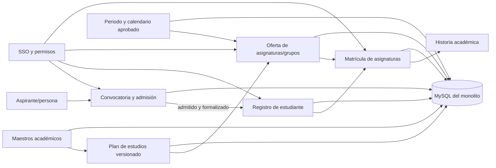

# Plataforma académica y ciclo de vida estudiantil — diseño arquitectónico

**Estado:** borrador para revisión del patrocinador; no habilita implementación ni tratamiento de datos reales.
**Objetivo:** construir por etapas el ciclo académico de pregrado presencial desde el catálogo curricular y la inscripción hasta el expediente del estudiante y la matrícula de asignaturas.
**Datos personales:** no se usan datos reales en este diseño ni en desarrollo.

## Entendimiento del objetivo

La plataforma reemplazará gradualmente los sistemas universitarios, con dos monolitos coordinados: React/Vite/TypeScript/SCSS para la interfaz y Java 25/Spring Boot para la lógica; MySQL y Flyway para persistencia. La estructura académica, los periodos y un catálogo versionado con importación CSV ya existen en el backend. Faltan aspirantes, estudiantes, admisiones, oferta de grupos y matrícula. El alcance final es el ciclo institucional; el primer dominio funcional confirmado por el patrocinador es pregrado presencial.

Las reglas del negocio y los datos maestros pertenecen a las áreas UPTC. Las fuentes públicas preparan el descubrimiento, pero no autorizan por sí mismas selección automática, captura de datos sensibles, matrícula ni corte de un sistema institucional. El entorno local conserva datos vacíos y pruebas sintéticas.

## Enfoques considerados

1. **Catálogo primero, ciclo del estudiante después (recomendado):** validar estructura y programa; cargar y aprobar asignaturas y mallas versionadas; implementar convocatoria, aspirante y decisión de admisión; después convertir al admitido en estudiante y ofrecer/matricular asignaturas por periodo. Reduce referencias curriculares provisionales y habilita una cadena trazable.
2. **Estudiante y admisión primero:** comenzar con aspirantes y ficha personal, enlazando temporalmente códigos de programa y mallas existentes. Entrega antes un formulario, pero aumenta el riesgo de duplicar personas, códigos, afiliaciones y campos antes de validar las fuentes maestras y el tratamiento de datos.
3. **Piloto de punta a punta para un programa y cohorte:** integrar en una sola entrega catálogo, inscripción, admisión y primera matrícula. Aporta valor visible si el dueño funcional facilita reglas, sistemas e información de ensayo; hoy esos contratos no están aprobados y hacen inviable completar el corte sin supuestos.

Se recomienda el enfoque 1 y desplegar cada etapa en `develop`. La interfaz pública puede mostrar estados y datos publicados; los comandos de administración siguen protegidos por permisos del servidor. La administración web permanece en consulta hasta tener SSO institucional y claims/grupos aprobados.

## Arquitectura objetivo

Los módulos permanecen dentro de los dos monolitos y comparten MySQL transaccional. Cada módulo posee sus tablas y expone contratos de aplicación; no hay escrituras directas entre módulos ni separación prematura en microservicios.

| Módulo backend | Responsabilidad | Fuente de escritura |
|---|---|---|
| `academics` | Unidades, sedes, afiliaciones, programas, asignaturas, versiones de plan de estudios y periodos/calendarios | Maestro académico y actos aprobatorios confirmados por sus responsables |
| `admissions` | Convocatorias y reglas versionadas; inscripciones, opciones, validaciones, decisiones, reclamaciones y llamados | ACRA y autoridad normativa, con contratos institucionales aprobados |
| `students` | Vínculo persistente de persona con condición de estudiante, programa(s), cohorte(s) e historia académica | Registro Académico y fuentes de identidad autorizadas |
| `academic-operations` | Oferta de grupos, matrícula de asignaturas, novedades y resultados | Áreas responsables de programación, escuelas y Registro Académico |
| `identity` / seguridad | Identidad de operador y permisos por acción; auditoría de cambios | Proveedor OIDC institucional y matriz de roles aprobada |

Los límites son módulos del monolito, no promesas de microservicios. La interfaz React consume contratos HTTP; el backend mantiene autorización, invariantes y transacciones. Los datos de búsqueda desnormalizados son proyecciones, nunca una segunda fuente de escritura.

## Separación del modelo académico

- **Programa:** identidad estable reutilizada; facultad/escuela y lugar se derivan de afiliaciones con vigencia, no de nuevos campos canónicos de texto. Cambios de unidad, sede o prioridad serán efectivos desde una fecha, conservarán el estado anterior y registrarán actor, referencia y auditoría.
- **Asignatura:** identidad de catálogo y revisiones de atributos. La unicidad del código entre programas, niveles, sedes y modalidades requiere validación del dueño del maestro antes de importación oficial.
- **Malla o plan de estudios:** versión inmutable asociada a programa y cohorte; ordena actividades/asignaturas por semestre curricular, créditos, espacio y componente. El semestre dentro de la malla no es un periodo académico.
- **PAE:** no es sinónimo del archivo CSV de asignaturas. El importador actual representa una malla/plan, no el proyecto académico educativo completo. Sus documentos, objetivos, perfiles, resultados de aprendizaje, métodos y aprobaciones requieren inventario separado y versión institucional.
- **Prerrequisitos, equivalencias y homologaciones:** relaciones explícitas, versionadas y con procedencia; no inferirlas por semestre, nombre o coincidencia de créditos. Se integran cuando el dueño académico confirme semántica, alcance y excepciones.
- **Periodo académico:** entidad fechada `REGULAR` o `INTERSEMESTRAL`, con calendario versionado y transición auditada. Su estado `OPEN` no equivale a una ventana de inscripción abierta; cada operación consultará la actividad de calendario que la habilita. El [Acuerdo 017 de 2023](https://www.uptc.edu.co/export/sites/default/secretaria_general/consejo_superior/acuerdos_2023/Acuerdo_017_2023.pdf) publica un rango de 20 a 35 estudiantes para abrir un curso intersemestral: es una condición candidata del grupo/curso, no de la apertura del periodo, y su aplicación vigente debe validarse con el dueño académico antes de automatizarla.

La importación conserva el flujo de prevalidación sin escritura, creación transaccional de borrador y publicación separada. Se añade gestión auditable del maestro y contratos de importación oficiales cuando se conozca el formato fuente. Una carga debe ser idempotente por claves de origen acordadas y mostrar filas rechazadas, conciliación y hash de origen; una fila inválida no produce escrituras parciales.

## Flujo objetivo del estudiante

1. **Oferta académica aprobada:** existen programa, afiliación vigente, malla publicada para cohorte, materias y periodo/calendario aprobados.
2. **Convocatoria:** se crea una convocatoria por cohorte, fuente normativa, reglas, programas/sedes, cupos y ventanas versionadas. Cambios posteriores crean revisión y no sobrescriben decisiones previas.
3. **Inscripción:** se captura solo el conjunto de campos y soportes autorizado. Se conserva cada presentación/corrección, su actor y fecha; las correcciones de identificadores siguen el proceso confirmado por ACRA.
4. **Verificación y selección:** reglas por programa/opción/prueba/cupo se ejecutan de forma reproducible contra versiones identificables. El sistema no calcula o publica decisión automática si falta ponderación, cupo, desempate, excepción o evidencia requerida.
5. **Admisión:** la decisión y los llamados son auditables. Solo una aceptación/formalización válida crea o vincula un registro de estudiante mediante el identificador maestro autorizado; inscripción, admisión, persona y condición estudiantil son entidades distintas.
6. **Oferta y matrícula:** se abren grupos desde una malla y un periodo, con código de sección, programa/sede, cupo, horario y responsables confirmados. El estudiante registra/cancela asignaturas dentro de las ventanas aplicables; choques, prerrequisitos, créditos, cupos, listas de espera y excepciones siguen reglas configuradas/versionadas y validadas.
7. **Historia académica:** cambios, resultados, homologaciones, reingresos, retiros, grados y certificados conservan procedencia y estado a la fecha del hecho. Estos subflujos se habilitan por sus propietarios y reglas, no por una enumeración genérica del estado de estudiante.

No se crea un único `student_status` que mezcle admisión, matrícula de programa, periodo y curso. Cada agregado tendrá transiciones y actores propios, y los eventos administrativos se escriben en la misma transacción que el cambio protegido.

## Secuencia de entrega

| Etapa | Contenido | Condición de salida |
|---|---|---|
| A. Maestros y mallas | Corrección efectiva/auditable de unidades, sitios, afiliaciones y orden; revisión del contrato de códigos; plantilla e importación/revisión/publicación de asignaturas y planes por cohorte; alcance explícito PAE vs. malla | Dueños de datos aceptan claves, jerarquía, muestra conciliada, aprobaciones y referencias de origen |
| B. Identidad y admisión | Contratos de persona/aspirante, datos mínimos por finalidad, convocatoria versionada, inscripción y selección de pregrado presencial; opción normalista como flujo aparte si ACRA lo decide | ACRA, Jurídica, Registro, Oficial de Protección de Datos y seguridad aprueban proceso, campos, reglas, permisos, fuente e integración |
| C. Estudiante y matrícula | Conversión admitido→estudiante; programa/cohorte, oferta de grupos, matrícula/cancelación y consulta de expediente por periodo | Registro Académico, escuelas y programas piloto aprueban ventanas, cupos, choques, créditos, prerrequisitos, novedades y reversa |
| D. Historia y continuidad | Calificaciones, homologación, reingreso, aplazamiento, retiro, grado, certificados e integraciones confirmadas | Reglas y sistemas fuente aceptados por dominio; conciliación, auditoría, retención y rollback ensayados |

Cada etapa se divide en cortes verticales con backend, interfaz, Flyway, pruebas AAA, C4/datos/procesos actualizados y evidencia verificable. Integrar un corte en `develop` no declara que ese proceso sea fuente oficial ni habilita producción.

## Seguridad, privacidad y migración

- No copiar estudiantes o aspirantes reales a Compose, fixtures, capturas ni benchmarks. No pedir ni almacenar PIN, identificaciones o soportes hasta aprobar necesidad, finalidad, base de tratamiento, clasificación, retención/eliminación, titulares menores, corrección, destinatarios e incidentes.
- El usuario/persona de SSO es distinto de aspirante y estudiante; autenticarse no otorga permisos académicos. Denegar por defecto; separar lectura, operación, publicación y administración; auditar lecturas sensibles y mutaciones según política UPTC aprobada.
- El inventario público UPTC remite a Resolución 3842 de 2013 y publica un Oficial de Protección de Datos designado por Resolución 1372 de 2023, así como reglas de seguridad posteriores. El carácter vigente, los campos, las finalidades y los periodos de conservación deben ser confirmados con sus responsables antes del contrato de datos. La Ley 1581/2012 requiere contemplar protección reforzada cuando haya aspirantes menores.
- Cada migración de dominio será de solo lectura/perfilado primero, con mapa de claves, conteos, discrepancias, idempotencia y reconciliación. Mantener una sola fuente oficial de escritura; preparar reversa y aceptación antes de corte. No realizar doble escritura sin conciliación.
- El objetivo MySQL de promedio `<50 ms` se verifica por consulta/end-point con volumen y concurrencia aprobados; registrar promedio y p50/p95/p99. El benchmark local actual no certifica rendimiento institucional.

## Decisiones pendientes de los dueños UPTC

1. Inventario maestro actual y claves oficiales de persona, aspirante, estudiante, programa, materia, cohorte, sede y grupo; fuentes autoritativas y contratos disponibles.
2. Campos personales mínimos por etapa, menores de edad, datos sensibles, soportes, finalidades, base del tratamiento, destinatarios y retención; política vigente y matriz de roles/claims.
3. Vigencia consolidada por cohorte de reglas de admisión, ponderaciones, pruebas, cupos, normalistas, empates, recursos, PIN y beneficios financieros.
4. Alcance aprobatorio de mallas/PAE, archivo maestro, códigos de asignatura, prerrequisitos, equivalencias y adscripción a cohortes/programas.
5. Ventanas/actos para apertura de matrícula, reglas de inscripción/cancelación, tope de créditos, conflictos de horario, cupos, mínimo/máximo por grupo e intersemestral, excepciones y cierre.
6. Cohorte/programa piloto, totales de conciliación, entorno de ensayo, aceptación de dueños, rollback y responsables operativos.

Las fuentes públicas ya registradas en [descubrimiento del ciclo estudiantil](../../discovery/student-lifecycle-baseline.md), [diseño del catálogo](2026-09-29-academic-catalog-design.md), [diseño de estructura y periodos](2026-09-30-academic-structure-and-periods-design.md) y [plan de admisiones](../plans/2026-09-30-pregrado-admissions.md) preparan estas decisiones; no reemplazan su aprobación.

## Criterios de aceptación arquitectónica

- Programa, asignatura, malla, periodo, aspirante, estudiante y matrícula tienen identidades y responsables diferenciados, sin campos repetidos usados como fuentes de verdad.
- Una cohorte conserva la versión de reglas de admisión y la malla que sustentan su resultado y su trayectoria.
- Una persona admitida puede convertirse en estudiante sin duplicarse y sin perder historial, una vez validada la clave institucional.
- Una operación de oferta o matrícula verifica periodo, ventana y reglas aprobadas y entrega conflicto determinista, sin cambios parciales ni auditoría huérfana.
- Correcciones de estructura, currículo y decisiones personales conservan valores/versiones previos y procedencia de acuerdo con política de acceso y retención.
- Los componentes futuros aparecen en diagramas como planeados hasta contar con implementación verificada; ninguna etiqueta los presenta como disponibles.
- Ningún corte de software autoriza carga real, selección oficial, reemplazo de sistema ni puesta en producción por sí solo.
