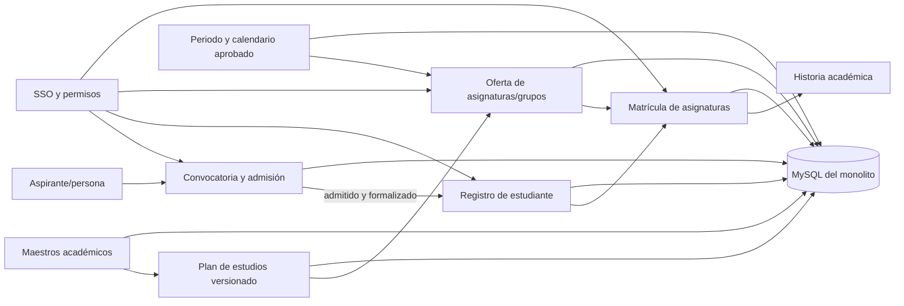
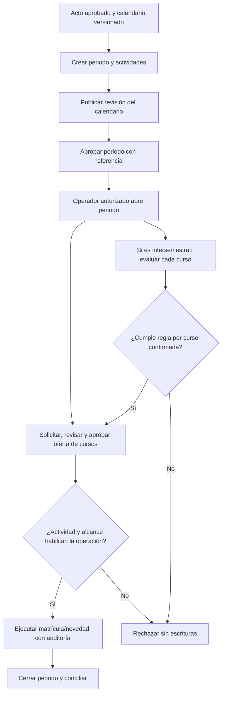

# Plataforma académica y ciclo de vida estudiantil — diseño arquitectónico

**Estado:** borrador para revisión del patrocinador; no habilita implementación ni tratamiento de datos reales.
**Objetivo:** construir por etapas el ciclo académico de pregrado presencial desde el catálogo curricular y la inscripción hasta el expediente del estudiante y la matrícula de asignaturas.
**Datos personales:** no se usan datos reales en este diseño ni en desarrollo.
**Áreas funcionales sugeridas por el patrocinador:** ACRA y Registro Académico, para participar en la validación de la fuente maestra y los campos del expediente. La evidencia pública distingue un Departamento ACRA central, contactos por seccional y “Registro y Control Académico” como proceso local en Sogamoso. Se debe mapear esa capa operativa sin inferir su RACI. La sugerencia no designa formalmente dueños ni confirma sistema autoritativo, contratos de datos o autorización para tratar información personal. El alcance del SGDEA y la referencia contractual “SGDA” también están por confirmar. Véanse el [antecedente de nomenclatura](../../discovery/student-lifecycle-baseline.md) y el [hallazgo de expedientes/documentos](../../discovery/uptc-academic-records-management.md).

## Entendimiento del objetivo

La plataforma reemplazará gradualmente los sistemas universitarios, con dos monolitos coordinados: React/Vite/TypeScript/SCSS para la interfaz y Java 25/Spring Boot para la lógica; MySQL y Flyway para persistencia. El backend ya permite registrar unidades, sedes, afiliaciones de programas y periodos regulares/intersemestrales; también versiona calendarios y audita su publicación, aprobación, apertura y cierre. El periodo actual tiene una identidad global por tipo/año/secuencia; sus actividades pueden tener alcance por unidad o sede, pero no por modalidad o programa. La vista actual es de consulta: todavía no existe oferta de grupos, matrícula de asignaturas ni una consola autenticada para corregir adscripciones u ordenar de nuevo la estructura. Faltan aspirantes, estudiantes, admisiones, oferta de grupos y matrícula. El alcance final es el ciclo institucional; el primer dominio funcional confirmado por el patrocinador es pregrado presencial.

Las reglas del negocio y los datos maestros pertenecen a las áreas UPTC. Las fuentes públicas preparan el descubrimiento, pero no autorizan por sí mismas selección automática, captura de datos sensibles, matrícula ni corte de un sistema institucional. El entorno local conserva datos vacíos y pruebas sintéticas.

## Enfoques considerados

1. **Preparar maestros mínimos y priorizar inscripción/selección (recomendado):** primero asegurar las referencias que la convocatoria necesita (códigos, programa, facultad/unidad, sede, cohorte y cupos); el primer corte funcional sigue siendo inscripción y selección de aspirantes, la prioridad ya definida por el patrocinador. La malla/PAE no bloquea admisiones si el proceso no la requiere; se habilita para oferta académica posterior. La cadena usa reglas versionadas y datos sintéticos hasta que ACRA valide fuentes, reglas y datos reales.
2. **Completar el catálogo antes de admisiones:** publicar todas las mallas, asignaturas y relaciones curriculares primero y después desarrollar la convocatoria. Reduce referencias provisionales, pero retrasa el flujo de inscripción/selección que el patrocinador priorizó y podría exigir catálogos que la convocatoria no necesita.
3. **Piloto de punta a punta para un programa y cohorte:** integrar catálogo, inscripción, admisión y primera matrícula en una entrega. Aporta valor visible si los dueños facilitan reglas, sistemas e información de ensayo; hoy esos contratos no están aprobados y hace falta dividirlo en cortes verificables.

Se recomienda el enfoque 1 y desplegar cada etapa en `develop`. La interfaz pública puede mostrar estados y datos publicados; los comandos de administración siguen protegidos por permisos del servidor. La administración web permanece en consulta hasta tener SSO institucional y claims/grupos aprobados.

## Arquitectura objetivo

Los módulos permanecen dentro de los dos monolitos y comparten MySQL transaccional. Cada módulo posee sus tablas y expone contratos de aplicación; no hay escrituras directas entre módulos ni separación prematura en microservicios.

| Módulo backend | Responsabilidad | Fuente de escritura |
|---|---|---|
| `academics` | Unidades, sedes, afiliaciones, programas, asignaturas, versiones de plan de estudios y periodos/calendarios | Maestro académico y actos aprobatorios confirmados por sus responsables |
| `admissions` | Convocatorias y reglas versionadas; inscripciones, opciones, validaciones, decisiones, reclamaciones y llamados | ACRA y autoridad normativa, con contratos institucionales aprobados |
| `students` | Vínculo persistente de persona con condición de estudiante, programa(s), cohorte(s) e historia académica | Registro Académico (responsable propuesto por el patrocinador) y fuentes de identidad autorizadas; confirmar formalmente maestro, campos y contratos |
| `academic-operations` | Oferta de grupos, matrícula de asignaturas, novedades y resultados | Áreas responsables de programación, escuelas y Registro Académico |
| `identity` / seguridad | Identidad de operador y permisos por acción; auditoría de cambios | Proveedor OIDC institucional y matriz de roles aprobada |

Los límites son módulos del monolito, no promesas de microservicios. La interfaz React consume contratos HTTP; el backend mantiene autorización, invariantes y transacciones. Los datos de búsqueda desnormalizados son proyecciones, nunca una segunda fuente de escritura.

## Separación del modelo académico

- **Programa y orden de la estructura:** identidad estable reutilizada; facultad/escuela y lugar se derivan de afiliaciones con vigencia, no de nuevos campos canónicos de texto. El modelo actual tiene orden de visualización en unidades, sedes y afiliaciones de programa; la consulta usa ese orden y desempates estables. La afiliación permite representar orden desde su creación, pero aún no existe un comando autenticado para corregir adscripciones ni reordenar después. El diseño objetivo permitirá ordenar facultades, escuelas/unidades, lugares y programas dentro de su ámbito; el orden de cada hijo se guardará en su relación con el padre correspondiente (no como propiedad global del nodo), tendrá vigencia, actor, referencia y auditoría, y se cambiará de forma atómica. Las mallas conservarán su orden curricular propio (semestre curricular y orden de fila); ningún orden visual cambiará códigos o identidad académica.
- **Asignatura:** identidad de catálogo y revisiones de atributos. La unicidad del código entre programas, niveles, sedes y modalidades requiere validación del dueño del maestro antes de importación oficial.
- **Malla o plan de estudios:** versión inmutable asociada a programa y cohorte; ordena actividades/asignaturas por semestre curricular, créditos, espacio y componente. El semestre dentro de la malla no es un periodo académico.
- **PAE:** no es sinónimo del archivo CSV de asignaturas. El importador actual representa una malla/plan, no el proyecto académico educativo completo. Sus documentos, objetivos, perfiles, resultados de aprendizaje, métodos y aprobaciones requieren inventario separado y versión institucional.
- **Prerrequisitos, equivalencias y homologaciones:** relaciones explícitas, versionadas y con procedencia; no inferirlas por semestre, nombre o coincidencia de créditos. Se integran cuando el dueño académico confirme semántica, alcance y excepciones.
- **Periodo académico y alcance:** el semestre curricular de una asignatura no es el periodo académico fechado en que se ofrece. El backend actual representa periodos `REGULAR` e `INTERSEMESTRAL`, valida secuencias 1–2 para regulares, y soporta DRAFT → APPROVED → OPEN → CLOSED (con cancelación antes de abrir). Para aprobar exige una revisión de calendario publicada y referencia aprobatoria; abrir/cerrar es una acción manual auditada. Las actividades admiten fechas y alcance por unidad/sede, y una modificación publicada queda como revisión nueva. La restricción global actual `(tipo, año, secuencia)` y la falta de alcance tipado por modalidad/programa no bastan para calendarios heterogéneos; antes de ampliar más allá del piloto de pregrado presencial habrá que acordar un alcance académico explícito y usarlo en claves, ventanas, autorizaciones y consultas. La [página pública de ACRA para 2026-2](https://www.uptc.edu.co/sitio/portal/sitios/universidad/vic_aca/adm_reg/2estu/est_pre.html) presenta fechas diferenciadas para presencial y FESAD, y lista resoluciones modificatorias 145/2025, 146/2025, 054/2026, 079/2026 y 104/2026; es evidencia para versionar calendario y alcance, no autorización para copiar fechas a código.
- **Apertura operativa:** `OPEN` marca el estado administrativo del periodo; por sí solo no abre matrícula, no crea grupos y no permite inscribir asignaturas. Cada operación futura (solicitud/aprobación/publicación de oferta, matrícula, cancelación, evaluación u otra) debe comprobar periodo, tipo, alcance académico, actividad y ventana vigentes en el calendario, además del estado y los permisos. Para el primer corte, el alcance se restringe a pregrado presencial; el modelo ampliado incorporará únicamente dimensiones aprobadas (nivel, modalidad, unidad, sede, programa o cohorte), con claves foráneas y consultas tipadas, no reglas basadas en texto libre. Las fechas no se codifican por año ni se abren automáticamente por cron. El flujo objetivo es: acto y calendario → borrador → revisión publicada → aprobación → apertura explícita → oferta/grupos aprobados → ventanas independientes para cada trámite → cierre con conciliación e historia.
- **Intersemestral:** el modelo actual tiene un tipo de periodo independiente, pero la norma pública regula cursos y calendarios de esos cursos; las autoridades académicas que UPTC designe, con la participación que corresponda de ACRA/Registro Académico, deben confirmar si la fuente maestra los representa como periodos independientes o como cursos dentro de una ventana de receso. El [Acuerdo 017 de 2023](https://www.uptc.edu.co/export/sites/default/secretaria_general/consejo_superior/acuerdos_2023/Acuerdo_017_2023.pdf) modifica el Acuerdo 035 de 2017 y fija entre 20 y 35 estudiantes para abrir cada curso; no es un umbral para abrir el periodo. El [calendario 2023](https://www.uptc.edu.co/export/sites/default/secretaria_general/consejo_academico/resoluciones_2023/res_37_2023.pdf) muestra la aprobación calendarizada por el Consejo Académico. Como ejemplo distinto, la [Resolución 015 de 2024](https://www.uptc.edu.co/export/sites/default/secretaria_general/consejo_academico/resoluciones_2024/res_015_2024.pdf) organizó solicitudes estudiantiles, recomendación del Comité de Currículo, aprobación del Consejo de Facultad, pagos, programación/registro de Escuelas en SIRA, desarrollo, notas y cierre. El [Acuerdo 027 de 2024](https://www.uptc.edu.co/export/sites/default/secretaria_general/consejo_superior/acuerdos_2024/Acuerdo_027_2024.pdf) permitió hasta dos cursos por estudiante si uno era de repetición, pero solo para junio-julio de 2024. Son antecedentes acotados, no reglas que puedan codificarse para otra cohorte sin confirmar vigencia, excepciones, sistema y roles actuales.

La importación conserva el flujo de prevalidación sin escritura, creación transaccional de borrador y publicación separada. Se añade gestión auditable del maestro y contratos de importación oficiales cuando se conozca el formato fuente. Una carga debe ser idempotente por claves de origen acordadas y mostrar filas rechazadas, conciliación y hash de origen; una fila inválida no produce escrituras parciales.

## Flujo objetivo del estudiante

El diagrama presenta el flujo objetivo, no una consola ya disponible. La API actual cubre periodo, calendario y transición; la oferta, inscripción, evaluación y conciliación siguen pendientes.

1. **Oferta académica aprobada:** existen programa, afiliación vigente, malla publicada para cohorte, materias y periodo/calendario aprobados.
2. **Convocatoria:** se crea una convocatoria por cohorte, fuente normativa, reglas, programas/sedes, cupos y ventanas versionadas. Cambios posteriores crean revisión y no sobrescriben decisiones previas.
3. **Inscripción:** se captura solo el conjunto de campos y soportes autorizado. Se conserva cada presentación/corrección, su actor y fecha; las correcciones de identificadores siguen el proceso confirmado por ACRA.
4. **Verificación y selección:** reglas por programa/opción/prueba/cupo se ejecutan de forma reproducible contra versiones identificables. El sistema no calcula o publica decisión automática si falta ponderación, cupo, desempate, excepción o evidencia requerida.
5. **Admisión:** la decisión y los llamados son auditables. Solo una aceptación/formalización válida crea o vincula un registro de estudiante mediante el identificador maestro autorizado; inscripción, admisión, persona y condición estudiantil son entidades distintas.
6. **Oferta y matrícula regular:** tras abrir el periodo, las unidades solicitan grupos desde la malla vigente y el responsable los aprueba/publica; luego las ventanas de matrícula y novedades habilitan las operaciones de estudiantes. El estudiante registra/cancela asignaturas dentro de la ventana y alcance aplicables. Choques, prerrequisitos, créditos, cupos, listas de espera y excepciones siguen reglas configuradas/versionadas y validadas. Abrir un periodo no publica automáticamente los grupos.
7. **Oferta intersemestral:** se recibe y evalúa la solicitud de cada curso; se valida programa, materia, estudiantes elegibles, unidad/sede, docente, intensidad, derechos pecuniarios, fechas y aprobaciones definidas por la norma vigente. El umbral de 20–35 se evalúa por curso cuando la oferta se abre, no sobre el periodo. Solo después de confirmar el modelo institucional se determina si se reutiliza `AcademicPeriod` o si se requiere una ventana de oferta separada.
8. **Historia académica:** cambios, resultados, homologaciones, reingresos, retiros, grados y certificados conservan procedencia y estado a la fecha del hecho. Estos subflujos se habilitan por sus propietarios y reglas, no por una enumeración genérica del estado de estudiante.

No se crea un único `student_status` que mezcle admisión, matrícula de programa, periodo y curso. Cada agregado tendrá transiciones y actores propios, y los eventos administrativos se escriben en la misma transacción que el cambio protegido.

## Secuencia de entrega

| Etapa | Contenido | Condición de salida |
|---|---|---|
| A. Maestros mínimos, orden y periodos | Corrección efectiva/auditable de unidades, sedes, relaciones, afiliaciones y orden; códigos/referencias que necesita la convocatoria; operación administrativa del ciclo de periodos y calendarios regulares/intersemestrales ya existente | Dueños de datos aceptan claves, jerarquía/orden, muestra conciliada, reglas de periodo y referencias de origen |
| B. Inscripción y selección — primer corte funcional | Contratos de persona/aspirante, datos mínimos por finalidad, convocatoria versionada, inscripción y selección de pregrado presencial; opción normalista como flujo aparte si ACRA lo decide | ACRA, Jurídica, Registro, Oficial de Protección de Datos y seguridad aprueban proceso, campos, reglas, permisos, fuente e integración |
| C. Estudiante, oferta y matrícula | Conversión admitido→estudiante; programa/cohorte, grupos regulares/intersemestrales, matrícula/cancelación y consulta de expediente por periodo | Registro Académico, escuelas y programas piloto aprueban ventanas, cupos, choques, créditos, prerrequisitos, reglas por curso intersemestral, novedades y reversa |
| D. Historia y continuidad | Calificaciones, homologación, reingreso, aplazamiento, retiro, grado, certificados e integraciones confirmadas | Reglas y sistemas fuente aceptados por dominio; conciliación, auditoría, retención y rollback ensayados |

Cada etapa se divide en cortes verticales con backend, interfaz, Flyway, pruebas AAA, C4/datos/procesos actualizados y evidencia verificable. Integrar un corte en `develop` no declara que ese proceso sea fuente oficial ni habilita producción.

## Seguridad, privacidad y migración

- No copiar estudiantes o aspirantes reales a Compose, fixtures, capturas ni benchmarks. No pedir ni almacenar PIN, identificaciones o soportes hasta aprobar necesidad, finalidad, base de tratamiento, clasificación, retención/eliminación, titulares menores, corrección, destinatarios e incidentes.
- El usuario/persona de SSO es distinto de aspirante y estudiante; autenticarse no otorga permisos académicos. Denegar por defecto; separar lectura, operación, publicación y administración; auditar lecturas sensibles y mutaciones según política UPTC aprobada.
- El inventario público UPTC remite a Resolución 3842 de 2013 y publica un Oficial de Protección de Datos designado por Resolución 1372 de 2023, así como reglas de seguridad posteriores. La TRD 2025 de ACRA establece retenciones archivísticas para convocatorias e historiales; los plazos no constituyen una regla de borrado automático de registros operativos o respaldos. El carácter vigente, el alcance documental, los campos, las finalidades y la conservación deben confirmarse con sus responsables antes del contrato de datos. La Ley 1581/2012 requiere contemplar protección reforzada cuando haya aspirantes menores.
- Cada migración de dominio será de solo lectura/perfilado primero, con mapa de claves, conteos, discrepancias, idempotencia y reconciliación. Mantener una sola fuente oficial de escritura; preparar reversa y aceptación antes de corte. No realizar doble escritura sin conciliación.
- El objetivo MySQL de promedio `<50 ms` se verifica por consulta/end-point con volumen y concurrencia aprobados; registrar promedio y p50/p95/p99. El benchmark local actual no certifica rendimiento institucional.

## Decisiones pendientes de los dueños UPTC

1. Mapear Departamento ACRA central y funciones/contactos de Registro y Control Académico por seccional; designar por entidad/sede el dueño de datos, responsable de proceso, custodio operativo, sistema autoritativo y responsable técnico. Inventariar el alcance del SGDEA y resolver la referencia “SGDA” de Sogamoso. Confirmar claves oficiales y contratos de persona, aspirante y estudiante; para programa, materia, cohorte, sede y grupo, confirmar fuentes con responsables académicos respectivos.
2. Las autoridades institucionales que UPTC designe —con participación de ACRA/Registro Académico según su estructura— deben aprobar los campos personales mínimos por etapa, menores de edad, datos sensibles, soportes, finalidades, base del tratamiento, destinatarios y retención; también la política vigente y la matriz de roles/claims.
3. Vigencia consolidada por cohorte de reglas de admisión, ponderaciones, pruebas, cupos, normalistas, empates, recursos, PIN y beneficios financieros.
4. Alcance aprobatorio de mallas/PAE, archivo maestro, códigos de asignatura, prerrequisitos, equivalencias y adscripción a cohortes/programas.
5. Ventanas/actos para apertura de matrícula, reglas de inscripción/cancelación, tope de créditos, conflictos de horario, cupos, mínimo/máximo por grupo e intersemestral, excepciones y cierre.
6. Semestre regular frente a curso intersemestral: confirmar el agregado institucional correcto, responsables, calendarios y actos; dimensiones del alcance (nivel/modalidad/unidad/sede/programa/cohorte) y clave de unicidad; flujo de solicitud y aprobación; prerrequisitos de estudiante, intensidad, cobros, cancelación, mínimo/máximo por curso, excepciones y su vigencia normativa.
7. Orden oficial de facultades, escuelas/unidades, lugares, programas y ofertas; alcance del orden (por cada padre, sede y vigencia), maestro fuente, actores que pueden modificarlo y procedimiento de publicación/auditoría.
8. Cohorte/programa piloto, totales de conciliación, entorno de ensayo, aceptación de dueños, rollback y responsables operativos.

Las fuentes públicas ya registradas en [descubrimiento del ciclo estudiantil](../../discovery/student-lifecycle-baseline.md), [diseño del catálogo](2026-09-29-academic-catalog-design.md), [diseño de estructura y periodos](2026-09-30-academic-structure-and-periods-design.md) y [plan de admisiones](../plans/2026-09-30-pregrado-admissions.md) preparan estas decisiones; no reemplazan su aprobación.

## Criterios de aceptación arquitectónica

- Programa, asignatura, malla, periodo, aspirante, estudiante y matrícula tienen identidades y responsables diferenciados, sin campos repetidos usados como fuentes de verdad.
- El orden de facultades/unidades, lugares, programas y asignaturas es explícito, determinista y consistente entre API, pantallas y exportaciones; los empates tienen una regla estable y no dependen del motor de base de datos.
- Reordenar una relación requiere permiso, fecha efectiva y motivo/referencia; conserva el orden anterior, escribe auditoría atómica y rechaza cambios concurrentes sin dejar secuencias parciales o duplicadas.
- Crear, aprobar, abrir, cerrar o cancelar un periodo regular sigue el ciclo y genera historial; un intersemestral usa calendario/ventanas por curso una vez confirmado su modelo institucional.
- Las consultas y operaciones delimitan el periodo por alcance académico aprobado; dos modalidades con fechas distintas no comparten ventanas por coincidencia de etiqueta, y las ventanas ajenas al estudiante/programa no autorizan su operación.
- Una matrícula u otra operación solo procede cuando coinciden periodo OPEN, actividad habilitante vigente, alcance unidad/sede/programa, regla versionada y permiso; fuera de ventana o con calendario modificado responde conflicto sin escritura parcial.
- La regla pública de 20–35, si los responsables confirman que sigue vigente para el proceso, se evalúa por curso intersemestral; nunca como condición para abrir todo el calendario.
- Una cohorte conserva la versión de reglas de admisión y la malla que sustentan su resultado y su trayectoria.
- Una persona admitida puede convertirse en estudiante sin duplicarse y sin perder historial, una vez validada la clave institucional.
- Una operación de oferta o matrícula verifica periodo, ventana y reglas aprobadas y entrega conflicto determinista, sin cambios parciales ni auditoría huérfana.
- Correcciones de estructura, currículo y decisiones personales conservan valores/versiones previos y procedencia de acuerdo con política de acceso y retención.
- Los componentes futuros aparecen en diagramas como planeados hasta contar con implementación verificada; ninguna etiqueta los presenta como disponibles.
- Ningún corte de software autoriza carga real, selección oficial, reemplazo de sistema ni puesta en producción por sí solo.
