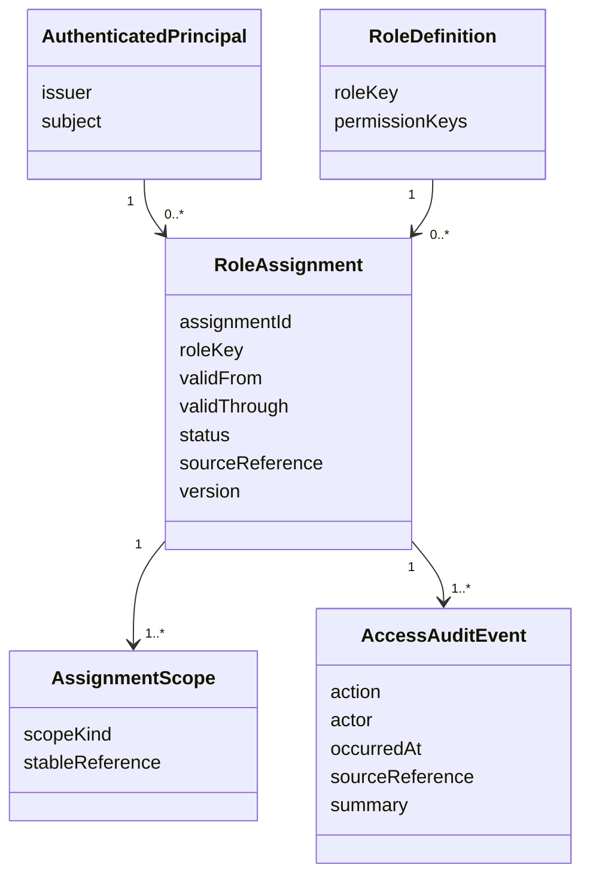
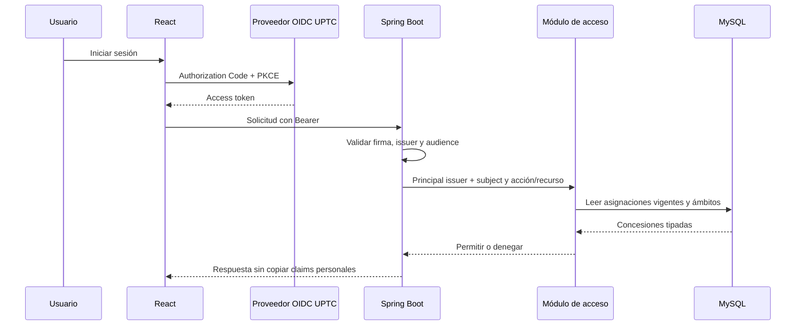
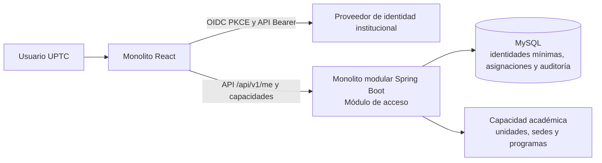

# Identidad y permisos por ámbito — propuesta de diseño

**Estado:** borrador para aprobación del patrocinador; no autoriza configuración institucional ni acceso a datos reales.<br>
**Fecha:** 1 de octubre de 2026<br>
**Primera capacidad:** asignación administrativa de permisos a identidades ya autenticadas, con alcance explícito y auditoría.<br>
**Fuentes de autenticación:** proveedor OIDC institucional, pendiente de configuración y validación por DTIC.<br>
**Datos personales:** ninguno en esta propuesta.

## Decisión propuesta

Adoptar un modelo híbrido: el proveedor institucional autentica a la persona y aporta su identificador opaco estable (`issuer` + `subject`); el backend conserva las asignaciones de roles funcionales de esta plataforma y sus ámbitos en MySQL. El backend calcula permisos en cada solicitud autenticada. El proveedor continúa siendo responsable de activar y desactivar la identidad institucional.

Esta opción responde al requerimiento de administrar perfiles y subroles de la plataforma, mantiene el control de acceso en el backend y permite revocar una asignación de la aplicación sin cambiar las credenciales de la persona. No se almacenan contraseñas, tokens OIDC, correo, teléfonos, fotos ni perfiles personales. No se aceptan permisos enviados por React.

Alternativas evaluadas:

| Alternativa | Ventaja | Riesgo para este caso |
|---|---|---|
| Todos los grupos y ámbitos vienen en claims del proveedor | Administración de identidades centralizada | Requiere que DTIC publique y mantenga claims/grupos detallados por módulo, facultad, programa y cargo; la evidencia pública no confirma ese contrato. |
| SSO autentica y la plataforma administra asignaciones locales | Permite administrar alcance funcional y revocación en esta plataforma | Requiere asignación inicial y conciliación periódica con las fuentes institucionales de vinculación y estructura. |
| Roles locales y autenticación local | Independencia del proveedor para acceso | Duplica credenciales y procesos institucionales de identidad; no se propone. |

## Identidad, perfil funcional y estado académico

- Una identidad de aplicación se vincula por el par validado (`issuer`, `subject`) del token. Ambos valores se validan criptográficamente con issuer y audience configurados por DTIC. La pareja es opaca: no se interpreta como correo ni documento.
- Tras el primer token válido, el backend puede registrar de forma automática solo esa pareja mínima. Iniciar sesión no concede privilegios administrativos; la nueva identidad parte con cero permisos hasta recibir una asignación aprobada.
- La revocación local de una asignación se aplica desde la siguiente solicitud autenticada. La latencia de baja de una cuenta institucional depende de la vigencia del token y de las capacidades de revocación/introspección del proveedor; DTIC debe fijar ese contrato antes de producción.
- Aspirante, admitido y estudiante representan etapas/relaciones del ciclo académico. Sus permisos de autoservicio se derivarán de un vínculo verificado con el registro fuente que se apruebe para cada proceso; esas etiquetas no autorizan a leer o editar personas ajenas.
- Docente, administrativo, directivo, admisiones y administrador son perfiles funcionales candidatos. El nombre del cargo por sí solo no concede permisos. La matriz rol–acción y la autoridad que asigna cada perfil requieren aprobación institucional.
- La cuenta pública de aspirante, sus datos y sus documentos siguen el sistema de inscripción vigente que la UPTC confirme. La plataforma no crea una contraseña alterna ni una segunda cuenta de aspirante mientras no se determine una interfaz autorizada con «Inscríbete», SIRA y la Fase III.

## Ámbitos y reglas de autorización

Una asignación contiene una identidad, un perfil funcional y uno o más límites tipados: universidad, sede, unidad académica/facultad, programa o cargo/nombramiento. `UNIVERSITY` es un alcance explícito, nunca un valor vacío por defecto. Los límites académicos reutilizan referencias normalizadas a las entidades existentes y validadas; el cargo conserva solo el identificador estable de nombramiento emitido por la fuente institucional autorizada. No se guardan nombres redundantes de facultades, programas o cargos en cada asignación.

Reglas propuestas:

1. Los límites incluidos en una misma asignación se intersectan (AND). Varias asignaciones vigentes de una identidad se combinan (OR).
2. Una asignación de facultad alcanza solo recursos y programas cuyo vínculo académico oficial esté vigente dentro de esa facultad. No amplía por nombre de texto ni por afiliación histórica.
3. Un cargo acredita una función; para restringir datos académicos también debe tener un ámbito organizacional explícito, salvo un rol institucional de alcance total aprobado expresamente.
4. El backend aplica la autorización tanto a la acción como al recurso. El frontend recibe permisos efectivos para renderizar controles, pero no decide el acceso a registros.
5. La vigencia de cada asignación tiene inicio, fin opcional, estado, actor que la concede, referencia institucional y versión para controlar concurrencia. Revocar conserva historial; no se borran asignaciones ni eventos de auditoría.
6. La consulta del servidor usa la fecha institucional vigente y vuelve a evaluar asignaciones en cada solicitud; una revocación confirmada afecta la siguiente solicitud autenticada.
7. Cualquier rol de alcance total requiere una asignación explícita, una referencia institucional y un procedimiento de provisión inicial separado. No habrá usuarios, grupos ni permisos seed de demostración.

El catálogo de permisos es una lista allowlisted del backend. Los perfiles habilitados son versiones revisadas que agrupan esas claves; el control de asignaciones no puede crear permisos, cambiar su significado ni concederse a sí mismo un perfil. La primera entrega administra asignaciones de perfiles habilitados; editar el catálogo de perfiles requiere un flujo separado de aprobación y no forma parte del primer corte.

Las reglas 2 y 3 deben confirmarse con DTIC, ACRA/Registro Académico y los responsables que la UPTC designe antes de habilitar datos reales. La jerarquía académica local todavía no tiene un catálogo oficial cargado.

## Límite de la primera entrega

El primer incremento de código, una vez aprobado el diseño, cubre:

- Contratos de aplicación para resolver principal autenticado, asignaciones activas, ámbito de recurso y decisión permiso–recurso.
- Persistencia versionada con Flyway para la vinculación mínima de identidad, perfiles permitidos, asignaciones tipadas y auditoría append-only del módulo de acceso.
- Endpoints del backend para consultar permisos/ámbitos propios y administrar asignaciones bajo permiso explícito de acceso; cada ruta queda allowlisted y denegada por defecto.
- Una vista de control React que lista/crea/revoca asignaciones solo con autorización de servidor, y presenta estados de carga, vacío, conflicto, error y pérdida de permiso.
- Pruebas AAA de dominio, autorización de rutas y contratos MySQL con datos sintéticos.

Los perfiles concretos (por ejemplo, admisiones o dirección de facultad) se habilitan en el catálogo después de aprobar su matriz de permisos. La vista no permite crear perfiles de aspirante, admitido o estudiante con acceso transversal; su acceso propio depende de la vinculación verificada del dominio correspondiente. La primera provisión del permiso global para administrar acceso deberá resolverse como operación institucional controlada; el producto no ofrece un botón de autorregistro privilegiado ni un seed de administrador.

Quedan para incrementos separados: búsqueda de personas por directorio/HR, alta o recuperación de cuentas, administración del proceso público de admisión, expediente, matrícula, oferta de cursos, grupos, notas y notificaciones. Cada uno necesita el contrato de datos y la fuente maestra que le correspondan. El mecanismo de ámbito debe admitir una futura relación docente–grupo y estudiante–registro propio; no se inventan tablas para grupos o matrículas en esta primera migración.

## Contratos y datos conceptuales



Las cardinalidades y el esquema relacional concreto se revisan al planear la migración: los ámbitos académicos deben tener integridad referencial y reutilizar `academic_organization_unit`, `academic_site` y el catálogo de programas. La fuente/código de cargo debe identificarse con Talento Humano/DTIC antes de crear una tabla maestra duplicada.

Interfaces internas propuestas:

```java
interface CurrentPrincipalProvider {
    AuthenticatedPrincipal requireCurrent();
}

interface AccessAssignmentRepository {
    List<RoleAssignment> findActive(AuthenticatedPrincipal principal, InstitutionalDate today);
    RoleAssignment save(RoleAssignment assignment, long expectedVersion);
}

interface AuthorizationPolicy {
    AccessDecision decide(AuthenticatedPrincipal principal, Permission permission, ResourceDescriptor resource);
}
```

Los adaptadores Spring Security, JDBC/Flyway y React consumen estos contratos. No se extraen servicios ni se agregan capas sin una responsabilidad comprobable.

## Flujo de autorización



## Criterios de aceptación de la implementación

- Sin issuer/audience válidos, todas las rutas protegidas responden `401`.
- Un token válido sin asignaciones o con asignaciones vencidas/revocadas obtiene cero permisos y `403` en operaciones protegidas.
- Un permiso de lectura no puede escribir; un rol o ámbito diferente no autoriza por prefijo ni por coincidencia de texto.
- Una persona con ámbito en una facultad no lee datos de otra facultad; un usuario no concede, amplía ni revoca sus propios privilegios.
- La referencia académica inexistente, histórica o ambigua falla cerrada; los conflictos de versión no pisan una asignación nueva.
- Los límites de una asignación se intersectan; dos asignaciones válidas se combinan y no duplican concesiones ni eventos.
- Los perfiles internos desconocidos, no habilitados o no configurados no conceden acceso. La interfaz no recibe credenciales, correos ni claims de perfil.
- Conceder/revocar y escribir su evento de auditoría forman una transacción. Un fallo no deja acceso parcial ni evento sin cambio.
- `/api/v1/me` retorna solo permisos y ámbitos que el frontend necesita para sus módulos y utiliza `Cache-Control: no-store`.
- Migraciones, permisos HTTP, casos borde y concurrencia se validan con TDD AAA y MySQL 8.4 efímero. No se habilitan proveedores ni usuarios de prueba en Compose.

## Gates institucionales previos a operación

DTIC debe confirmar issuer, audience, subject estable, MFA/revocación, claims disponibles y procedimiento de alta/baja. Talento Humano debe confirmar fuente de cargos/nombramientos y sus ciclos de vigencia. Las autoridades de proceso deben aprobar la matriz actor–acción–datos–ámbito, delegaciones y roles privilegiados. El responsable de datos y el Oficial de Protección de Datos deben aprobar campos mínimos, finalidad, retención y consulta de directorios. La autoridad académica debe aprobar qué afiliaciones definen el alcance de facultad/programa.

La política institucional consultada cita A-RI-P20, pero su procedimiento completo y matriz de producto no son públicos en las fuentes revisadas; la evidencia y sus límites están en [`student-lifecycle-baseline.md`](../../discovery/student-lifecycle-baseline.md). No se activa SSO institucional, no se importan usuarios y no se declaran permisos UPTC hasta cerrar esos gates.

## Diagrama de contexto C4 propuesto



El flujo mantiene un solo backend, una sola base transaccional MySQL y los contratos internos del monolito. No introduce un proveedor de roles, microservicios ni duplicación del maestro académico.
