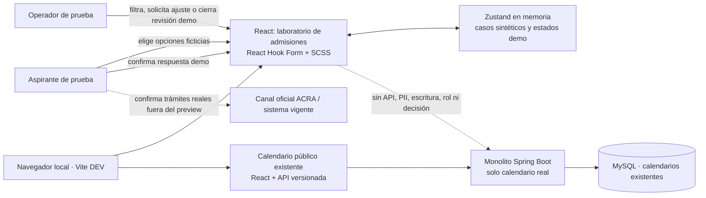

# Laboratorio local de experiencia de admisiones

**Estado:** entrega visual y funcional de desarrollo; no es un trámite institucional. 
**Alcance priorizado:** pregrado presencial; la convocatoria pública disponible es contexto de consulta, no autorización para reemplazar el canal oficial. 
**Última consulta de fuentes públicas:** 1 de octubre de 2026.

## Propósito

La ruta `/#admisiones` ya presenta la agenda pública y una consola protegida para versionar calendarios, pero no ofrece un recorrido que permita revisar la experiencia de aspirante y del equipo de admisiones. Este laboratorio local da al patrocinador una forma visible de recorrer ambas perspectivas y entregar feedback antes de diseñar el contrato institucional de postulaciones.

## Evidencia y límites institucionales

- ACRA publica fechas e indicaciones para el primer semestre de 2027. La página exige contar con resultados Saber 11 y que SNP, nombres y apellidos coincidan con ICFES. La convocatoria está en curso; esas fechas no se reutilizan para otra cohorte ni convierten esta plataforma en el portal oficial.
- UPTC informó el 22 de septiembre de 2026 la apertura de inscripciones 2027-I y que la venta de PIN se realiza en el portal institucional.
- UPTC había reportado «Inscríbete» para 2026-II con PIN y repositorio documental; la relación de ese sistema con SIRA y la Fase III, y el portal operativo para 2027-I, continúan por confirmar.
- Las fuentes no aprueban campos, sistema maestro, interfaces, tratamiento de datos, permisos, archivo documental ni reglas ejecutables de selección.

Fuentes primarias: [ACRA — aspirante pregrado](https://reportes.uptc.edu.co/sitio/portal/sitios/universidad/vic_aca/adm_reg/1aspi/pre/), [comunicado UPTC 240 del 22 de septiembre de 2026](https://dsp.uptc.edu.co/sitio/portal/cal_not_eve/noticias/det/UPTC-abre-inscripciones-para-estudiar-un-pregrado-presencial-a-distancia-o-virtual-el-proximo-semestre/) y [descubrimiento institucional de admisiones](../../discovery/uptc-inscribete-2026.md).

## Recorrido local

La ruta ofrece tres perspectivas claramente etiquetadas:

1. **Aspirante (demostración):** elige entre opciones ficticias, confirma el aviso sin datos personales, crea una ficha sintética y consulta su estado. Puede confirmar una respuesta ficticia a un ajuste de ejercicio.
2. **Equipo de admisiones (demostración):** consulta una bandeja filtrable por referencia y estado, abre el detalle y puede iniciar la revisión, solicitar un ajuste de una lista fija o finalizar la revisión. Tras una confirmación demo de la perspectiva aspirante, puede reanudarla y cerrarla. No puede admitir, rechazar, clasificar ni calcular puntajes.
3. **Calendario público:** conserva la agenda versionada y el respaldo oficial ya existente.

El selector de perspectiva es una herramienta de prueba visual. No representa roles, sesión, autorización o capacidad institucional.

## Datos y seguridad

- Solo carga en entorno Vite de desarrollo mediante una importación dinámica; el build productivo no debe incluir el laboratorio.
- El dominio de demostración contiene un consecutivo sintético, dos opciones ficticias, confirmaciones demo y estados acotados a `DEMO_RECEIVED`, `DEMO_REVIEWING`, `DEMO_CORRECTION_REQUESTED`, `DEMO_CORRECTION_SUBMITTED` y `DEMO_REVIEW_COMPLETE`.
- Los motivos de ajuste son opciones fijas de demostración; no existe un campo de texto libre. El detalle de la bandeja muestra el motivo seleccionado.
- La store Zustand vive únicamente en memoria del módulo. No usa `persist`, `localStorage`, `sessionStorage`, API, backend, MySQL, analítica ni servicios externos.
- No hay campos de nombre, documento, contacto, puntaje, PIN, pago, expediente o archivos. La interfaz advierte que no se deben introducir datos reales.
- Los estados de demostración no cambian perfiles canónicos `user_id`, calendarios oficiales, admisión, matrícula ni permisos.
- Se mantiene íntegro el gate institucional existente: no implementar una inscripción real, repositorio de documentos o resultado de selección hasta resolver G0–G3 de la especificación de descubrimiento.

## Contrato de UI

- React Hook Form controla y valida opciones distintas y las confirmaciones antes de crear una ficha de demostración; la bandeja permite buscar por referencia y filtrar por estado.
- Zustand comparte casos entre la vista de aspirante y la bandeja sin persistencia y valida transiciones permitidas, incluida la solicitud/respuesta de ajuste y el cierre de revisión.
- Errores y confirmaciones son accesibles (`aria-live`/`role="alert"`), los tabs admiten teclado y el diseño parte de móvil.
- Las llamadas de administración real permanecen exclusivamente en la perspectiva de calendario y siguen protegidas por los permisos existentes.

## C4 del incremento

## Criterios de aceptación

- El navegador local abre por defecto el recorrido de aspirante de demostración y permite cambiar entre aspirante, equipo y calendario.
- Enviar una ficha válida crea un consecutivo sintético visible en la bandeja; opciones duplicadas o casillas incompletas producen errores claros y no cambian el store.
- El recorrido permite iniciar revisión, solicitar un ajuste fijo, confirmarlo desde la perspectiva aspirante, reanudar y finalizar. Las transiciones solo afectan estados de demostración; nunca presentan una decisión de admisión.
- Al recargar, la ficha deja de existir. No hay tráfico de postulación ni datos personales.
- El build de producción excluye el módulo del laboratorio.
- `npm test`, `npm run build` y `npm run lint` pasan; las pruebas de componentes cubren permisos/calendario existentes, validaciones, flujo aspirante→bandeja, transiciones, estados vacíos y teclado.

## Fuera de alcance de esta entrega

Registro de identidad o persona, formularios institucionales, documentos, PIN, recibos, Wompi, consulta ICFES, conversión de aspirante a admitido/estudiante, cupos, ponderación, ranking, selección, notificaciones y persistencia. Son entregas posteriores con dueño, política y contrato aprobados.
