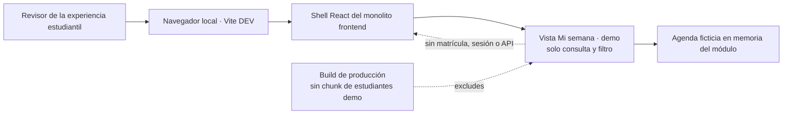

# Experiencia local de consulta académica del estudiante

**Estado:** incremento funcional de UX para desarrollo; no consulta matrículas UPTC. 
**Alcance:** una agenda semanal de ejemplo, accesible desde `/#estudiante-demo` en Vite DEV. 
**Datos:** fixtures inventados, sin nombres, identificadores personales ni datos institucionales.

## Propósito

Dar al patrocinador una vista navegable de cómo podría consultar una persona su semana académica desde móvil o escritorio. La página hace visibles el horario, la ubicación de ejemplo y el detalle de una sesión sin afirmar que exista una matrícula o que la UPTC haya autorizado una nueva fuente de horarios.

## Recorrido

1. La persona abre **Mi semana · demo** en el espacio de experiencias locales.
2. Revisa la agenda semanal ficticia o filtra por un día.
3. Selecciona una sesión para consultar curso, hora, aula y docente de muestra.
4. Si elige un día sin actividad, la página explica que no hay sesiones en esa agenda de ejemplo.

## Límites

- No representa inicio de sesión, rol de estudiante, autorización, perfil ni estado de matrícula.
- No llama API, MySQL, SIRA, UPTConecta ni sistemas externos; no usa Zustand porque no hay lecturas que cachear ni estado que compartir entre módulos.
- No solicita ni guarda datos personales. La agenda vive en fixtures del componente y desaparece al salir de la ruta.
- No ofrece inscribir, cancelar, calificar, editar horario ni confirmar disponibilidad de aulas.
- No muestra programas, docentes, aulas, créditos o periodos oficiales. Todos los valores llevan rótulo de ejemplo.
- Solo se importa con `import.meta.env.DEV`; una comprobación del manifest impide incluir `src/features/students/demo/` en producción.

## Contrato de interfaz

- Encabezado claro de “Mi semana académica” y aviso persistente: vista de demostración con agenda ficticia, sin matrícula real.
- Resumen de cantidades etiquetado como ejemplo.
- Filtros accesibles para todos los días y para cada día con teclado y lector de pantalla.
- Sesiones ordenadas por día y hora; seleccionar una abre un panel de detalle asociado semánticamente.
- Estado vacío para días sin sesiones.
- Diseño mobile-first: agenda en lista en móvil y cuadrícula de días en pantallas amplias; SCSS usa los tokens compartidos y admite ambos temas.

## C4 del incremento

## Criterios de aceptación

- `/#estudiante-demo` abre la experiencia en desarrollo; en producción la ruta y el enlace no están disponibles.
- La vista presenta el aviso de datos ficticios antes de la agenda y no contiene formularios de captura.
- Filtrar un día deja visibles únicamente sus sesiones; un día vacío muestra su estado correspondiente.
- Seleccionar una sesión expone sus datos de muestra en un panel de detalle accesible.
- No hay peticiones de red, escrituras, permisos, persistencia de navegador ni conexiones con servicios académicos.
- Las pruebas cubren navegación, filtros, detalle, estado vacío y exclusión del manifest productivo.

## Puertas para una consulta real

La versión conectada requiere identidad institucional autorizada, permiso de lectura propia, fuente maestra de matrícula/horario, identificadores y contrato de actualización, prueba de aislamiento por usuario, política de datos y aceptación de ACRA/Registro Académico/DTIC. El prototipo no satisface ni reemplaza esas dependencias.
