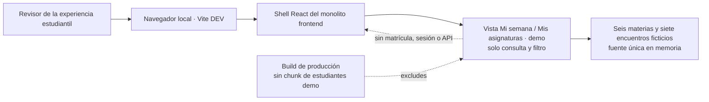

# Experiencia local de consulta académica del estudiante

**Estado:** incremento funcional de UX para desarrollo; no consulta matrículas UPTC. 
**Alcance:** una agenda semanal y una vista de asignaturas de ejemplo, accesibles desde `/#estudiante-demo` en Vite DEV. 
**Datos:** fixtures inventados, sin nombres, identificadores personales ni datos institucionales.

## Propósito

Dar al patrocinador una vista navegable de cómo podría consultar una persona sus materias y semana académica desde móvil o escritorio. Ambas vistas usan la misma estructura ficticia: seis asignaturas con siete encuentros; el detalle hace visibles código, horario, espacio y docente de ejemplo sin afirmar que exista una matrícula o que la UPTC haya autorizado una nueva fuente.

## Recorrido

1. La persona abre **Vida académica · demo** en el espacio de experiencias locales; la vista semanal es la predeterminada.
2. Cambia entre **Mi semana** y **Mis asignaturas** mediante controles accesibles.
3. Revisa los siete encuentros ficticios o filtra la semana por día; los días sin encuentros muestran un estado vacío.
4. En **Mis asignaturas**, cada una de las seis materias aparece una sola vez aunque tenga varios encuentros.
5. Selecciona una sesión o materia para consultar horarios, espacios y docente de muestra.

## Límites

- No representa inicio de sesión, rol de estudiante, autorización, perfil ni estado de matrícula.
- La vista no llama APIs académicas, MySQL, SIRA, UPTConecta ni sistemas externos; el shell general conserva sus consultas de branding e identidad. No usa Zustand porque no hay lecturas académicas que cachear ni estado que compartir entre módulos.
- No solicita ni guarda datos personales. La agenda vive en fixtures del componente y desaparece al salir de la ruta.
- No ofrece inscribir, cancelar, calificar, editar horario ni confirmar disponibilidad de aulas.
- No muestra programas, docentes, aulas, créditos o periodos oficiales. Todos los valores llevan rótulo de ejemplo.
- El catálogo ficticio es la fuente única de materias y encuentros; la semana se deriva de esos mismos datos para evitar duplicar docentes, códigos o ubicaciones.
- Solo se importa con `import.meta.env.DEV`; una comprobación del manifest impide incluir `src/features/students/demo/` en producción.

## Contrato de interfaz

- Encabezado que identifica la vista activa y aviso persistente: demostración con datos ficticios, sin matrícula real.
- Selector accesible entre semana y asignaturas; el cambio de vista limpia el detalle anterior.
- Resumen de cantidades etiquetado como ejemplo: siete encuentros semanales o seis materias.
- Filtros accesibles para todos los días y para cada día con teclado y lector de pantalla.
- Sesiones ordenadas por día y hora; seleccionar una abre un panel de detalle asociado semánticamente.
- La lista de asignaturas agrupa los encuentros por materia y muestra todos los horarios, espacios y el docente de ejemplo de la materia seleccionada.
- Estado vacío para días sin sesiones.
- Diseño mobile-first: agenda en lista en móvil y cuadrícula de días en pantallas amplias; SCSS usa los tokens compartidos y admite ambos temas.

## C4 del incremento

## Criterios de aceptación

- `/#estudiante-demo` abre la experiencia en desarrollo; en producción la ruta y el enlace no están disponibles.
- La vista presenta el aviso de datos ficticios antes de la agenda y no contiene formularios de captura.
- Filtrar un día deja visibles únicamente sus sesiones; un día vacío muestra su estado correspondiente.
- La vista de asignaturas muestra una sola tarjeta por materia, aunque tenga varios encuentros, y presenta todos sus horarios al seleccionarla.
- Cambiar de vista descarta el detalle seleccionado de la vista anterior.
- Seleccionar una sesión expone sus datos de muestra en un panel de detalle accesible.
- La vista no hace peticiones a servicios académicos ni realiza escrituras, lecturas de permisos o persistencia en el navegador.
- Las pruebas cubren navegación, filtros, detalle, estado vacío y exclusión del manifest productivo.

## Puertas para una consulta real

La versión conectada requiere identidad institucional autorizada, permiso de lectura propia, fuente maestra de matrícula/horario, identificadores y contrato de actualización, prueba de aislamiento por usuario, política de datos y aceptación de ACRA/Registro Académico/DTIC. El prototipo no satisface ni reemplaza esas dependencias.
